## 概述
缓冲区溢出，操作系统厂商永远的痛楚。本文讲述它的原理及最新技术。

## 前世
缓冲区溢出攻击，简单的讲，就是在一个大的缓冲区的数据向小缓冲区复制的过程中，没有注意小缓冲区的边界，“撑爆”了较小的缓冲区，从而冲掉了和小缓冲区相邻的内存区域的其他数据而引起的内存问题。如图1
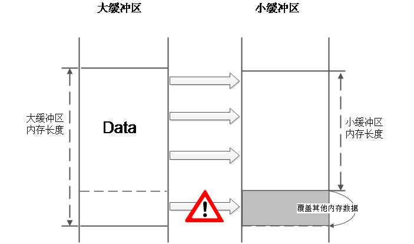   
图1 缓冲区溢出示意图  
所以说，缓冲区溢出是一个古老的内存攻击技术，那在理解其基本原理之前，先来看下内存的一下基础知识。

## 内存
我们编写的程序被编译器编译、链接后形成了可执行文件，可执行文件在不同的OS平台下文件格式不同，比如Windows下的可执行文件格式就是PE格式（例如我们常见的EXE文件）， 而Linux下是ELF。通常我们很少去关注可执行文件内部有哪些数据以及数据是如何组织的，这是一个很复杂的主题，本节将简述其内容。  

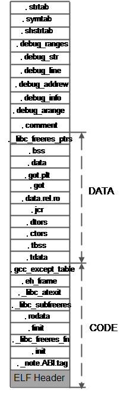   
图2 ELF格式文件组成  
上图，算是一个相对完整的ELF可执行文件格式的内部组成，我们看到了相当多的段，但其实我们需要关注的，在运行时起作用的就是两类数据：代码和数据。  
那么这些又和内存有什么关系呢？我们看到的是可执行文件存储在磁盘中的组织形式，当我们通过鼠标双击或通过shell的命令来执行这个文件后，OS开始加载解析这个文件，此时我们的程序开始进入“运行时”，“运行时”的程序组织形式可以简单的认识是OS中进程，对操作系统原理知识有些了解的人都应该知道，进程在“运行时”主要负责程序资源的管理和分配，比如内存、文件句柄及其他OS资源。那么可执行文件被加载到内存后，它的样子是什么？如图3.  

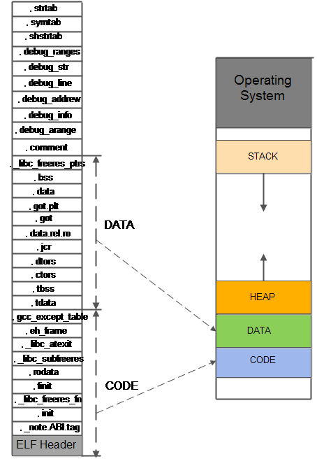   
图3 磁盘中的ELF文件映射到进程中内存情形  
所以我们看到在“运行时”，内存按照功能被分为四个部分： 
1)	代码区：这个区域存储着被装入执行的二进制机器代码（也就是我们的代码编译后的形式），处理器会到这个区域取指令解析执行。  
2)	数据区：用于存储全局变量和局部静态变量。  
3)	堆区：进程可以在堆区动态请求一定大小的内存，并在用完结束后归还堆区。堆区的特点是它的动态分配回收和细粒度内存块的管理。  
4)	栈区：用于动态存储函数之间的调用关系，以保证被调用函数在返回时恢复到母函数中继续执行，同时函数中的局部变量也存储在栈中。  
## 栈
栈，是一种数据结构，是一个先进后出的数据表，所以会为其抽象出栈底和栈顶两个属性。简单的理解，可以用生活中的装书的箱子类比，我们取书的顺序和放书的顺序相反，即第一本放入的书最后才能取出。对栈的操作也非常简单：压栈和弹栈。如图4.  
   
图4 栈及其操作示意图  
我们在上节中看到的进程虚拟内存中的栈指的是系统栈。系统栈由系统自动维护（我们可以在编译器编译时指定大小），用于实现函数调用。  

## Function call，What has happened
我们通过实际的代码调用过程，来看下OS如何配合系统栈完成函数的调用过程。先看下代码：  
``` c
int func_B(int arg_B1 , int arg_B2)
{
	int var_B;
	var_B = arg_B1 - arg_B2;
	return var_B;
}

int func_A(int arg_A1 , int arg_A2)
{
	int var_A;
	var_A = func_B(arg_A1 + arg_A2) + arg_A2;
	return var_A;
}

int main(int argc , char **argv , char **envp)
{
	int var_main;
	var_main = func_A(4 , 3);
}
```
我们代码编译、链接后，在可执行文件和进程虚拟内存中存在的形式相同，见下图。可以看到编译后的二进制代码以函数为单位散乱的分布在进程的虚拟内存的代码区，那么CPU在执行代码的过程。图5是代码在内存中的分布，图6是CPU执行代码的过程。  
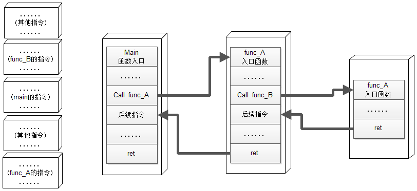 
图5 内存中的代码              图6 CPU执行二进制代码的过程   
从CPU取指执行过程中，我们发现一个重要的问题，当子函数调用执行完毕后，CPU可以回到母函数调用子函数指令的后续指令继续执行，这是怎么实现的？其实这就是通过系统栈来实现的。  
首先，我们来看下一个函数的调用过程：  
1)	参数入栈：将参数从右向左依次压入栈中（这里压栈的顺序根据不同的函数调用约定有所改变）。  
2)	返回地址入栈：将当前代码区调用指令的下一条指令地址压入栈中，供函数返回时继续执行。  
3)	代码区跳转：CPU从当前代码区跳转到被调用函数的入口处。  
4)	栈帧调整：  
a)	保存当前栈帧状态值，以备后面恢复本栈帧时使用（EBP入栈）。  
b)	将当前栈帧切换到新栈帧（将ESP值装入EBP，更新栈帧底部）。  
c)	在新栈帧中为函数分配空间（将ESP减去所需空间大小，通过抬高栈顶的方式分配空间）。  
函数的调用过程原理图如图7.  
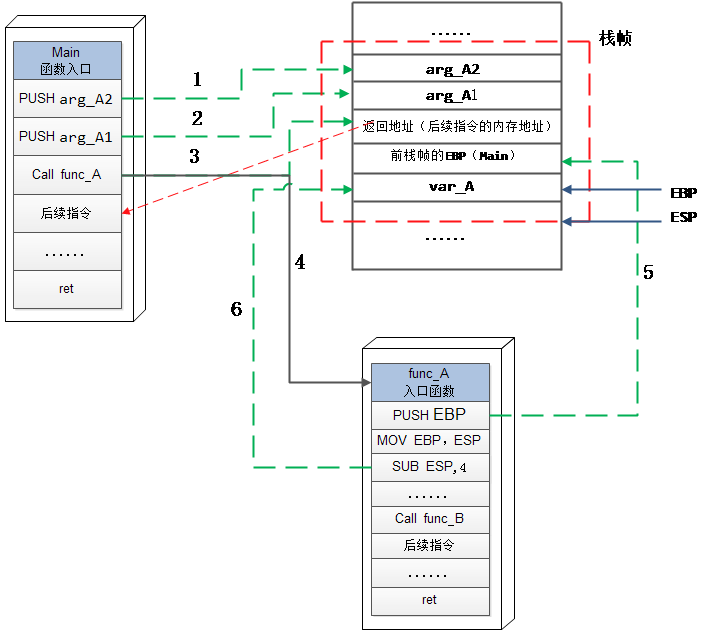   
图 7 子函数调用时的过程    
同样，函数返回的步骤如下：  
	保存返回值：通常是将函数返回值保存在寄存器EAX中。  
	弹出当前栈帧，恢复上一个栈帧环境：  
a)	在堆栈平衡的基础上，给ESP加上栈帧的大小，降低栈顶，回收当前栈帧空间。  
b)	将当前栈帧底部保存的前栈帧EBP值弹入EBP中，恢复上一个栈帧。   
c)	将函数返回地址弹给EIP寄存器。  
	跳转，按照函数返回地址跳回母函数中继续执行。  
函数返回时的示意图如图8.  
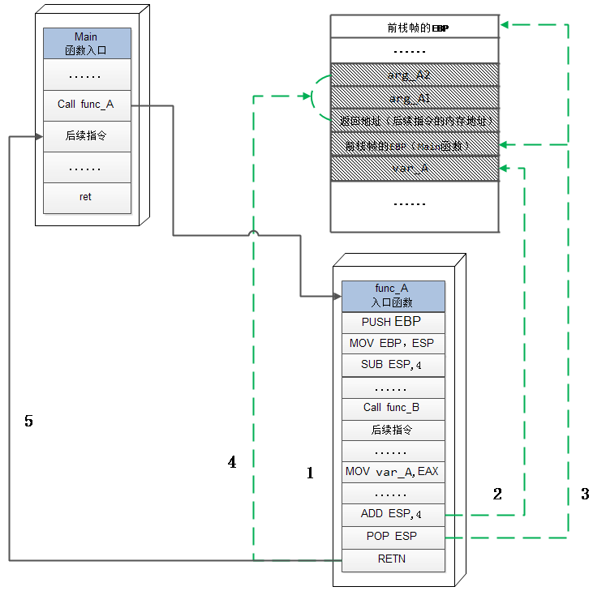   
图8 子函数返回的过程    
通过上面对函数调用过程，看到了栈在函数调用过程中的重要作用，那么现在可以进入正题了，缓冲区溢出问题和攻击是怎么发生的？  
首先，这里指的缓冲区存在于被调用函数的栈帧中的局部变量区，常见的是函数中的局部数组变量。比如下面的函数：  
``` c
void func_A(char * str)
{
	char buf_A[6];
   strcpy(buf_A , str);
}
```
函数func_A被调用时，它的栈帧如图9。  
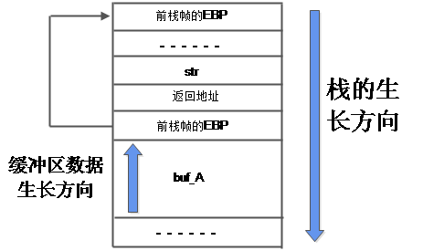   
图9 func_A的栈帧    
从这个栈帧中我们得到两个重点：  
1) 系统栈的内存地址增长方向是从高地址到低地址。  
2) 栈中的局部数组变量的数据增长方向是从低地址向高地址。    
正是由于这个特点，才造就了缓冲区溢出后劫持程序正常工作流，我们来看下这个过程。当程序由于在向缓冲区复制数据时没有判定其可承受数据大小造成数据溢出，此时数据溢出后会覆盖栈帧中的其他内存数据，此时会发生一些意想不到的问题：  
3) 覆盖函数中的重要变量。如这些变量用于条件分支判断，则会导致攻击者可以控制函数执行流。  
4) 覆盖当前函数栈帧中的返回地址。攻击者可以经过精心的计算，使预订的数据来覆盖函数栈帧返回地址，来达到控制当前函数返回时，CPU执行指定内存地址中的指令。  
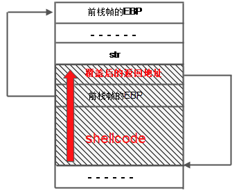   
图10 溢出后覆盖返回地址的攻击    
如图10所示，攻击者通过缓冲区溢出攻击，达到执行填充到缓冲区中的恶意指令的目的，从而控制计算机。  

## 发展
前面讲解了最基本的缓冲区溢出原理，随着攻击者和操作系统厂商的不断攻防，促进了操作系统越来越安全，在此过程中操作系统厂商绞尽脑汁增强防御措施，但攻击者总是很快就突破防御机制，公布解决方案。  
终于，攻与防的战争中迎来了一次史诗级的战役。操作系统厂商祭出了重量级的杀手锏—DEP和ALSR机制。总结缓冲区溢出攻击的根本原因是由于：栈内存的可执行机制。因为栈被用来维护函数调用时的栈帧数据管理，但并没有禁止在其局部缓冲区中存放代码（代码也是一种数据），同时运行CPU可以执行栈内存中的代码。正是由于这个根本原因操作系统作为防御方，总是处在被动地位。DEP和ALSR机制改变了这一现状，其中DEP机制从根本上解决了栈内存可执行的问题，至此即使缓冲区溢出后，也无法在执行存储于栈中的shellcode代码。而ALSR机制促使可执行文件每次被加载到内存后，其栈内存的地址是不确定的，这也增加了溢出后被利用的难度。  
但是，“邪恶”再一次战胜了“正义”。虽然DEP和ALSR机制的组合非常强大，但也只是提高了缓冲区溢出的门槛，而没有成功的防御住来自高水平攻击者的长矛—ROP技术。  

## 今生
其实，攻击者利用缓冲区溢出进行攻击的过程中最重要的目标是控制CPU执行任意指令，在进一步说在X86体系的CPU中就是控制EIP寄存器的值，前面讲解的基础原理中通过覆盖函数的返回地址来达到该目的，因为函数的返回地址最终会被赋值给EIP（通过ret指令，因为ret指令相当于POP+JMP，这样可以操纵ESP的值来达到同样的效果）。所以只要我们能够达到这个目标，利用还是存在希望的。接下要解决的问题就是我们的攻击载荷布置在目标机器的内存中，但是由于DEP机制的存在，我们可以使用的内存都被设置成不可执行，如图11.  
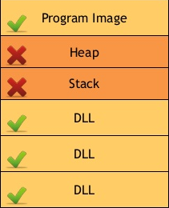   
图11 DEP下的内存段执行权限    
为此攻击者绞尽脑汁，终于有一天灵光一闪，为什么一定要想目标机器注入我们的载荷呢？只有能够达到攻击的效果，那么可以满足这个目的的任意代码，我们都可以使用，比如存在于程序加载的动态链接库中，所以“Ret2Lib”技术产生了。  

## Ret2Lib
首先被提出的突破DEP机制的技术叫做Return-to-library technique，简称“Ret2Lib”。该技术的核心思想是这样的：既然栈帧无法在执行代码，但是在程序的进程空间中存在着各种动态加载库（Windows下是DLL，Linux是.SO），这些链接库包括程序特有的第三方库以及OS平台提供的C运行库。在这些库中存在着大量函数，程序可以直接调用来完成工作，这样攻击者可以把函数返回值直接指向动态库中的已存在函数（在Linux下一般指向system函数，因为这个函数只有一个参数，容易构造调用），这样同样能够达到攻击的目的。通过Ret2Lib技术调用Linux中的Glibc库的system函数的栈布局如图12.    
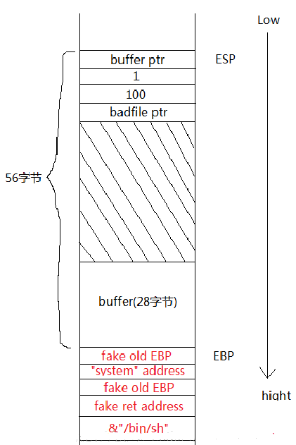   
图12 缓冲区溢出后调用systen函数进行攻击的栈布局    

## ROP
Ret2Lib技术在X86体系结构的计算机中工作的很好，但在X64体系结构的计算机上却不能使用，因为X86体系结构的函数调用约定中，参数的传递不再依赖栈来传递，并规定函数的第一个参数必须保存到寄存去EAX中。这将导致通过Ret2Lib技术调用现有的函数，因为无法在栈构造参数，除非是无参的函数。  
攻击者又是灵光一闪。攻击载荷也是一段二进制代码，说白了就是一堆指令的集合按照指定顺序执行后完成攻击任务，而CPU不会理解执行的上下文，完全按照指令来执行，那么我们是不是可以把组成载荷功能的二进制指令功能，在加载库中找到对应的指令片段，并串联起来让CPU执行就可以了，所以ROP技术产生了。  
攻击者祭出了终极长矛—Retrun-Oriented-Programming，简称“ROP”。首先，ROP技术仍是一种利用程序依赖的动态链接库的一种攻击方式。ROP不在把向内存中注入自定义的攻击指令载荷，而是使用内存中现有的函数代码中的指令片段串联起来构成完整的攻击载荷链，可利用的攻击指令片段被称为“gadget”，每个Gadget都是由跳转指令结尾，并且攻击者可以控制跳转的位置，在Android下有自己特殊的Gadget，这里不详述。  
这种技术非常恐怖，理论上只有找到溢出漏洞，并且堆栈空间足够大，就可以实现任意攻击，并且现在的杀毒软件很难防范这种攻击。ROP攻击的Gadget链示例如图13.  
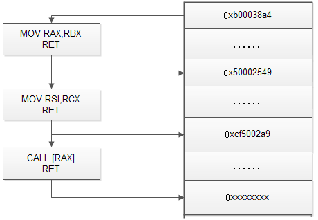   
图 13 ROP攻击的Gadget链    
从上面的原理中，我们看到ROP技术需要解决的几个问题：  
1) 攻击者可以利用漏洞来构造栈空间布局。  
2) 攻击者需要找到合适的Gadget。首先需要选择目标动态链接库，OS平台的C运行时库是个不错的选择， 因为它是大部分OS功能的底层支持库。怎么泄漏库的基址需要根据不同漏洞来不同分析。   

