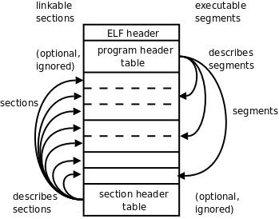
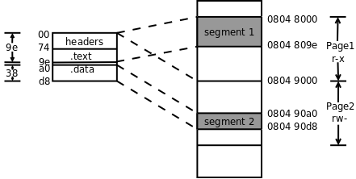
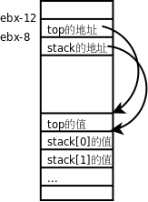

ELF文件格式是一个开放标准，各种UNIX系统的可执行文件都采用ELF格式，它有三种不同的类型：  

* 可重定位的目标文件（Relocatable，或者Object File）

* 可执行文件（Executable）

* 共享库（Shared Object，或者Shared Library）

本节我们以[“求一组数的最大值的汇编程序”](./linux%20x86%20汇编程序示例.md)为例讨论目标文件和可执行文件的格式。现在详细解释一下这个程序的汇编、链接、运行过程：    

写一个汇编程序保存成文本文件max.s。  

汇编器读取这个文本文件转换成目标文件max.o，目标文件由若干个Section组成，我们在汇编程序中声明的.section会成为目标文件中的Section，此外汇编器还会自动添加一些Section（比如符号表）。  

然后链接器把目标文件中的Section合并成几个Segment，生成可执行文件max。  

最后加载器（Loader）根据可执行文件中的Segment信息加载运行这个程序。  

ELF格式提供了两种不同的视角，链接器把ELF文件看成是Section的集合，而加载器把ELF文件看成是Segment的集合。如下图所示。  
  
图 ELF文件

## ELF文件  

左边是从链接器的视角来看ELF文件，开头的ELF Header描述了体系结构和操作系统等基本信息，并指出Section Header Table和Program Header Table在文件中的什么位置，Program Header Table在链接过程中用不到，所以是可有可无的，Section Header Table中保存了所有Section的描述信息，通过Section Header Table可以找到每个Section在文件中的位置。右边是从加载器的视角来看ELF文件，开头是ELF Header，Program Header Table中保存了所有Segment的描述信息，Section Header Table在加载过程中用不到，所以是可有可无的。从上图可以看出，一个Segment由一个或多个Section组成，这些Section加载到内存时具有相同的访问权限。有些Section只对链接器有意义，在运行时用不到，也不需要加载到内存，那么就不属于任何Segment。注意Section Header Table和Program Header Table并不是一定要位于文件的开头和结尾，其位置由ELF Header指出，上图这么画只是为了清晰。  

目标文件需要链接器做进一步处理，所以一定有Section Header Table；可执行文件需要加载运行，所以一定有Program Header Table；而共享库既要加载运行，又要在加载时做动态链接，所以既有Section Header Table又有Program Header Table。  

### 5.1. 目标文件

下面用readelf工具读出目标文件max.o的ELF Header和Section Header Table，然后我们逐段分析。  
```
$ readelf -a max.o 
ELF Header:
  Magic:   7f 45 4c 46 01 01 01 00 00 00 00 00 00 00 00 00 
  Class:                             ELF32
  Data:                              2's complement, little endian
  Version:                           1 (current)
  OS/ABI:                            UNIX - System V
  ABI Version:                       0
  Type:                              REL (Relocatable file)
  Machine:                           Intel 80386
  Version:                           0x1
  Entry point address:               0x0
  Start of program headers:          0 (bytes into file)
  Start of section headers:          200 (bytes into file)
  Flags:                             0x0
  Size of this header:               52 (bytes)
  Size of program headers:           0 (bytes)
  Number of program headers:         0
  Size of section headers:           40 (bytes)
  Number of section headers:         8
  Section header string table index: 5
...
```
ELF Header中描述了操作系统是UNIX，体系结构是80386。Section Header Table中有8个Section Header，从文件地址200（0xc8）开始，每个Section Header占40字节，共320字节，到文件地址0x207结束。这个目标文件没有Program Header。文件地址是这样定义的：文件开头第一个字节的地址是0，然后每个字节占一个地址。  
```
...
Section Headers:
  [Nr] Name              Type            Addr     Off    Size   ES Flg Lk Inf Al
  [ 0]                   NULL            00000000 000000 000000 00      0   0  0
  [ 1] .text             PROGBITS        00000000 000034 00002a 00  AX  0   0  4
  [ 2] .rel.text         REL             00000000 0002b0 000010 08      6   1  4
  [ 3] .data             PROGBITS        00000000 000060 000038 00  WA  0   0  4
  [ 4] .bss              NOBITS          00000000 000098 000000 00  WA  0   0  4
  [ 5] .shstrtab         STRTAB          00000000 000098 000030 00      0   0  1
  [ 6] .symtab           SYMTAB          00000000 000208 000080 10      7   7  4
  [ 7] .strtab           STRTAB          00000000 000288 000028 00      0   0  1
Key to Flags:
  W (write), A (alloc), X (execute), M (merge), S (strings)
  I (info), L (link order), G (group), x (unknown)
  O (extra OS processing required) o (OS specific), p (processor specific)

There are no section groups in this file.

There are no program headers in this file.
...
```
从Section Header中读出各Section的描述信息，其中.text和.data是我们在汇编程序中声明的Section，而其它Section是汇编器自动添加的。Addr是这些段加载到内存中的地址（我们讲过程序中的地址都是虚拟地址），加载地址要在链接时填写，现在空缺，所以是全0。Off和Size两列指出了各Section的文件地址，比如.data段从文件地址0x60开始，一共0x38个字节，回去翻一下程序，.data段定义了14个4字节的整数，一共是56个字节，也就是0x38。根据以上信息可以描绘出整个目标文件的布局。  
<table summary="目标文件的布局" border="1"><colgroup><col /><col /></colgroup><thead><tr><th>起始文件地址</th><th>Section或Header</th></tr></thead><tbody><tr><td>0</td><td>ELF Header</td></tr><tr><td>0x34</td><td><code class="literal">.text</code></td></tr><tr><td>0x60</td><td><code class="literal">.data</code></td></tr><tr><td>0x98</td><td><code class="literal">.bss</code>（此段为空）</td></tr><tr><td>0x98</td><td><code class="literal">.shstrtab</code></td></tr><tr><td>0xc8</td><td>Section Header Table</td></tr><tr><td>0x208</td><td><code class="literal">.symtab</code></td></tr><tr><td>0x288</td><td><code class="literal">.strtab</code></td></tr><tr><td>0x2b0</td><td><code class="literal">.rel.text</code></td></tr></tbody></table>
表 目标文件的布局

这个文件不大，我们直接用hexdump工具把目标文件的字节全部打印出来看。  
```
$ hexdump -C max.o 
00000000  7f 45 4c 46 01 01 01 00  00 00 00 00 00 00 00 00  |.ELF............|
00000010  01 00 03 00 01 00 00 00  00 00 00 00 00 00 00 00  |................|
00000020  c8 00 00 00 00 00 00 00  34 00 00 00 00 00 28 00  |........4.....(.|
00000030  08 00 05 00 bf 00 00 00  00 8b 04 bd 00 00 00 00  |................|
00000040  89 c3 83 f8 00 74 10 47  8b 04 bd 00 00 00 00 39  |.....t.G.......9|
00000050  d8 7e ef 89 c3 eb eb b8  01 00 00 00 cd 80 00 00  |.~..............|
00000060  03 00 00 00 43 00 00 00  22 00 00 00 de 00 00 00  |....C...".......|
00000070  2d 00 00 00 4b 00 00 00  36 00 00 00 22 00 00 00  |-...K...6..."...|
00000080  2c 00 00 00 21 00 00 00  16 00 00 00 0b 00 00 00  |,...!...........|
00000090  42 00 00 00 00 00 00 00  00 2e 73 79 6d 74 61 62  |B.........symtab|
000000a0  00 2e 73 74 72 74 61 62  00 2e 73 68 73 74 72 74  |..strtab..shstrt|
000000b0  61 62 00 2e 72 65 6c 2e  74 65 78 74 00 2e 64 61  |ab..rel.text..da|
000000c0  74 61 00 2e 62 73 73 00  00 00 00 00 00 00 00 00  |ta..bss.........|
000000d0  00 00 00 00 00 00 00 00  00 00 00 00 00 00 00 00  |................|
*
000000f0  1f 00 00 00 01 00 00 00  06 00 00 00 00 00 00 00  |................|
00000100  34 00 00 00 2a 00 00 00  00 00 00 00 00 00 00 00  |4...*...........|
00000110  04 00 00 00 00 00 00 00  1b 00 00 00 09 00 00 00  |................|
00000120  00 00 00 00 00 00 00 00  b0 02 00 00 10 00 00 00  |................|
00000130  06 00 00 00 01 00 00 00  04 00 00 00 08 00 00 00  |................|
00000140  25 00 00 00 01 00 00 00  03 00 00 00 00 00 00 00  |%...............|
00000150  60 00 00 00 38 00 00 00  00 00 00 00 00 00 00 00  |`...8...........|
00000160  04 00 00 00 00 00 00 00  2b 00 00 00 08 00 00 00  |........+.......|
00000170  03 00 00 00 00 00 00 00  98 00 00 00 00 00 00 00  |................|
00000180  00 00 00 00 00 00 00 00  04 00 00 00 00 00 00 00  |................|
00000190  11 00 00 00 03 00 00 00  00 00 00 00 00 00 00 00  |................|
000001a0  98 00 00 00 30 00 00 00  00 00 00 00 00 00 00 00  |....0...........|
000001b0  01 00 00 00 00 00 00 00  01 00 00 00 02 00 00 00  |................|
000001c0  00 00 00 00 00 00 00 00  08 02 00 00 80 00 00 00  |................|
000001d0  07 00 00 00 07 00 00 00  04 00 00 00 10 00 00 00  |................|
000001e0  09 00 00 00 03 00 00 00  00 00 00 00 00 00 00 00  |................|
000001f0  88 02 00 00 28 00 00 00  00 00 00 00 00 00 00 00  |....(...........|
00000200  01 00 00 00 00 00 00 00  00 00 00 00 00 00 00 00  |................|
00000210  00 00 00 00 00 00 00 00  00 00 00 00 00 00 00 00  |................|
00000220  00 00 00 00 03 00 01 00  00 00 00 00 00 00 00 00  |................|
00000230  00 00 00 00 03 00 03 00  00 00 00 00 00 00 00 00  |................|
00000240  00 00 00 00 03 00 04 00  01 00 00 00 00 00 00 00  |................|
00000250  00 00 00 00 00 00 03 00  0c 00 00 00 0e 00 00 00  |................|
00000260  00 00 00 00 00 00 01 00  17 00 00 00 23 00 00 00  |............#...|
00000270  00 00 00 00 00 00 01 00  21 00 00 00 00 00 00 00  |........!.......|
00000280  00 00 00 00 10 00 01 00  00 64 61 74 61 5f 69 74  |.........data_it|
00000290  65 6d 73 00 73 74 61 72  74 5f 6c 6f 6f 70 00 6c  |ems.start_loop.l|
000002a0  6f 6f 70 5f 65 78 69 74  00 5f 73 74 61 72 74 00  |oop_exit._start.|
000002b0  08 00 00 00 01 02 00 00  17 00 00 00 01 02 00 00  |................|
000002c0
```
左边一列是文件地址，中间是每个字节的十六进制表示，右边是把这些字节解释成ASCII码所对应的字符。中间有一个*号表示省略的部分全是0。.data段对应的是这一块：  
```
...
00000060  03 00 00 00 43 00 00 00  22 00 00 00 de 00 00 00  |....C...".......|
00000070  2d 00 00 00 4b 00 00 00  36 00 00 00 22 00 00 00  |-...K...6..."...|
00000080  2c 00 00 00 21 00 00 00  16 00 00 00 0b 00 00 00  |,...!...........|
00000090  42 00 00 00 00 00 00 00
...
```
.data段将被原封不动地加载到内存中，下一小节会看到.data段被加载到内存地址0x080490a0~0x080490d7。  

.shstrtab和.strtab这两个Section中存放的都是ASCII码：  
```
...
                                   00 2e 73 79 6d 74 61 62  |B.........symtab|
000000a0  00 2e 73 74 72 74 61 62  00 2e 73 68 73 74 72 74  |..strtab..shstrt|
000000b0  61 62 00 2e 72 65 6c 2e  74 65 78 74 00 2e 64 61  |ab..rel.text..da|
000000c0  74 61 00 2e 62 73 73 00                           |ta..bss.........|
...
                                   00 64 61 74 61 5f 69 74  |.........data_it|
00000290  65 6d 73 00 73 74 61 72  74 5f 6c 6f 6f 70 00 6c  |ems.start_loop.l|
000002a0  6f 6f 70 5f 65 78 69 74  00 5f 73 74 61 72 74 00  |oop_exit._start.|
...
```
可见.shstrtab段保存着各Section的名字，.strtab段保存着程序中用到的符号的名字。每个名字都是以'\0'结尾的字符串。  

我们知道，C语言的全局变量如果在代码中没有初始化，就会在程序加载时用0初始化。这种数据属于.bss段，在加载时它和.data段一样都是可读可写的数据，但是在ELF文件中.data段需要占用一部分空间保存初始值，而.bss段则不需要。也就是说，.bss段在文件中只占一个Section Header而没有对应的Section，程序加载时.bss段占多大内存空间在Section Header中描述，在我们这个例子中没有用到.bss段。

我们继续分析readelf输出的最后一部分，是从.rel.text和.symtab这两个Section中读出的信息。  
```
...
Relocation section '.rel.text' at offset 0x2b0 contains 2 entries:
 Offset     Info    Type            Sym.Value  Sym. Name
00000008  00000201 R_386_32          00000000   .data
00000017  00000201 R_386_32          00000000   .data

There are no unwind sections in this file.

Symbol table '.symtab' contains 8 entries:
   Num:    Value  Size Type    Bind   Vis      Ndx Name
     0: 00000000     0 NOTYPE  LOCAL  DEFAULT  UND 
     1: 00000000     0 SECTION LOCAL  DEFAULT    1 
     2: 00000000     0 SECTION LOCAL  DEFAULT    3 
     3: 00000000     0 SECTION LOCAL  DEFAULT    4 
     4: 00000000     0 NOTYPE  LOCAL  DEFAULT    3 data_items
     5: 0000000e     0 NOTYPE  LOCAL  DEFAULT    1 start_loop
     6: 00000023     0 NOTYPE  LOCAL  DEFAULT    1 loop_exit
     7: 00000000     0 NOTYPE  GLOBAL DEFAULT    1 _start

No version information found in this file.
```
.rel.text告诉链接器指令中的哪些地方需要做重定位，在下一小节详细讨论。  

.symtab是符号表。Ndx列是每个符号所在的Section编号，例如符号data_items在第3个Section里（也就是.data段），各Section的编号见Section Header Table。Value列是每个符号所代表的地址，在目标文件中，符号地址都是相对于该符号所在Section的相对地址，比如data_items位于.data段的开头，所以地址是0，_start位于.text段的开头，所以地址也是0，但是start_loop和loop_exit相对于.text段的地址就不是0了。从Bind这一列可以看出_start这个符号是GLOBAL的，而其它符号是LOCAL的，GLOBAL符号是在汇编程序中用.globl指示声明过的符号。  

现在剩下.text段没有分析，objdump工具可以把程序中的机器指令反汇编（Disassemble），那么反汇编的结果是否跟原来写的汇编代码一模一样呢？我们对比分析一下。  
```
$ objdump -d max.o

max.o:     file format elf32-i386


Disassembly of section .text:

00000000 <_start>:
   0:	bf 00 00 00 00       	mov    $0x0,%edi
   5:	8b 04 bd 00 00 00 00 	mov    0x0(,%edi,4),%eax
   c:	89 c3                	mov    %eax,%ebx

0000000e <start_loop>:
   e:	83 f8 00             	cmp    $0x0,%eax
  11:	74 10                	je     23 <loop_exit>
  13:	47                   	inc    %edi
  14:	8b 04 bd 00 00 00 00 	mov    0x0(,%edi,4),%eax
  1b:	39 d8                	cmp    %ebx,%eax
  1d:	7e ef                	jle    e <start_loop>
  1f:	89 c3                	mov    %eax,%ebx
  21:	eb eb                	jmp    e <start_loop>

00000023 <loop_exit>:
  23:	b8 01 00 00 00       	mov    $0x1,%eax
  28:	cd 80                	int    $0x80
```
左边是机器指令的字节，右边是反汇编结果。显然，所有的符号都被替换成地址了，比如je 23，注意没有加$的数表示内存地址，而不表示立即数。这条指令后面的<loop_exit>并不是指令的一部分，而是反汇编器从.symtab和.strtab中查到的符号名称，写在后面是为了有更好的可读性。目前所有指令中用到的符号地址都是相对地址，下一步链接器要修改这些指令，把其中的地址都改成加载时的内存地址，这些指令才能正确执行。  

### 5.2. 可执行文件

现在我们按上一节的步骤分析可执行文件max，看看链接器都做了什么改动。  
```
$ readelf -a max
ELF Header:
  Magic:   7f 45 4c 46 01 01 01 00 00 00 00 00 00 00 00 00 
  Class:                             ELF32
  Data:                              2's complement, little endian
  Version:                           1 (current)
  OS/ABI:                            UNIX - System V
  ABI Version:                       0
  Type:                              EXEC (Executable file)
  Machine:                           Intel 80386
  Version:                           0x1
  Entry point address:               0x8048074
  Start of program headers:          52 (bytes into file)
  Start of section headers:          256 (bytes into file)
  Flags:                             0x0
  Size of this header:               52 (bytes)
  Size of program headers:           32 (bytes)
  Number of program headers:         2
  Size of section headers:           40 (bytes)
  Number of section headers:         6
  Section header string table index: 3

Section Headers:
  [Nr] Name              Type            Addr     Off    Size   ES Flg Lk Inf Al
  [ 0]                   NULL            00000000 000000 000000 00      0   0  0
  [ 1] .text             PROGBITS        08048074 000074 00002a 00  AX  0   0  4
  [ 2] .data             PROGBITS        080490a0 0000a0 000038 00  WA  0   0  4
  [ 3] .shstrtab         STRTAB          00000000 0000d8 000027 00      0   0  1
  [ 4] .symtab           SYMTAB          00000000 0001f0 0000a0 10      5   6  4
  [ 5] .strtab           STRTAB          00000000 000290 000040 00      0   0  1
Key to Flags:
  W (write), A (alloc), X (execute), M (merge), S (strings)
  I (info), L (link order), G (group), x (unknown)
  O (extra OS processing required) o (OS specific), p (processor specific)

There are no section groups in this file.

Program Headers:
  Type           Offset   VirtAddr   PhysAddr   FileSiz MemSiz  Flg Align
  LOAD           0x000000 0x08048000 0x08048000 0x0009e 0x0009e R E 0x1000
  LOAD           0x0000a0 0x080490a0 0x080490a0 0x00038 0x00038 RW  0x1000

 Section to Segment mapping:
  Segment Sections...
   00     .text 
   01     .data 

There is no dynamic section in this file.

There are no relocations in this file.

There are no unwind sections in this file.

Symbol table '.symtab' contains 10 entries:
   Num:    Value  Size Type    Bind   Vis      Ndx Name
     0: 00000000     0 NOTYPE  LOCAL  DEFAULT  UND 
     1: 08048074     0 SECTION LOCAL  DEFAULT    1 
     2: 080490a0     0 SECTION LOCAL  DEFAULT    2 
     3: 080490a0     0 NOTYPE  LOCAL  DEFAULT    2 data_items
     4: 08048082     0 NOTYPE  LOCAL  DEFAULT    1 start_loop
     5: 08048097     0 NOTYPE  LOCAL  DEFAULT    1 loop_exit
     6: 08048074     0 NOTYPE  GLOBAL DEFAULT    1 _start
     7: 080490d8     0 NOTYPE  GLOBAL DEFAULT  ABS __bss_start
     8: 080490d8     0 NOTYPE  GLOBAL DEFAULT  ABS _edata
     9: 080490d8     0 NOTYPE  GLOBAL DEFAULT  ABS _end

No version information found in this file.
```
在ELF Header中，Type改成了EXEC，由目标文件变成可执行文件了，Entry point address改成了0x8048074（这是_start符号的地址），还可以看出，多了两个Program Header，少了两个Section Header。  

在Section Header Table中，.text和.data段的加载地址分别改成了0x08048074和0x080490a0。.bss段没有用到，所以被删掉了。.rel.text段就是用于链接过程的，做完链接就没用了，所以也删掉了。  

多出来的Program Header Table描述了两个Segment的信息。.text段和前面的ELF Header、Program Header Table一起组成一个Segment（FileSiz指出总长度是0x9e），.data段组成另一个Segment（总长度是0x38）。VirtAddr列指出第一个Segment加载到虚拟地址0x08048000（注意在x86平台上后面的PhysAddr列是没有意义的，并不代表实际的物理地址），第二个Segment加载到地址0x080490a0。Flg列指出第一个Segment的访问权限是可读可执行，第二个Segment的访问权限是可读可写。最后一列Align的值0x1000（4K）是x86平台的内存页面大小。在加载时文件也要按内存页面大小分成若干页，文件中的一页对应内存中的一页，对应关系如下图所示。  
  
图 文件和加载地址的对应关系  

这个可执行文件很小，总共也不超过一页大小，但是两个Segment必须加载到内存中两个不同的页面，因为MMU的权限保护机制是以页为单位的，一个页面只能设置一种权限。此外还规定每个Segment在文件页面内偏移多少加载到内存页面仍然要偏移多少，比如第二个Segment在文件中的偏移是0xa0，在内存页面0x08049000中的偏移仍然是0xa0，所以从0x080490a0开始，这样规定是为了简化链接器和加载器的实现。从上图也可以看出.text段的加载地址应该是0x08048074，_start符号位于.text段的开头，所以_start符号的地址也是0x08048074，从符号表中可以验证这一点。  

原来目标文件符号表中的Value都是相对地址，现在都改成绝对地址了。此外还多了三个符号__bss_start、_edata和_end，这些符号在链接脚本中定义，被链接器添加到可执行文件中。  

再看一下反汇编的结果：  
```
$ objdump -d max

max:     file format elf32-i386


Disassembly of section .text:

08048074 <_start>:
 8048074:	bf 00 00 00 00       	mov    $0x0,%edi
 8048079:	8b 04 bd a0 90 04 08 	mov    0x80490a0(,%edi,4),%eax
 8048080:	89 c3                	mov    %eax,%ebx

08048082 <start_loop>:
 8048082:	83 f8 00             	cmp    $0x0,%eax
 8048085:	74 10                	je     8048097 <loop_exit>
 8048087:	47                   	inc    %edi
 8048088:	8b 04 bd a0 90 04 08 	mov    0x80490a0(,%edi,4),%eax
 804808f:	39 d8                	cmp    %ebx,%eax
 8048091:	7e ef                	jle    8048082 <start_loop>
 8048093:	89 c3                	mov    %eax,%ebx
 8048095:	eb eb                	jmp    8048082 <start_loop>

08048097 <loop_exit>:
 8048097:	b8 01 00 00 00       	mov    $0x1,%eax
 804809c:	cd 80                	int    $0x80
```
指令中的相对地址都改成绝对地址了。我们仔细检查一下改了哪些地方。首先看跳转指令，原来目标文件的指令是这样：  
```
...
  11:	74 10                	je     23 <loop_exit>
...
  1d:	7e ef                	jle    e <start_loop>
...
  21:	eb eb                	jmp    e <start_loop>
...
```
现在改成了这样：  
```
...
 8048085:	74 10                	je     8048097 <loop_exit>
...
 8048091:	7e ef                	jle    8048082 <start_loop>
...
 8048095:	eb eb                	jmp    8048082 <start_loop>
...
```
改了吗？其实只是反汇编的结果不同了，指令的机器码根本没变。为什么不用改指令就能跳转到新的地址呢？因为跳转指令中指定的是相对于当前指令向前或向后跳多少字节，而不是指定一个完整的内存地址，内存地址有32位，这些跳转指令只有16位，显然也不可能指定一个完整的内存地址，这称为相对跳转。这种相对跳转指令只有16位，只能在当前指令前后的一个小范围内跳转，不可能跳得太远，也有的跳转指令指定一个完整的内存地址，可以跳到任何地方，这称绝对跳转，在第5.4节 “动态链接的过程”我们会看到这样的例子。  

再看内存访问指令，原来目标文件的指令是这样：  
```
...
   5:	8b 04 bd 00 00 00 00 	mov    0x0(,%edi,4),%eax
...
  14:	8b 04 bd 00 00 00 00 	mov    0x0(,%edi,4),%eax
...
```
现在改成了这样：  
```
...
 8048079:	8b 04 bd a0 90 04 08 	mov    0x80490a0(,%edi,4),%eax
...
 8048088:	8b 04 bd a0 90 04 08 	mov    0x80490a0(,%edi,4),%eax
...
```
指令中的地址原本是0x00000000，现在改成了0x080409a0（注意是小端字节序）。那么链接器怎么知道要改这两处呢？是根据目标文件中的.rel.text段提供的重定位信息来改的：  
```
...
Relocation section '.rel.text' at offset 0x2b0 contains 2 entries:
 Offset     Info    Type            Sym.Value  Sym. Name
00000008  00000201 R_386_32          00000000   .data
00000017  00000201 R_386_32          00000000   .data
...
```
第一列Offset的值就是.text段需要改的地方，在.text段中的相对地址是8和0x17，正是这两条指令中00 00 00 00的位置。  

### 5.3 共享库
组成共享库的目标文件和一般的目标文件有所不同，在编译时要加-fPIC选项，例如：  

`$ gcc -c -fPIC stack/stack.c stack/push.c stack/pop.c stack/is_empty.c`  
-f后面跟一些编译选项，PIC是其中一种，表示生成位置无关代码（Position Independent Code）。那么用-fPIC生成的目标文件和一般的目标文件有什么不同呢？下面分析这个问题。  

我们知道一般的目标文件称为Relocatable，在链接时可以把目标文件中各段的地址做重定位，重定位时需要修改指令。我们先不加-fPIC选项编译生成目标文件：  

`$ gcc -c -g stack/stack.c stack/push.c stack/pop.c stack/is_empty.c`  
由于接下来要用objdump -dS把反汇编指令和源代码穿插起来分析，所以用-g选项加调试信息。注意，加调试信息必须在编译每个目标文件时用-g选项，而不能只在最后编译生成可执行文件时用-g选项。  
反汇编查看push.o：    
```
$ objdump -dS push.o 

push.o:     file format elf32-i386


Disassembly of section .text:

00000000 <push>:
/* push.c */
extern char stack[512];
extern int top;

void push(char c)
{
   0:	55                   	push   %ebp
   1:	89 e5                	mov    %esp,%ebp
   3:	83 ec 04             	sub    $0x4,%esp
   6:	8b 45 08             	mov    0x8(%ebp),%eax
   9:	88 45 fc             	mov    %al,-0x4(%ebp)
	stack[++top] = c;
   c:	a1 00 00 00 00       	mov    0x0,%eax
  11:	83 c0 01             	add    $0x1,%eax
  14:	a3 00 00 00 00       	mov    %eax,0x0
  19:	8b 15 00 00 00 00    	mov    0x0,%edx
  1f:	0f b6 45 fc          	movzbl -0x4(%ebp),%eax
  23:	88 82 00 00 00 00    	mov    %al,0x0(%edx)
}
  29:	c9                   	leave  
  2a:	c3                   	ret
```
指令中凡是用到stack和top的地址都用0x0表示，准备在重定位时修改。再看readelf输出的.rel.text段的信息：  
```
Relocation section '.rel.text' at offset 0x848 contains 4 entries:
 Offset     Info    Type            Sym.Value  Sym. Name
0000000d  00001001 R_386_32          00000000   top
00000015  00001001 R_386_32          00000000   top
0000001b  00001001 R_386_32          00000000   top
00000025  00001101 R_386_32          00000000   stack
```
标出了指令中有四处需要在重定位时修改。下面编译链接成可执行文件之后再做反汇编分析：  
```
$ gcc -g main.c stack.o push.o pop.o is_empty.o -Istack -o main
$ objdump -dS main
...
080483c0 <push>:
/* push.c */
extern char stack[512];
extern int top;

void push(char c)
{
 80483c0:       55                      push   %ebp
 80483c1:       89 e5                   mov    %esp,%ebp
 80483c3:       83 ec 04                sub    $0x4,%esp
 80483c6:       8b 45 08                mov    0x8(%ebp),%eax
 80483c9:       88 45 fc                mov    %al,-0x4(%ebp)
        stack[++top] = c;
 80483cc:       a1 10 a0 04 08          mov    0x804a010,%eax
 80483d1:       83 c0 01                add    $0x1,%eax
 80483d4:       a3 10 a0 04 08          mov    %eax,0x804a010
 80483d9:       8b 15 10 a0 04 08       mov    0x804a010,%edx
 80483df:       0f b6 45 fc             movzbl -0x4(%ebp),%eax
 80483e3:       88 82 40 a0 04 08       mov    %al,0x804a040(%edx)
}
 80483e9:       c9                      leave  
 80483ea:       c3                      ret    
 80483eb:       90                      nop    
...
```
原来指令中的0x0被修改成了0x804a010和0x804a040，这样做了重定位之后，各段的加载地址就定死了，因为在指令中使用了绝对地址。  

现在看用-fPIC编译生成的目标文件有什么不同：  
```
$ gcc -c -g -fPIC stack/stack.c stack/push.c stack/pop.c stack/is_empty.c
$ objdump -dS push.o

push.o:     file format elf32-i386


Disassembly of section .text:

00000000 <push>:
/* push.c */
extern char stack[512];
extern int top;

void push(char c)
{
   0:	55                   	push   %ebp
   1:	89 e5                	mov    %esp,%ebp
   3:	53                   	push   %ebx
   4:	83 ec 04             	sub    $0x4,%esp
   7:	e8 fc ff ff ff       	call   8 <push+0x8>
   c:	81 c3 02 00 00 00    	add    $0x2,%ebx
  12:	8b 45 08             	mov    0x8(%ebp),%eax
  15:	88 45 f8             	mov    %al,-0x8(%ebp)
	stack[++top] = c;
  18:	8b 83 00 00 00 00    	mov    0x0(%ebx),%eax
  1e:	8b 00                	mov    (%eax),%eax
  20:	8d 50 01             	lea    0x1(%eax),%edx
  23:	8b 83 00 00 00 00    	mov    0x0(%ebx),%eax
  29:	89 10                	mov    %edx,(%eax)
  2b:	8b 83 00 00 00 00    	mov    0x0(%ebx),%eax
  31:	8b 08                	mov    (%eax),%ecx
  33:	8b 93 00 00 00 00    	mov    0x0(%ebx),%edx
  39:	0f b6 45 f8          	movzbl -0x8(%ebp),%eax
  3d:	88 04 0a             	mov    %al,(%edx,%ecx,1)
}
  40:	83 c4 04             	add    $0x4,%esp
  43:	5b                   	pop    %ebx
  44:	5d                   	pop    %ebp
  45:	c3                   	ret    

Disassembly of section .text.__i686.get_pc_thunk.bx:

00000000 <__i686.get_pc_thunk.bx>:
   0:	8b 1c 24             	mov    (%esp),%ebx
   3:	c3                   	ret
```
指令中用到的stack和top的地址不再以0x0表示，而是以0x0(%ebx)表示，但其中还是留有0x0准备做进一步修改。再看readelf输出的.rel.text段：  
```
Relocation section '.rel.text' at offset 0x94c contains 6 entries:
 Offset     Info    Type            Sym.Value  Sym. Name
00000008  00001202 R_386_PC32        00000000   __i686.get_pc_thunk.bx
0000000e  0000130a R_386_GOTPC       00000000   _GLOBAL_OFFSET_TABLE_
0000001a  00001403 R_386_GOT32       00000000   top
00000025  00001403 R_386_GOT32       00000000   top
0000002d  00001403 R_386_GOT32       00000000   top
00000035  00001503 R_386_GOT32       00000000   stack
```
top和stack对应的记录类型不再是R_386_32了，而是R_386_GOT32，有什么区别呢？我们先编译生成共享库再做反汇编分析：  
```
$ gcc -shared -o libstack.so stack.o push.o pop.o is_empty.o
$ objdump -dS libstack.so
...
0000047c <push>:
/* push.c */
extern char stack[512];
extern int top;

void push(char c)
{
 47c:	55                   	push   %ebp
 47d:	89 e5                	mov    %esp,%ebp
 47f:	53                   	push   %ebx
 480:	83 ec 04             	sub    $0x4,%esp
 483:	e8 ef ff ff ff       	call   477 <__i686.get_pc_thunk.bx>
 488:	81 c3 6c 1b 00 00    	add    $0x1b6c,%ebx
 48e:	8b 45 08             	mov    0x8(%ebp),%eax
 491:	88 45 f8             	mov    %al,-0x8(%ebp)
	stack[++top] = c;
 494:	8b 83 f4 ff ff ff    	mov    -0xc(%ebx),%eax
 49a:	8b 00                	mov    (%eax),%eax
 49c:	8d 50 01             	lea    0x1(%eax),%edx
 49f:	8b 83 f4 ff ff ff    	mov    -0xc(%ebx),%eax
 4a5:	89 10                	mov    %edx,(%eax)
 4a7:	8b 83 f4 ff ff ff    	mov    -0xc(%ebx),%eax
 4ad:	8b 08                	mov    (%eax),%ecx
 4af:	8b 93 f8 ff ff ff    	mov    -0x8(%ebx),%edx
 4b5:	0f b6 45 f8          	movzbl -0x8(%ebp),%eax
 4b9:	88 04 0a             	mov    %al,(%edx,%ecx,1)
}
 4bc:	83 c4 04             	add    $0x4,%esp
 4bf:	5b                   	pop    %ebx
 4c0:	5d                   	pop    %ebp
 4c1:	c3                   	ret    
 4c2:	90                   	nop    
 4c3:	90                   	nop    
...
```
和先前的结果不同，指令中的0x0(%ebx)被修改成-0xc(%ebx)和-0x8(%ebx)，而不是修改成绝对地址。所以共享库各段的加载地址并没有定死，可以加载到任意位置，因为指令中没有使用绝对地址，因此称为位置无关代码。另外，注意这几条指令：  
```
 494:	8b 83 f4 ff ff ff    	mov    -0xc(%ebx),%eax
 49a:	8b 00                	mov    (%eax),%eax
 49c:	8d 50 01             	lea    0x1(%eax),%edx
```
和先前的指令对比一下：  
```
 80483cc:       a1 10 a0 04 08          mov    0x804a010,%eax
 80483d1:       83 c0 01                add    $0x1,%eax
```
可以发现，-0xc(%ebx)这个地址并不是变量top的地址，这个地址的内存单元中又保存了另外一个地址，这另外一个地址才是变量top的地址，所以mov -0xc(%ebx),%eax是把变量top的地址传给eax，而mov (%eax),%eax才是从top的地址中取出top的值传给eax。lea 0x1(%eax),%edx是把top的值加1存到edx中，如下图所示：  
  
图 间接寻址

top和stack的绝对地址保存在一个地址表中，而指令通过地址表做间接寻址，因此避免了将绝对地址写死在指令中，这也是一种避免硬编码的策略。 

### 5.4 动态链接的过程

本节研究一下在main.c中调用共享库的函数push是如何实现的。首先反汇编看一下main的指令：  
```
$ objdump -dS main
...
Disassembly of section .plt:

080483a8 <__gmon_start__@plt-0x10>:
 80483a8:	ff 35 f8 9f 04 08    	pushl  0x8049ff8
 80483ae:	ff 25 fc 9f 04 08    	jmp    *0x8049ffc
 80483b4:	00 00                	add    %al,(%eax)
...
080483d8 <push@plt>:
 80483d8:	ff 25 08 a0 04 08    	jmp    *0x804a008
 80483de:	68 10 00 00 00       	push   $0x10
 80483e3:	e9 c0 ff ff ff       	jmp    80483a8 <_init+0x30>

Disassembly of section .text:
...
080484a4 <main>:
/* main.c */
#include <stdio.h>
#include "stack.h"

int main(void)
{
 80484a4:	8d 4c 24 04          	lea    0x4(%esp),%ecx
 80484a8:	83 e4 f0             	and    $0xfffffff0,%esp
 80484ab:	ff 71 fc             	pushl  -0x4(%ecx)
 80484ae:	55                   	push   %ebp
 80484af:	89 e5                	mov    %esp,%ebp
 80484b1:	51                   	push   %ecx
 80484b2:	83 ec 04             	sub    $0x4,%esp
	push('a');
 80484b5:	c7 04 24 61 00 00 00 	movl   $0x61,(%esp)
 80484bc:	e8 17 ff ff ff       	call   80483d8 <push@plt>
...
```
和链接静态库不同，push函数没有链接到可执行文件中。而且`call 80483d8 <push@plt>`这条指令调用的也不是push函数的地址。共享库是位置无关代码，在运行时可以加载到任意地址，其加载地址只有在动态链接时才能确定，所以在main函数中不可能直接通过绝对地址调用push函数，也是通过间接寻址来找push函数的。对照着上面的指令，我们用gdb跟踪一下：  
```
$ gdb main
...
(gdb) start
Breakpoint 1 at 0x80484b5: file main.c, line 7.
Starting program: /home/akaedu/somedir/main 
main () at main.c:7
7		push('a');
(gdb) si
0x080484bc	7		push('a');
(gdb) si
0x080483d8 in push@plt ()
Current language:  auto; currently asm
```
跳转到.plt段中，现在将要执行一条`jmp *0x804a008`指令，我们看看0x804a008这个地址里存的是什么：  
```
(gdb) x 0x804a008
0x804a008 <_GLOBAL_OFFSET_TABLE_+20>:	0x080483de
原来就是下一条指令push $0x10的地址。继续跟踪下去：

(gdb) si
0x080483de in push@plt ()
(gdb) si
0x080483e3 in push@plt ()
(gdb) si
0x080483a8 in ?? ()
(gdb) si
0x080483ae in ?? ()
(gdb) si
0xb806a080 in ?? () from /lib/ld-linux.so.2
```
最终进入了动态链接器/lib/ld-linux.so.2，在其中完成动态链接的过程并调用push函数，我们不深入这些细节了，直接用finish命令返回到main函数：  
```
(gdb) finish
Run till exit from #0  0xb806a080 in ?? () from /lib/ld-linux.so.2
main () at main.c:8
8		return 0;
Current language:  auto; currently c
```
这时再看看0x804a008这个地址里存的是什么：  
```
(gdb) x 0x804a008
0x804a008 <_GLOBAL_OFFSET_TABLE_+20>:	0xb803f47c
(gdb) x 0xb803f47c
0xb803f47c <push>:	0x53e58955
```
动态链接器已经把push函数的地址存在这里了，所以下次再调用push函数就可以直接从jmp *0x804a008指令跳到它的地址，而不必再进入/lib/ld-linux.so.2做动态链接了。   

## Reference
https://akaedu.github.io/book/ch18s05.html