原文 by 走位@阿里聚安全  

## 0 前言
近年来，漏洞挖掘越来越火，各种漏洞挖掘、利用的分析文章层出不穷。从大方向来看，主要有基于栈溢出的漏洞利用和基于堆溢出的漏洞利用两种。国内关于栈溢出的资料相对较多，这里就不累述了，但是关于堆溢出的漏洞利用资料就很少了。鄙人以为主要是堆溢出漏洞的门槛较高，需要先吃透相应操作系统的堆内存管理机制，而这部分内容一直是一个难点。因此本系列文章主要从Linux系统堆内存管理机制出发，逐步介绍诸如基本堆溢出漏洞、基于unlink的堆溢出漏洞利用、double free、use-after-free等等常见的堆溢出漏洞利用技术。  
 
前段时间偶然学习了这篇文章：  
https://sploitfun.wordpress.com/2015/02/10/understanding-glibc-malloc/comment-page-1/  


该文是我近段时间以来读到的最好文章之一，文章浅显易懂，条例清晰，作为初学者的我从中学到了很多linux堆内存管理相关的知识。但是估计由于篇幅的限制，该文对很多难点一带而过，造成部分知识点理解上的困难。因此我决定以该文为蓝本，结合其他参考资料和自己的理解，写一篇足够详细、完整的linux堆管理介绍文章，希冀能够给其他初学者献上微末之力。所以就内容来源而言，本文主要由两部分组成：一部分是翻译的上面提及的文章；另一部分是笔者结合其他参考资料和自己的理解添加的补充说明。鉴于笔者知识能力上的不足，如有问题欢迎各位大牛斧正！  


同样地，鉴于篇幅过长，我将文章分成了上下两部分，上部分主要介绍堆内存管理中的一些基本概念以及相互关系，同时也着重介绍了堆中chunk分配和释放策略中使用到的隐式链表技术。后半部分主要介绍glibc malloc为了提高堆内存分配和释放的效率，引入的显式链表技术，即binlist的概念和核心原理。其中使用到的源码在：  
https://github.com/sploitfun/lsploits/tree/master/glibc  


## 1 堆内存管理简介

当前针对各大平台主要有如下几种堆内存管理机制：
* dlmalloc – General purpose allocator
* ptmalloc2 – glibc
* jemalloc – FreeBSD and Firefox
* tcmalloc – Google
* libumem – Solaris
 
本文主要学习介绍在linux glibc使用的ptmalloc2实现原理。  
本来linux默认的是dlmalloc，但是由于其不支持多线程堆管理，所以后来被支持多线程的ptmalloc2代替了。  
当然在linux平台*malloc本质上都是通过系统调用brk或者mmap实现的。关于这部分内容，一定要学习下面这篇文章：  
https://sploitfun.wordpress.com/2015/02/11/syscalls-used-by-malloc/  

鉴于篇幅，本文就不加以详细说明了，只是为了方便后面对堆内存管理的理解，截取其中函数调用关系图：  
  
 
图1-1 函数调用关系图  


系统内存分布图：  
   
图1-2系统内存分布图  
 
## 2 实验演示

试想有如下代码：  

``` c
/* Per thread arena example. */
#include <stdio.h>
#include <stdlib.h>
#include <pthread.h>
#include <unistd.h>
#include <sys/types.h>
 
void* threadFunc(void* arg) {
        printf("Before malloc in thread 1\n");
        getchar();
        char* addr = (char*) malloc(1000);
        printf("After malloc and before free in thread 1\n");
        getchar();
        free(addr);
        printf("After free in thread 1\n");
        getchar();
}
 
int main() {
        pthread_t t1;
        void* s;
        int ret;
        char* addr;
 
        printf("Welcome to per thread arena example::%d\n",getpid());
        printf("Before malloc in main thread\n");
        getchar();
        addr = (char*) malloc(1000);
        printf("After malloc and before free in main thread\n");
        getchar();
        free(addr);
        printf("After free in main thread\n");
        getchar();
        ret = pthread_create(&t1, NULL, threadFunc, NULL);
        if(ret)
        {
                printf("Thread creation error\n");
                return -1;
        }
        ret = pthread_join(t1, &s);
        if(ret)
        {
                printf("Thread join error\n");
                return -1;
        }
        return 0;
}
```
下面我们依次分析其各个阶段的堆内存分布状况。  
1. Before malloc in main thread :  
在程序调用malloc之前程序进程中是没有heap segment的，并且在创建在创建线程前，也是没有线程堆栈的。  
2. After malloc in main thread :  
在主线程中调用malloc之后，就会发现系统给程序分配了堆栈，且这个堆栈刚好在数据段之上：  
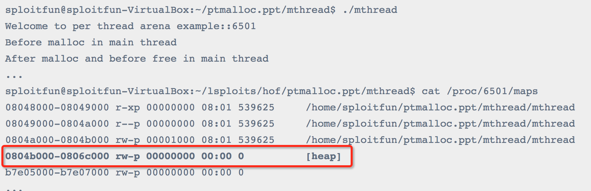    
这就说明它是通过brk系统调用实现的。并且，还可以看出虽然我们只申请了1000字节的数据，但是系统却分配了132KB大小的堆，这是为什么呢？原来这132KB的堆空间叫做arena，此时因为是主线程分配的，所以叫做main arena(每个arena中含有多个chunk，这些chunk以链表的形式加以组织)。由于132KB比1000字节大很多，所以主线程后续再申请堆空间的话，就会先从这132KB的剩余部分中申请，直到用完或不够用的时候，再通过增加program break location的方式来增加main arena的大小。同理，当main arena中有过多空闲内存的时候，也会通过减小program break location的方式来缩小main arena的大小。  

3. After free in main thread :  
在主线程调用free之后：从内存布局可以看出程序的堆空间并没有被释放掉，原来调用free函数释放已经分配了的空间并非直接“返还”给系统，而是由glibc 的malloc库函数加以管理。它会将释放的chunk添加到main arenas的bin(这是一种用于存储同类型free chunk的双链表数据结构，后边会加以详细介绍)中。在这里，记录空闲空间的freelist数据结构称之为bins。之后当用户再次调用malloc申请堆空间的时候，glibc malloc会先尝试从bins中找到一个满足要求的chunk，如果没有才会向操作系统申请新的堆空间。如下图所示：  
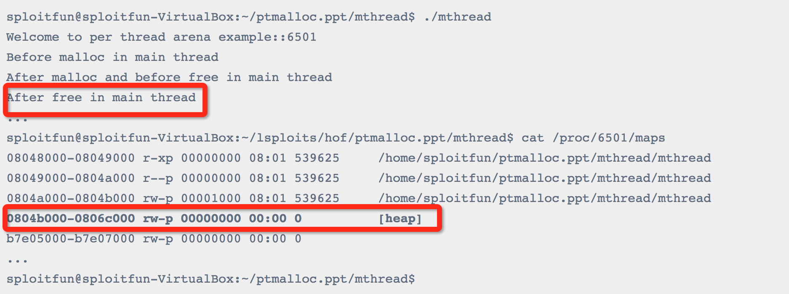   

4. Before malloc in thread1 :
在thread1调用malloc之前：从输出结果可以看出thread1中并没有heap segment，但是此时thread1自己的栈空间已经分配完毕了：  
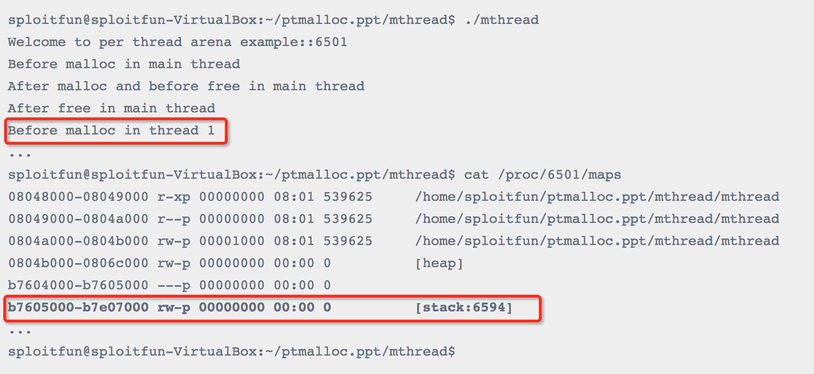 

5. After malloc in thread1 :
在thread1调用malloc之后：从输出结果可以看出thread1的heap segment已经分配完毕了，同时从这个区域的起始地址可以看出，它并不是通过brk分配的，而是通过mmap分配，因为它的区域为b7500000-b7600000共1MB，并不是同程序的data segment相邻。同时，我们还能看出在这1MB中，根据内存属性分为了2部分：0xb7500000-0xb7520000共132KB大小的空间是可读可写属性；后面的是不可读写属性。原来，这里只有可读写的132KB空间才是thread1的堆空间，即thread1 arena。  
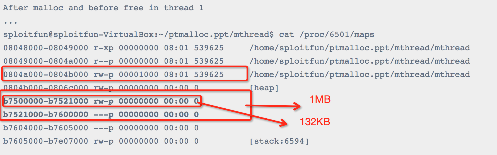   

6. 在thread1调用free之后：同main thread。  

## 3 Arena介绍

### 3.1 Arena数量限制

在第2章中我们提到main thread和thread1有自己独立的arena，那么是不是无论有多少个线程，每个线程都有自己独立的arena呢？答案是否定的。事实上，arena的个数是跟系统中处理器核心个数相关的，如下表所示：  

```
For 32 bit systems:
     Number of arena = 2 * number of cores + 1.
For 64 bit systems:
     Number of arena = 8 * number of cores + 1.
```
### 3.2 多Arena的管理

假设有如下情境：一台只含有一个处理器核心的PC机安装有32位操作系统，其上运行了一个多线程应用程序，共含有4个线程——主线程和三个用户线程。显然线程个数大于系统能维护的最大arena个数（2*核心数 + 1= 3），那么此时glibc malloc就需要确保这4个线程能够正确地共享这3个arena，那么它是如何实现的呢？  

当主线程首次调用malloc的时候，glibc malloc会直接为它分配一个main arena，而不需要任何附加条件。  


当用户线程1和用户线程2首次调用malloc的时候，glibc malloc会分别为每个用户线程创建一个新的thread arena。此时，各个线程与arena是一一对应的。但是，当用户线程3调用malloc的时候，就出现问题了。因为此时glibc malloc能维护的arena个数已经达到上限，无法再为线程3分配新的arena了，那么就需要重复使用已经分配好的3个arena中的一个(main arena, arena 1或者arena 2)。那么该选择哪个arena进行重复利用呢？  


1)首先，glibc malloc循环遍历所有可用的arenas，在遍历的过程中，它会尝试lock该arena。如果成功lock(该arena当前对应的线程并未使用堆内存则表示可lock)，比如将main arena成功lock住，那么就将main arena返回给用户，即表示该arena被线程3共享使用。  


2)而如果没能找到可用的arena，那么就将线程3的malloc操作阻塞，直到有可用的arena为止。  


3)现在，如果线程3再次调用malloc的话，glibc malloc就会先尝试使用最近访问的arena(此时为main arena)。如果此时main arena可用的话，就直接使用，否则就将线程3阻塞，直到main arena再次可用为止。  
这样线程3与主线程就共享main arena了。至于其他更复杂的情况，以此类推。  


## 4 堆管理介绍

### 4.1 整体介绍

在glibc malloc中针对堆管理，主要涉及到以下3种数据结构：


1. heap_info: 即Heap Header，因为一个**thread arena**（注意：不包含main thread）可以包含多个heaps，所以为了便于管理，就给每个heap分配一个heap header。那么在什么情况下一个thread arena会包含多个heaps呢?在当前heap不够用的时候，malloc会通过系统调用mmap申请新的堆空间，新的堆空间会被添加到当前thread arena中，便于管理。  

``` c
typedef struct _heap_info
{
  mstate ar_ptr; /* Arena for this heap. */
  struct _heap_info *prev; /* Previous heap. */
  size_t size;   /* Current size in bytes. */
  size_t mprotect_size; /* Size in bytes that has been mprotected
                           PROT_READ|PROT_WRITE.  */
  /* Make sure the following data is properly aligned, particularly
     that sizeof (heap_info) + 2 * SIZE_SZ is a multiple of
     MALLOC_ALIGNMENT. */
  char pad[-6 * SIZE_SZ & MALLOC_ALIGN_MASK];
} heap_info;
```
2. malloc_state: 即Arena Header，每个thread只含有一个Arena Header。Arena Header包含bins的信息、top chunk以及最后一个remainder chunk等(这些概念会在后文详细介绍):  

``` c
struct malloc_state
{
  /* Serialize access.  */
  mutex_t mutex;
 
  /* Flags (formerly in max_fast).  */
  int flags;
 
  /* Fastbins */
  mfastbinptr fastbinsY[NFASTBINS];
 
  /* Base of the topmost chunk -- not otherwise kept in a bin */
  mchunkptr top;
 
  /* The remainder from the most recent split of a small request */
  mchunkptr last_remainder;
 
  /* Normal bins packed as described above */
  mchunkptr bins[NBINS * 2 - 2];
 
  /* Bitmap of bins */
  unsigned int binmap[BINMAPSIZE];
 
  /* Linked list */
  struct malloc_state *next;
 
  /* Linked list for free arenas.  */
  struct malloc_state *next_free;
 
  /* Memory allocated from the system in this arena.  */
  INTERNAL_SIZE_T system_mem;
  INTERNAL_SIZE_T max_system_mem;
};
```
3. malloc_chunk: 即Chunk Header，一个heap被分为多个chunk，至于每个chunk的大小，这是根据用户的请求决定的，也就是说用户调用malloc(size)传递的size参数“就是”chunk的大小(这里给“就是”加上引号，说明这种表示并不准确，但是为了方便理解就暂时这么描述了，详细说明见后文)。每个chunk都由一个结构体malloc_chunk表示：  


``` c
struct malloc_chunk {
  /* #define INTERNAL_SIZE_T size_t */
  INTERNAL_SIZE_T      prev_size;  /* Size of previous chunk (if free).  */
  INTERNAL_SIZE_T      size;       /* Size in bytes, including overhead. */
  struct malloc_chunk* fd;         /* double links -- used only if free. 这两个指针只在free chunk中存在*/
  struct malloc_chunk* bk;
 
  /* Only used for large blocks: pointer to next larger size.  */
  struct malloc_chunk* fd_nextsize; /* double links -- used only if free. */
  struct malloc_chunk* bk_nextsize;
};
```

可能有很多读者会疑惑：该结构体里面并没有一个类似于data的字段来表示用户申请到的堆内存空间啊？且该结构体明确含有2个size_t 类型的成员，4个指针，这不就意味着malloc_chunk的大小是固定的了么？那它又如何能够根据用户的请求分配不同大小的内存呢？要想回答清楚这个问题，需要我们完全理解整个glibc malloc的堆内存管理机制，同时，本文的主要目的之一就是希望解释清楚这个概念，鉴于这部分内容较多，我将在后文的第5章加以详细介绍。  


NOTE:
1. Main thread不含有多个heaps所以也就不含有heap_info结构体。当需要更多堆空间的时候，就通过扩展sbrk的heap segment来获取更多的空间，直到它碰到内存mapping区域为止。  
2. 不同于thread arena，main arena的arena header并不是sbrk heap segment的一部分，而是一个全局变量！因此它属于libc.so的data segment。  


### 4.2 heap segment与arena关系

首先，通过内存分布图理清malloc_state与heap_info之间的组织关系。
下图是只有一个heap segment的main arena和thread arena的内存分布图：

图4-1 只含一个heap segment的main arena与thread arena图
  

下图是一个thread arena中含有多个heap segments的情况：  

    
图4-2 一个thread arena含有多个heap segments的内存分布图  
 
从上图可以看出，thread arena只含有一个malloc_state(即arena header)，却有两个heap_info(即heap header)。由于两个heap segments是通过mmap分配的内存，两者在内存布局上并不相邻而是分属于不同的内存区间，所以为了便于管理，libc malloc将第二个heap_info结构体的prev成员指向了第一个heap_info结构体的起始位置（即ar_ptr成员），而第一个heap_info结构体的ar_ptr成员指向了malloc_state，这样就构成了一个单链表，方便后续管理。  


## 5 对chunk的理解

在glibc malloc中将整个堆内存空间分成了连续的、大小不一的chunk，即对于堆内存管理而言chunk就是最小操作单位。Chunk总共分为4类：1)allocated chunk; 2)free chunk; 3)top chunk; 4)Last remainder chunk。  
从本质上来说，所有类型的chunk都是内存中一块连续的区域，只是通过该区域中**特定位置的某些标识符**加以区分。为了简便，我们先将这4类chunk简化为2类：allocated chunk以及free chunk，前者表示已经分配给用户使用的chunk，后者表示未使用的chunk。  


众所周知，无论是何种堆内存管理器，其完成的核心目的都是能够高效地分配和回收内存块(chunk)。因此，它需要设计好相关算法以及相应的数据结构，而数据结构往往是根据算法的需要加以改变的。既然是算法，那么算法肯定有一个优化改进的过程，所以本文将根据堆内存管理器的演变历程，逐步介绍在glibc malloc中chunk这种数据结构是如何设计出来的，以及这样设计的优缺点。  


PS:鉴于时间和精力有限，后文介绍的演变历程并没有加以严格考证，笔者只是按照一些参考书籍、自己的理解以及便于文章内容安排做出的“善意的捏造”，如有错误，欢迎大家斧正！  
 
### 5.1 隐式链表技术

前文说过，任何堆内存管理器都是以chunk为单位进行堆内存管理的，而这就需要一些数据结构来标志各个块的边界，以及区分已分配块和空闲块。大多数堆内存管理器都将这些边界信息作为chunk的一部分嵌入到chunk内部，典型的设计如下所示：  

  
图5-1 简单的allocated chunk格式  

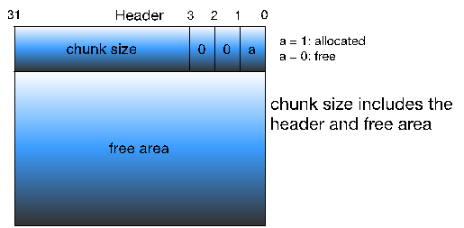    
图5-2 简单的free chunk格式  


堆内存中要求每个chunk的大小必须为8的整数倍，因此chunk size的后3位是无效的，为了充分利用内存，堆管理器将这3个比特位用作chunk的标志位，典型的就是将第0比特位用于标记该chunk是否已经被分配。这样的设计很巧妙，因为我们只要获取了一个指向chunk size的指针，就能知道该chunk的大小，即确定了此chunk的边界，且利用chunk size的第0比特位还能知道该chunk是否已经分配，这样就成功地将各个chunk区分开来。注意在allocated chunk中padding部分主要是用于地址对齐的(也可用于对付外部碎片)，即让整个chunk的大小为8的整数倍。  


通过上面的设计，我们就能将整个堆内存组织成一个连续的已分配或未分配chunk序列:
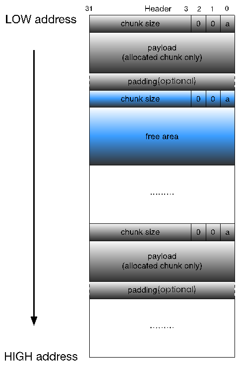  
图5-3 简单的chunk序列  


上面的这种结构就叫做隐式链表。该链表隐式地由每个chunk的size字段链接起来，在进行分配操作的时候，堆内存管理器可以通过遍历整个堆内存的chunk，分析每个chunk的size字段，进而找到合适的chunk。  
 
细心的读者可能发现：这种隐式链表效率其实是相当低的，特别是在内存回收方面，它难以进行相邻多个free chunk的合并操作。我们知道，如果只对free chunk进行分割，而不进行合并的话，就会产生大量小的、无法继续使用的内部碎片，直至整个内存消耗殆尽。因此堆内存管理器设计了带边界标记的chunk合并技术。  


#### 1 带边界标记的合并技术


试想如下场景：假设我们要释放的chunk为P，它紧邻的前一个chunk为FD，紧邻的后一个chunk为BK，且BK与FD都为free chunk。将P与BK合并在一起是很容易的，因为可以通过P的size字段轻松定位到BK的开始位置，进而获取BK的size等等，但是将P与FD合并却很难，我们必须从头遍历整个堆，找到FD，然后加以合并，这就意味着每次进行chunk释放操作消耗的时间与堆的大小成线性关系。为了解决这个问题，Knuth提出了一种聪明而通用的技术——边界标记。  


Knuth在每个chunk的最后添加了一个脚部(Footer)，它就是该chunk 头部(header)的一个副本，我们称之为边界标记：  
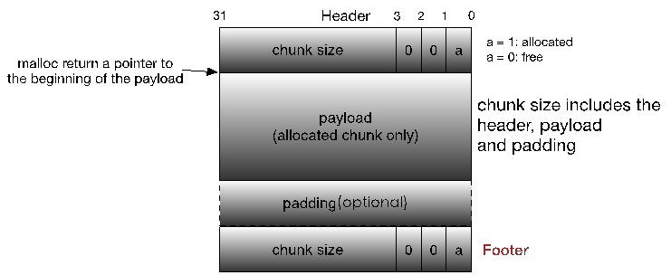  
图5-4 改进版的chunk格式之Knuth边界标记  


显然每个chunk的脚部都在其相邻的下一个chunk的头部的前4个字节处。通过这个脚部，堆内存管理器就可以很容易地得到前一个chunk的起始位置和分配状态，进而加以合并了。  


但是，边界标记同时带来了一个问题：它要求每个块都包含一个头部和脚部，如果应用程序频繁地进行小内存的申请和释放操作的话(比如1，2个字节)，就会造成很大的性能损耗。同时，考虑到只有在对free chunk进行合并的时候才需要脚部，也就是说对于allocated chunk而言它并不需要脚部，因此我们可以对这个脚部加以优化——将前一个chunk的已分配/空闲标记位存储在当前chunk的size字段的第1，或2比特位上，这样如果我们通过当前chunk的size字段知道了前一个chunk为free chunk，那么就可得出结论：当前chunk地址之前的4个字节为前一个free chunk的脚部，我们可以通过该脚部获取前一个chunk的起始位置；如果当前chunk的size字段的标记位表明前一个chunk是allocated chunk的话，那么就可得出另一个结论：前一个chunk没有脚部，即当前chunk地址之前的4个字节为前一个allocated chunk的payload或padding的最后部分。新的chunk格式图如下：  
  
图5-5 改进版的Knuth边界标记allocated chunk格式  
 
  
图5-6 改进版的Knuth边界标记free chunk格式  
 
#### 2 再进化——支持多线程


随着技术的发展，特别是堆内存管理器添加对多线程的支持，前述的chunk格式已经难以满足需求，比如，我们需要标志位来标记当前chunk是否属于非主线程即thread arena，以及该chunk由mmap得来还是通过brk实现等等。但此时chunk size只剩下一个比特位未使用了，怎么办呢？这需要对chunk格式进行大手术！  


首先思考：是否有必要同时保存当前chunk和**前一个chunk**的已分配/空闲标记位？答案是否定的，因为我们只需要保存前一个chunk的分配标志位就可以了，至于**当前chunk**的分配标志位，可以通过查询**下一个chunk**的size字段得到。那么size字段中剩下的两个比特位就可以用于满足多线程的标  志需求了：    
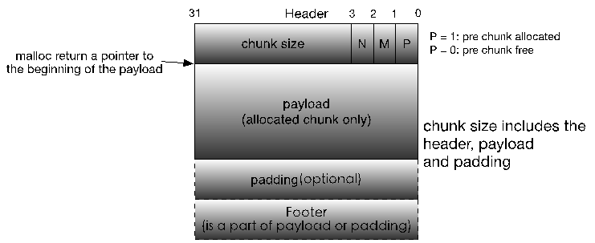  
图5-7 多线程版本Knuth边界标记allocated chunk格式  

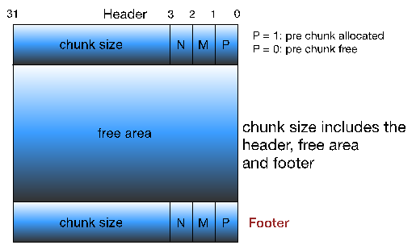  
图5-8 多线程版本Knuth边界标记free chunk格式  


这里的P,M,N的含义如下：  
PREV_INUSE(P): 表示前一个chunk是否为allocated。  
IS_MMAPPED(M)：表示当前chunk是否是通过mmap系统调用产生的。  
NON_MAIN_ARENA(N)：表示当前chunk是否是thread arena。  


再进一步，发现没必要保存chunk size的副本，也就是说Footer的作用并不大，但是如果前一个chunk是free的话，在合并的时候我们又需要知道前一个chunk的大小，怎么办呢？将Footer从尾部移到首部，同时其不再保存当前chunk的size，而是前一个free chunk的size不就行了。同样的，为了提高内存利用率，如果前一个chunk是allocated chunk的话，这个Footer就作为allocated chunk的payload或padding的一部分，结构图如下：   

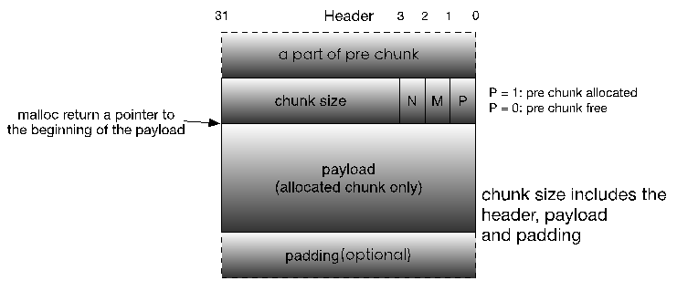  
图5-9 当前glibc malloc allocated chunk格式  

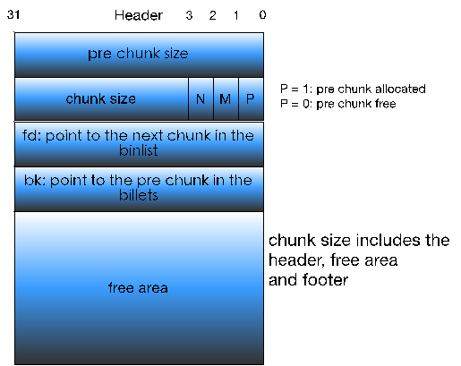  
图5-10 当前glibc malloc free chunk格式  

至此，glibc malloc堆内存管理器中使用的隐式链表技术就介绍完毕了。现在我们再回过头去看malloc_chunk结构体就很好理解了：该结构体通过每个chunk的prev_size和size构成了隐式链表，而后续的fd, bk等指针并不是作用于隐式链表的，而是用于后文会介绍的用于加快内存分配和释放效率的显式链表bin(还记得bin么？用于记录同一类型free chunk的链表)，并且这些指针跟prev_size一样只在free chunk中存在。关于显式链表bin的原理比较复杂，让我们带着疑惑，暂时略过这部分信息，等介绍完所有chunk之后再加以详细介绍。  
 
### 5.2 Top Chunk

当一个chunk处于一个arena的最顶部(即最高内存地址处)的时候，就称之为top chunk。该chunk**并不属于任何bin**，而是在系统当前的所有free chunk(无论那种bin)都无法满足用户请求的内存大小的时候，将此chunk当做一个应急消防员，分配给用户使用。如果top chunk的大小比用户请求的大小要大的话，就将该top chunk分作两部分：1）用户请求的chunk；2）剩余的部分成为新的top chunk。否则，就需要扩展heap或分配新的heap了——在main arena中通过sbrk扩展heap，而在thread arena中通过mmap分配新的heap。
 
### 5.3 Last Remainder Chunk

要想理解此chunk就必须先理解glibc malloc中的bin机制。如果你已经看了第二部分文章，那么下面的原理就很好理解了，否则建议你先阅读第二部分文章。对于Last remainder chunk，我们主要有两个问题：1)它是怎么产生的；2)它的作用是什么？


先回答第一个问题。还记得第二部分文章中对small bin的malloc机制的介绍么？当用户请求的是一个small chunk，且该请求无法被small bin、unsorted bin满足的时候，就通过binmaps遍历bin查找最合适的chunk，如果该chunk有剩余部分的话，就将该剩余部分变成一个新的chunk加入到unsorted bin中，另外，**再将该新的chunk变成新的last remainder chunk**。


然后回答第二个问题。此类型的chunk用于提高连续malloc(small chunk)的效率，主要是提高内存分配的局部性。那么具体是怎么提高局部性的呢？举例说明。当用户请求一个small chunk，且该请求无法被small bin满足，那么就转而交由unsorted bin处理。同时，假设当前unsorted bin中只有一个chunk的话——就是last remainder chunk，那么就将该chunk分成两部分：前者分配给用户，剩下的部分放到unsorted bin中，并成为新的last remainder chunk。这样就保证了连续malloc(small chunk)中，各个small chunk在内存分布中是相邻的，即提高了内存分配的局部性。

## Reference
https://jaq.alibaba.com/community/art/show?articleid=315
