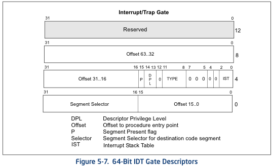
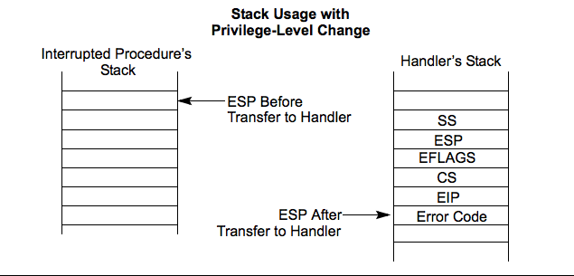

转载本文请务必注明，文章出处：《[Linux系统调用权威指南](http://www.csyssec.org/20161231/systemcallinternal/)》与作者信息：CSysSec出品  
文中引用有关glibc 的源代码地址 前缀为 `https://github.molgen.mpg.de/git-mirror/glibc/blob/glibc-2.15/`  
文中引用有关linux 的源代码地址 前缀为 `https://github.com/torvalds/linux/blob/v3.13/`  
## 长话短说(Too long; Don’t read)

文章解释了Linux程序在内核中是如何调用函数的。    

读完你可以知道：触发系统调用的不同方法，如何编写汇编代码触发系统调用(含代码样例)，内核执行系统调用的入口，内核从系统调用返回的出口，glibc封装器，相关bugs，还有更多，更多。    

## 什么是系统调用？

当你运行的程序调用 open,fork,read,write（以及其它类似的函数)时，就会触发系统调用。  

系统调用描述的是用户程序进入内核后执行的任务。用户程序利用系统调用能执行许多操作：创建进程、网络、文件以及I/O操作等。  

[man page for syscalls(2)](http://man7.org/linux/man-pages/man2/syscalls.2.html) 列出了全部系统调用。  

用户程序可以通过不同的方式执行系统调用，不同CPU架构中，底层执行系统调用的指令也有所不同。  

作为应用程序开发者，不必刻意去考虑系统调用是如何执行的。你只需要简单的加上合适的头文件，像调用普通函数一样就可以使用系统调用了。  

glibc提供了封装代码将底层抽象，把你传递的参数放置好之后开始进入内核。  

在深入理解系统调用执行的细节之前，我们需要定义一些术语，再谈一谈后面要用到的核心知识点。  

## 准备知识

### 硬件与软件

这篇博客作以下假设：　　

你在使用32位、64位Intel或AMD CPU，文中提到的方法可能对那些使用其它系统的人同样有效，但列出的代码都是依赖CPU的。  
你感兴趣的是Linux kernel 3.13.0，其它的内核版本类似，但实际的代码行号，代码架构以及文件路径会有所不同，文中也提供了3.13.0内核源代码的github链接。   
你感兴趣的是glibc，或者由glibc衍生的其它libc实现(比如eglibc)。  

文中提到的x86-64指的是基于x86架构的64位Intel和AMD处理器。  

### 用户程序，内核与CPU特权级

用户程序(如编辑器、终端、ssh进程等)需要与内核交互，内核才能代表用户程序执行一些其不能执行的操作。  

举个例子，如果一个用户程序需要执行一些I/O操作(open,read,write等)或者修改自身的地址空间(mmap,sbrk等)，必须要通知内核才能代表其自身完成这些操作。  

那么又是什么阻碍了用户程序自身执行这些操作呢？  

x86-64处理器引入了特权级的概念。特权级是个复杂的话题，需要另写博文详述了。当然，本文重点不在此，因此将特权级的概念简化如下：  

特权级实现了访问控制。当前特权级决定了哪些CPU指令和I/O操作能被执行。  
内核运行在最高特权级，称为"Ring 0"；用户程序运行在最低特权级,称为"Ring 3"。  
用户程序要执行特权操作，必须经历特权级转变的过程(从"Ring 3"到"Ring 0")，才能让内核来执行这些操作。  

有许多方法能引起特权级转变并触发内核执行相关操作。  

从常用的方法说起：中断。  

### 中断

可以把中断理解为硬件或软件引发的一个事件。  

硬件中断源于硬件设备通知内核某个特殊事件的发生，网卡收到数据包时产生的中断是比较常见的硬件中断。  

软件中断由某段代码的执行而引发，在x86-64系统中，执行 int指令就会引发软件中断。  

中断通常都会被分配一个中断号，这些中断号有着特殊的含义。

想象存储在CPU内存中的一个数组，数组的每个条目都映射为一个中断号。每个条目还存储了当CPU接收到中断信号后将要执行的函数地址以及一些其它的选项，选项中含有中断处理函数应该在哪个特权级上执行的信息。  

下面的这张图取自Intel CPU手册，描述了数组中每个条目的存储结构。  
  
中断描述符表IDT（Interrupt Descriptor Table）  

仔细看，会发现有一个2位的域标记着特权级描述符(DPL)，这个值决定了当执行中断处理函数时CPU需要的最低特权级。

当CPU接收到特定类型事件时，通过DPL信息知道它应该执行在哪个地址空间，以及事件处理器应该执行在哪个特权级上。

实际上，在x86-64系统中有许多不同的方法处理中断，对这个感兴趣想了解更多的可以参考 [8259 Programmable Interrupt Controller, Advanced Interrupt Controllers](http://wiki.osdev.org/8259_PIC) 和 [IO Advanced Interrupt Controllers](http://wiki.osdev.org/IOAPIC) 。  

当处理硬件中断和软件中断时，还会涉及到其它一些复杂的工作要处理，比如中断号冲突与重映射等问题。  

讨论系统调用时，我们不必关注以上这些细节。  

### 特殊模块寄存器

特殊模块寄存器（MSRs)是用来控制CPU某些特性的一组控制寄存器，CPU文档中列举了每个MSRs的地址，可以执行CPU指令 rdmsr/wrmsr来读/写 MSRs。  

也有一些命令行工具可以用来读/写 MSRs，但不建议这么做，因为修改这些值（尤其当系统在运行的时候)是相当危险的，除非你真的能做到小心翼翼。  

如果你不介意让你的系统不稳定或者不可恢复的损坏你的数据，你可以安装msr-tools工具并加载msr内核模块来读/写MSRs。  
```  bash
% sudo apt-get install msr-tools
% sudo modprobe msr
% sudo rdmsr
```
下文中我们会看到一些系统调用的方法就会用到这些MSRs。  

### 编写汇编代码触发系统调用不是个好主意

自己编写汇编代码来触发系统调用可不是个好主意。  

最大的原因就在于一些系统调用在执行之前或之后会有额外的代码需要在glibc中执行。  

在下面的例子中，我们会用到exit系统调用，你可以在exit被调用时利用atexit注册处理函数。  

这些处理函数都是被glibc调用的，注意不是kernel. 因此当你自己写汇编代码调用exit时，你自己注册的处理函数是不会执行的，因为你绕过了glibc。  

然而，写汇编代码来执行系统调用是个不错的学习经验。  

## 传统系统调用

从上文的准备知识中，我们可以知道两件事情：  

可以通过软件中断来触发内核的执行；  
可以通过汇编指令 int 来产生软件中断；    
结合这两个概念我们再去了解Linux系统中的传统系统调用接口。  

Linux内核分配了一个特殊的软件中断号，让用户程序进入到内核中执行系统调用。  

Linux内核会为中断处理号 128(0x80)注册一个中断处理器`ia32-syscall`，通过代码来看看到底怎么做的。  

内核3.13.0源码中的`arch/x86/kernel/traps.c`中有个`trap_init`函数:  
``` c
void __init trap_init(void)
{
        /* ..... other code ... */
        set_system_intr_gate(IA32_SYSCALL_VECTOR, ia32_syscall);
```
其中，`IA32_SYSCALL_VECTOR` 在 `arch/x86/include/asm/irq_vectors.h` 中被定义为 0x80。  

进一步看，既然内核预留了一个软件中断供用户程序来触发内核的执行，那在这么多的系统调用中，内核又是如何知道该执行哪一个呢？  

这时，用户程序需要在eax寄存器中放入系统调用号，系统调用相关的其它参数会被传入到剩余的通用寄存器中。  

`arch/x86/ia32/ia32entry.S` 中的注释对此有具体的介绍：  
``` asm
* Emulated IA32 system calls via int 0x80.
*
* Arguments:
* %eax System call number.
* %ebx Arg1
* %ecx Arg2
* %edx Arg3
* %esi Arg4
* %edi Arg5
* %ebp Arg6    [note: not saved in the stack frame, should not be touched]
*
```
现在我们知道了如何执行系统调用以及如何传递这些参数，可以开始试着写一些内联汇编代码。  

### 自己编写汇编代码使用传统系统调用

要使用传统系统调用，你可以写一小段内联汇编代码，尽管从学习的角度来看这很有用，我绝不鼓励读者们自己编写汇编代码使用系统调用。  

在下面的例子中，我们会试着去执行exit系统调用，它只需要一个参数：退出状态。  

首先，我们需要找到exit的系统调用号。Linux内核中有个文件将每个系统调用列在了一张表中，很多脚本在构建的时候会处理此文件以产生一些头文件供用户使用。  

看看上述的表格，可以在`arch/x86/syscalls/syscall_32.tbl` 找到：  

`1 i386 exit sys_exit`  
可见 exit的系统调用号是1。根据上文所述，我们需要将系统调用号写入eax寄存器中，以及第一个参数（退出状态)写入ebx寄存器中。  

下面介绍的一段C代码（含有一些内联汇编）做的就是上面的工作，可以看到退出状态是'42'。  

（实际上这个例子可以简化一些，但我认为多用一些文字描述会更有用，让那些之前从没见过GCC内联汇编代码的人也可以用下面的例子作为参考）
``` c
int
main(int argc, char *argv[])
{
  unsigned int syscall_nr = 1;
  int exit_status = 42;
  asm ("movl %0, %%eax\n"
             "movl %1, %%ebx\n"
       "int $0x80"
    : /* output parameters, we aren't outputting anything, no none */
      /* (none) */
    : /* input parameters mapped to %0 and %1, repsectively */
      "m" (syscall_nr), "m" (exit_status)
    : /* registers that we are "clobbering", unneeded since we are calling exit */
      "eax", "ebx");
}
```
接下来，编译，执行，然后检查退出状态。  
``` bash
$ gcc -o test test.c
$ ./test
$ echo $?
42
```
成功了！ 这就是我们利用软件中断来执行exit系统调用的全过程。  

## 内核层面：int $0x80入口

目前为止，我们知道了如何从用户程序中触发系统调用。  
下面来看看内核如何利用系统调用号执行系统调用中的代码。  

回顾前文，内核调用`ia32_syscall`来注册系统调用处理函数。  

该函数是用汇编实现的，定义在 `arch/x86/ia32/ia32entry.S` 中，该函数做了很多事情，但最重要的还是它触发了实际的系统调用：  

``` asm
ia32_do_call:
        IA32_ARG_FIXUP
        call *ia32_sys_call_table(,%rax,8) # xxx: rip relative
```
注意到，`IA32_ARG_FIXUP` 是一个宏，做的是重新处理初始参数，以让当前的系统调用层能正确的理解这些参数。  

`ia32_sys_call_table` 是 `arch/x86/ia32/syscall_ia32.c` 中定义的一张表。注意代码中的最后一行 `#include`。  
``` c
const sys_call_ptr_t ia32_sys_call_table[__NR_ia32_syscall_max+1] = {
        /*
         * Smells like a compiler bug -- it doesn't work
         * when the & below is removed.
         */
        [0 ... __NR_ia32_syscall_max] = &compat_ni_syscall,
#include <asm/syscalls_32.h>
};
``` 
回想一下前面提到在 `arch/x86/syscalls/syscall_32.tbl` 中定义的系统调用表。  

一些脚本在编译的时候使用这张表生成 `syscalls_32.h` 头文件，头文件中由一些有效的C代码组成，就像上面一样，以 `#include` 的形式插入到`ia32_sys_call_table` 中，里面含有系统调用号引用的函数地址。  

到目前为止，你已经知道如何通过传统系统调用进入内核了。  

## iret: 从传统系统调用返回

了解了如何通过软件中断进入内核执行系统调用之后，应该思考，内核应该如何返回到用户程序中并恢复其原始特权级呢？  

查阅 [Intel Software Developer's Manual](ftp://download.intel.com/design/processor/manuals/253668.pdf) （警告：PDF很大), 可以找到一些有用的图表，描述了当特权级转变时，程序栈的状态。  

请看图：  
  
isr-stack  

当用户程序利用软件中断将执行环境转变到内核函数`ia32_syscall`中时，发生特权级转变。上图描述的就是当进入到ia32_syscall中时栈的状态。  

这就意味着在ia32_syscall执行前，返回地址和CPU标志(用来编码特权级)以及其它的信息都被存储在栈中。  

如此一来，为了恢复用户程序的执行，内核只需要将栈中的这些值拷贝到相应的寄存器中。  

好了，这些都是如何做到的？  

有很多方法可以做到，其中最简单的就是使用`iret` 指令。  

Intel指令集手册中指出，iret指令从栈中将返回地址和保存的寄存器的值按照初始顺序pop出来。
> As with a real-address mode interrupt return, the IRET instruction pops the return instruction pointer, return code segment selector, and EFLAGS image from the stack to the EIP, CS, and EFLAGS registers, respectively, and then resumes execution of the interrupted program or procedure.

在Linux内核中找到相关的代码有一点点困难，因为它们隐藏在许多宏中，类似的标志以及系统调用退出的追踪信息都会经过额外的处理。  

遍历内核中汇编存根里面所有的宏最终会找到`iret`，用来从系统调用返回到用户程序。  

在`arch/x86/kernel/entry_64.S` 中可以找到`irq_return`：  
```
irq_return:
INTERRUPT_RETURN
```
其中 `INTERRUPT_RETURN` 在 `arch/x86/include/asm/irqflags.h` 被定义为 `iretq`  

到目前为止，你已经知道传统系统调用是如何工作的了。  

### 快速系统调用

传统的系统调用过程看起来似乎很合理，但最新的方法是不需要软件中断来触发系统调用的，而且比使用软件中断更快。  

这两种快速的方法都分别包含两条指令，一条指令用来进入内核，另一条则用来退出内核。两种方法都在Intel CPU的文档中定义为”快速系统调用”。  

然而，Intel和AMD在具体实现的时候，针对CPU分别运行在32位和64位时该采用哪种方法才有更效的问题上产生了分歧。  

为了在Intel和AMD处理器中最大化兼容性：  

32位系统中使用：`sysenter` 和 `sysexit`  
64位系统中使用：`syscall` 和 `sysret`  

### 32位快速系统调用

#### sysenter/sysexit

用`sysenter` 触发系统调用比传统中断方法要复杂一些，其涉及到用户程序(通过glibc）与内核之间更多的协调问题。  

我们逐步来了解这些细节。首先来看看Intel指令集参考手册中是如何描述`sysenter`以及如何使用它的。  

看下面：  

> Prior to executing the SYSENTER instruction, software must specify the privilege level 0 code segment and code entry point, and the privilege level 0 stack segment and stack pointer by writing values to the following MSRs:

> • IA32_SYSENTER_CS (MSR address 174H) — The lower 16 bits of this MSR are the segment selector for the privilege level 0 code segment. This value is also used to determine the segment selector of the privilege level 0 stack segment (see the Operation section). This value cannot indicate a null selector.

> • IA32_SYSENTER_EIP (MSR address 176H) — The value of this MSR is loaded into RIP (thus, this value references the first instruction of the selected operating procedure or routine). In protected mode, only bits 31:0 are loaded.

> • IA32_SYSENTER_ESP (MSR address 175H) — The value of this MSR is loaded into RSP (thus, this value contains the stack pointer for the privilege level 0 stack). This value cannot represent a non-canonical address. In protected mode, only bits 31:0 are loaded.

换句话说：为了让内核接收到sysenter触发的系统调用，内核必须设置3个特殊模块寄存器（MSRs). 其中最重要的是 `IA32_SYSENTER_EIP`(地址是0x176). 该MSR代表的是用户程序在执行 sysenter指令时，内核将要执行的函数地址。  

我们可以在内核代码`arch/x86/vdso/vdso32-setup.c` 中找到写MSR的相关代码：
``` c
void enable_sep_cpu(void)
{
/ … other code … /

wrmsr(MSR_IA32_SYSENTER_EIP, (unsigned long) ia32_sysenter_target, 0);
```
`MSR_IA32_SYSENTER_EIP` 在 `arch/x86/include/uapi/asm/msr-index.h` 中定义为 `0x00000176`。  

类似传统软件中断型的系统调用，使用sysenter触发系统调用时也定义了一些规范。  

在`arch/x86/ia32/ia32entry.S` 的注释中可以找到相关内容： 
``` asm
* 32bit SYSENTER instruction entry.
 *
 * Arguments:
 * %eax System call number.
 * %ebx Arg1
 * %ecx Arg2
 * %edx Arg3
 * %esi Arg4
 * %edi Arg5
 * %ebp user stack
 * 0(%ebp) Arg6
```
回想一下，传统的系统调用方法包括返回到用户程序的机制：iret指令。  

要理解让 `sysenter` 正确执行的逻辑不太简单，因为不像软件中断，`sysenter` 并不存储返回地址。  

实际上，在执行`sysenter` 指令之前，内核要做的一些记录工作都是会随着时间而变化的(如果已经改变了，你就会看到下文中将要描述的bugs了)  

为了兼容未来特性的变化，用户程序使用内核中的函数 `__kernel_vsyscall`。当调用该函数的进程执行时，会被映射到每个用户进程空间中去。  

这听起来有点诡异，它是内核中的代码，却在用户层执行。  

实际上，`__kernel_vsyscall`是 `vDSO(virtual Dynamic Shared Object)` 的一部分，而vDSO 允许程序在用户层中执行内核代码。  

后文中会具体介绍什么是vDSO，vDSO做了什么以及工作原理是什么。  

我们先来了解 `__kernel_vsyscall` 的一些细节。  

#### __kernel_vsyscall内幕

`__kernel_vsyscall` 函数封装了`sysenter` 调用的规范，定义在 `arch/x86/vdso/vdso32/sysenter.S`：  
``` asm
__kernel_vsyscall:
.LSTART_vsyscall:
    push %ecx
.Lpush_ecx:
    push %edx
.Lpush_edx:
    push %ebp
.Lenter_kernel:
    movl %esp,%ebp
    sysenter
```
`__kernel_vsyscall` 既然是vDSO(也被称为共享库)的一部分，那用户程序是如何在运行时定位该函数地址的呢？  

`__kernel_vsyscall` 函数的地址被写入到 [ELF 辅助向量](https://www.gnu.org/software/libc/manual/html_node/Auxiliary-Vector.html) ，用户程序以及库函数(主要指glibc)可以在这里找到其地址并使用。  

以下方法可用来查找ELF辅助向量：  

使用`getauxval` 函数，带有`AT_SYSINFO` 参数。  
迭代搜索环境变量,然后从内存中解析这些变量。  
第一种方法较为简单，但glibc 2.16前的版本不支持。 

下文例子中介绍的代码中实现的是第二种方法。    
 
从有关`__kernel_vsyscall` 的代码中可以看出，在执行`sysenter` 指令之前 `__kernel_vsyscall` 会做一些记录工作。  

因此，我们需要做的就是手动利用`sysenter` 进入到内核中：    

. 在ELF辅助向量中找到`AT_SYSINFO`，也就是 `__kernel_vsyscall` 被写入的地址   
. 像传统系统调用一样，将系统调用号和参数写入寄存器中  
. 调用 `__kernel_vsyscall` 函数  

你可能从来没写过属于你自己的 `sysenter` 封装函数，那是因为内核利用 `sysenter` 进入和退出系统调用的规范是会变化的，到那时候你的代码就会崩溃了。  

在开始用`sysenter` 触发系统调用前，你都要调用 `__kernel_vsyscall` 函数。  

那么，让我们开始吧。  

#### 自己写汇编使用sysenter

继续利用前面传统系统调用的例子，我们调用exit，退出状态是42。  

exit的系统调用号是1，根据前文描述，我们只需要将系统调用号写进eax寄存器中，并把第一个参数(退出状态)写到ebx寄存器中。  

（实际上这个例子可以简化一些，但我认为多用一些文字描述会更有趣，让那些之前没见过GCC内联汇编代码的人也可以用下面的例子作为参考）  

``` asm
#include <stdlib.h>
#include <elf.h>
int
main(int argc, char* argv[], char* envp[])
{
  unsigned int syscall_nr = 1;
  int exit_status = 42;
  Elf32_auxv_t *auxv;
  /* auxilliary vectors are located after the end of the environment
   * variables
   *
   * check this helpful diagram: https://static.lwn.net/images/2012/auxvec.png
   */
  while(*envp++ != NULL);
  /* envp is now pointed at the auxilliary vectors, since we've iterated
   * through the environment variables.
   */
  for (auxv = (Elf32_auxv_t *)envp; auxv->a_type != AT_NULL; auxv++)
  {
    if( auxv->a_type == AT_SYSINFO) {
      break;
    }
  }
  /* NOTE: in glibc 2.16 and higher you can replace the above code with
   * a call to getauxval(3):  getauxval(AT_SYSINFO)
   */
  asm(
      "movl %0,  %%eax    \n"
      "movl %1, %%ebx    \n"
      "call *%2          \n"
      : /* output parameters, we aren't outputting anything, no none */
        /* (none) */
      : /* input parameters mapped to %0 and %1, repsectively */
        "m" (syscall_nr), "m" (exit_status), "m" (auxv->a_un.a_val)
      : /* registers that we are "clobbering", unneeded since we are calling exit */
        "eax", "ebx");
}
``` 
接下来，编译，执行，然后检查退出状态：  
``` bash
$ gcc -m32 -o test test.c
$ ./test
$ echo $?
42
```
成功了! 我们利用 sysenter触发了exit系统调用，而不需要引发软件中断。  

#### 内核层面：sysenter入口

目前我们已经知道用户程序如何通过 `__kernel_vsyscall` 函数利用sysenter触发系统调用，下面来看看内核如何利用系统调用号来执行系统调用中的代码。  

回想前面的章节，内核调用 `ia32_sysenter_target` 来注册系统调用处理函数。  

此函数在 `arch/x86/ia32/ia32entry.S` 中以汇编代码实现。我们来看看eax寄存器中的值是在哪里被用来执行系统调用的：  
``` asm
sysenter_dispatch:
    call    *ia32_sys_call_table(,%rax,8)
```
这段代码和前文传统系统调用模式的代码很类似：名为`ia32_sys_call_table` 的表存储着系统调用号。  

在所有必要的记录工作完成后，传统系统调用模型以及sysenter系统调用模型采用相同的机制和系统调用表来分配系统调用。  

参照 int $0x80（内核层面：int $0x80入口这一章节)，可以了解到`ia32_sys_call_table` 是如何定义和构造的。  

以上内容就是如何通过sysenter系统调用进入内核的全部过程。

### sysexit: 从sysenter中返回

内核利用`sysexit` 指令将执行环境恢复到用户程序。  

sysexit 指令的使用不像iret那么直接，调用者需要将返回地址写入rdx寄存器中，并将栈指针写入rcx寄存器。  

这就意味着你的代码中需要计算执行环境要返回的地址，保存地址值，并在调用sysexit前能恢复。  

可以在 `arch/x86/ia32/ia32entry.S` 找到相关代码：  
``` asm
sysexit_from_sys_call:
        andl    $~TS_COMPAT,TI_status+THREAD_INFO(%rsp,RIP-ARGOFFSET)
        /* clear IF, that popfq doesn't enable interrupts early */
        andl  $~0x200,EFLAGS-R11(%rsp)
        movl    RIP-R11(%rsp),%edx              /* User %eip */
        CFI_REGISTER rip,rdx
        RESTORE_ARGS 0,24,0,0,0,0
        xorq    %r8,%r8
        xorq    %r9,%r9
        xorq    %r10,%r10
        xorq    %r11,%r11
        popfq_cfi
        /*CFI_RESTORE rflags*/
        popq_cfi %rcx                           /* User %esp */
        CFI_REGISTER rsp,rcx
        TRACE_IRQS_ON
        ENABLE_INTERRUPTS_SYSEXIT32
```
`ENABLE_INTERRUPTS_SYSEXIT32` 是定义在 `arch/x86/include/asm/irqflags.h` 的宏，其中含有 `sysexit` 指令。  

好了，你已经知道32位快速系统调用是如何工作的了。  

### 64位快速系统调用

下一步之旅就是去探索64位快速系统调用了。其分别利用`syscall` 、`sysret` 指令进入系统调用、从系统调用中返回。  

#### syscall/sysret

Intel指令集参考指南解释了syscall指令是如何工作的：  

> SYSCALL invokes an OS system-call handler at privilege level 0. It does so by loading RIP from the IA32_LSTAR MSR (after saving the address of the instruction following SYSCALL into RCX).

换句话说：为了让内核接收到系统调用，内核必须向`IA32_LSTAR MSR` 注册当系统调用触发时要执行的代码地址。  

在 `arch/x86/kernel/cpu/common.c` 可以找到相关代码：

``` c
void syscall_init(void)
{
        /* ... other code ... */
        wrmsrl(MSR_LSTAR, system_call);
```
`MSR_LSTAR`在 `arch/x86/include/uapi/asm/msr-index.h` 定义为 `0xc0000082` 。  

类似传统软件中断型的系统调用，使用syscall触发系统调用时也定义了一些规范。  

用户程序需要将系统调用号写入rax 寄存器中，系统调用的参数要c传入通用寄存器中。  

[x86-64 ABI](http://www.x86-64.org/documentation/abi.pdf) 章节A.2.1 对此有所描述:

1. User-level applications use as integer registers for passing the sequence %rdi, %rsi, %rdx, %rcx, %r8 and %r9. The kernel interface uses %rdi, %rsi, %rdx, %r10, %r8 and %r9.
2. A system-call is done via the syscall instruction. The kernel destroys registers %rcx and %r11.
3. The number of the syscall has to be passed in register %rax.
4. System-calls are limited to six arguments,no argument is passed directly on the stack.
5. Returning from the syscall, register %rax contains the result of the system-call. A value in the range between -4095 and -1 indicates an error, it is -errno.
6. Only values of class INTEGER or class MEMORY are passed to the kernel.

`arch/x86/kernel/entry_64.S` 的注释中也有相关介绍。  

现在我们已经知道了如何执行系统调用以及如何传递这些参数，开始着手写一些内联汇编代码。  

### 自己写汇编使用syscall

基于前面介绍的例子，我们开始着手编写一小段含有内联汇编的C程序，代码中执行exit系统调用并传递退出状态：42。

首先，我们要找到exit的系统调用号。在这个例子中，我们需要从 `arch/x86/syscalls/syscall_64.tbl` 中读取这张表：  

`60 common exit sys_exit`  
exit的系统调用号是60，根据前文介绍，我们只需将60写入eax寄存器，以及第一个参数(退出状态)写入rdi寄存器。  

请看下面这段含有内联汇编的C代码。类似前面的例子，从清晰度来看，冗余的文字可能比代码本身更重要。 

``` c
int
main(int argc, char *argv[])
{
  unsigned long syscall_nr = 60;
  long exit_status = 42;
  asm ("movq %0, %%rax\n"
       "movq %1, %%rdi\n"
       "syscall"
    : /* output parameters, we aren't outputting anything, no none */
      /* (none) */
    : /* input parameters mapped to %0 and %1, repsectively */
      "m" (syscall_nr), "m" (exit_status)
    : /* registers that we are "clobbering", unneeded since we are calling exit */
      "rax", "rdi");
}
```
接下来，编译，执行，然后检查退出状态：  
``` bash
$ gcc -o test test.c
$ ./test
$ echo $?
42
```
成功了! 我们利用syscall系统调用方式来触发exit系统调用。避免了软件中断，如果我们要用micro-benchmark 来计算时间的话，这种方法执行起来要快许多。  

### 内核层面：syscall入口

现在我们已经知道了如何从用户程序中触发系统调用。接下来就要介绍内核如何利用系统调用号执行系统调用中的代码。

回想前文，我们知道如何将`system_call` 函数的地址写入`LSTAR MSR` 中。  
 
下面就来看看这个函数中的代码是如何利用rax寄存器将执行环境切换到系统调用中的。  
可以参考 `arch/x86/kernel/entry_64.S`：   

`call *sys_call_table(,%rax,8)  # XXX:    rip relative`  
类似传统系统调用，`sys_call_table` 一张在C文件中定义的表，其利用`#include` 将脚本产生的C代码包含进来。 

在`arch/x86/kernel/syscall_64.c`，注意底部的 `#include`：  

``` asm
asmlinkage const sys_call_ptr_t sys_call_table[__NR_syscall_max+1] = {
        /*
         * Smells like a compiler bug -- it doesn't work
         * when the & below is removed.
         */
        [0 ... __NR_syscall_max] = &sys_ni_syscall,
#include <asm/syscalls_64.h>
};
``` 
从前文我们知道，系统调用表定义在 `arch/x86/syscalls/syscall_64.tbl` 。与传统中断模式一样，脚本在内核编译的时候执行并通过`syscall_64.tbl` 文件中的表生成 `syscalls_64.h` 文件。  

上述代码包括能生成系统调用号索引的函数指针数组的C代码。  

以上就是如何通过syscall系统调用进入内核的全过程。  

### sysret: 从syscall中返回

内核利用sysret指令将执行环境恢复到用户程序执行syscall的地方。  

sysret比起sysexit来要简单一些，因为当执行syscall时，需要被恢复执行的地址保存在rcx寄存器中。  

只要能将这个地址保存起来，并在执行sysret前将其恢复到rcx寄存器中，执行环境就能在触发syscall的地方恢复。  

这种机制比较方便，因为sysenter却要求你自己在代码中计算这个地址，并将其重写到寄存器中。  

上述代码在 `arch/x86/kernel/entry_64.S`：  
``` asm
movq RIP-ARGOFFSET(%rsp),%rcx
CFI_REGISTER    rip,rcx
RESTORE_ARGS 1,-ARG_SKIP,0
/*CFI_REGISTER  rflags,r11*/
movq    PER_CPU_VAR(old_rsp), %rsp
USERGS_SYSRET64
``` 
其中 `USERGS_SYSRET64` 是定义在 `arch/x86/include/asm/irqflags.h` 中的宏，其中包含sysret 指令。  

好了，目前为止，你已经知道64位系统调用是如何工作的了。  

## syscall(2)半手动调用syscall

太棒了，针对不同系统调用模型，我们已经知道如何编写汇编代码去触发这些系统调用了。  

通常来说，你没必要自己写汇编代码，glibc提供的封装器函数已经为你处理好了所有的汇编代码。  

当然，也有一些系统调用，glibc并没有为其做好封装器。其中一个例子就是futex–快速用户层上锁系统调用。  

等等，为什么futex没有系统调用封装器呢？  

futex是为库函数调用准备的，而不是应用程序。因此，要想调用futex，你必须这样做：  

为你想支持的平台生成汇编存根(stub)  
使用glibc提供的syscall封装器  
有些时候，如果你想执行那些没有封装器的系统调用，你别无选择，只能利用第二种方法：使用glibc提供的syscall函数。  

我们试试利用glibc提供的syscall调用exit，其退出状态是42：
``` c
#include <unistd.h>
int
main(int argc, char *argv[])
{
  unsigned long syscall_nr = 60;
  long exit_status = 42;
  syscall(syscall_nr, exit_status);
}
```
接下来，编译，执行，然后检查退出状态:
``` bash
$ gcc -o test test.c
$ ./test
$ echo $?
42
```
成功了！我们利用glibc提供的syscall封装器成功的调用了exit。  

## glibc syscall封装器内幕

来看看前面例子中syscall封装器在glibc中是如何工作的  

在`sysdeps/unix/sysv/linux/x86_64/syscall.S`：  
``` asm
/* Usage: long syscall (syscall_number, arg1, arg2, arg3, arg4, arg5, arg6)
   We need to do some arg shifting, the syscall_number will be in
   rax.  */
        .text
ENTRY (syscall)
        movq %rdi, %rax         /* Syscall number -> rax.  */
        movq %rsi, %rdi         /* shift arg1 - arg5.  */
        movq %rdx, %rsi
        movq %rcx, %rdx
        movq %r8, %r10
        movq %r9, %r8
        movq 8(%rsp),%r9        /* arg6 is on the stack.  */
        syscall                 /* Do the system call.  */
        cmpq $-4095, %rax       /* Check %rax for error.  */
        jae SYSCALL_ERROR_LABEL /* Jump to error handler if error.  */
L(pseudo_end):
        ret                     /* Return to caller.  */
```
前面我们给出了x86_64 ABI文档的参考链接，其描述了用户层和内核层的调用规范。  

这段汇编stud很酷，因为它同时遵守两种调用规范。传递到这个函数的参数遵守用户层调用规范，但是在转移到另一组不同的寄存器利用syscall进入内核之前，又遵守内核层规范。  

以上就是在你要执行默认没有封装器的系统调用时，glibc提供的syscall封装器的工作方式。  

## 虚拟系统调用

到目前为止，我们已经介绍了所有进入内核触发系统调用的方法，并演示了如何手动(或者半手动）触发系统调用将系统从用户层切换到内核层。  

倘若程序能触发一些系统调用，而不需要进入到内核呢？  

这就是Linux vDSO存在的原因。Linux vDSO是内核代码的一部分，但是却被映射到用户程序地址空间中在用户层执行。  

这也就是一些系统调用不用进入到内核就能被执行的原因。举个这样的例子: `gettimeofday` 系统调用。  

程序调用`gettimeofday` 并不会真正进入到内核。而是简单的调用了内核提供的一小段代码，然后在用户层执行。  

没有软件中断，也不需要复杂的`sysenter`或者 `syscall` 的记录工作。`gettimeofday` 只是一个普通的函数调用。  

当你执行ldd命令时，可以看到vDSO出现在第一个条目中：  
``` bash
$ ldd `which bash`
 linux-vdso.so.1 =>  (0x00007fff667ff000)
 libtinfo.so.5 => /lib/x86_64-linux-gnu/libtinfo.so.5 (0x00007f623df7d000)
  libdl.so.2 => /lib/x86_64-linux-gnu/libdl.so.2 (0x00007f623dd79000)
  libc.so.6 => /lib/x86_64-linux-gnu/libc.so.6 (0x00007f623d9ba000)
  /lib64/ld-linux-x86-64.so.2 (0x00007f623e1ae000)
```
下面来看看vDSO在内核中是如何设置的。  

## 内核中的vDSO

可以在 `arch/x86/vdso/` 中找到vDSO的源码。 其中包括一小段汇编代码、一些C源文件和一个链接器脚本  

此 [链接器脚本](https://sourceware.org/binutils/docs/ld/Scripts.html) 是个很酷的东西，可以具体去了解一下。  

看看 `arch/x86/vdso/vdso.lds.S`:  

``` asm
/*
 * This controls what userland symbols we export from the vDSO.
 */
VERSION {
        LINUX_2.6 {
        global:
                clock_gettime;
                __vdso_clock_gettime;
                gettimeofday;
                __vdso_gettimeofday;
                getcpu;
                __vdso_getcpu;
                time;
                __vdso_time;
        local: *;
        };
}
```
链接器脚本很有用处，但并不被大家所熟知。链接器脚本会处理vDSO要导出的符号表。  

可以看到，vDSO导出了4个不同的函数，每个函数都有两个名字。  
可以在此文件夹下的C文件中找到函数的定义。  

例如，`gettimeofday` 的源代码可以在 `arch/x86/vdso/vclock_gettime.c` 中找到:  
``` c
int gettimeofday(struct timeval *, struct timezone *)
    __attribute__((weak, alias("__vdso_gettimeofday")));
```
这段代码将`gettimeofday` 作为 `__vdso_gettimeofday` 的弱别名([weak alias](https://gcc.gnu.org/onlinedocs/gcc-4.3.5/gcc/Function-Attributes.html))。  

[同文件](https://github.com/torvalds/linux/blob/v3.13/arch/x86/vdso/vclock_gettime.c#L260-L280) 中的 `__vdso_gettimeofday` 函数中包含了当用户程序执行 `gettimeofday` 系统调用时真正在用户层执行的源代码。  

## 在内存中定为vDSO

由于地址空间布局随机化([ASLR](https://en.wikipedia.org/wiki/Address_space_layout_randomization))的原因，当程序开始执行时，vDSO会被加载到随机的地址空间中。  

如果vDSO加载到随机地址空间中，用户程序是如何找到它的呢？  

回想前文提到的sysenter系统调用方法，用户程序要调用 `__kernel_vsyscall` 函数，而不是自己写sysenter汇编代码。  

而 `__kernel_vsyscall` 函数也是vDSO的一部分。  

提供的代码样例中通过搜索ELF辅助头文件找到和 `AT_SYSINFO` 匹配的头文件，头文件中含有 `__kernel_vsyscall`函数的地址。  

类似的，要定位到vDSO, 用户程序可以搜索[ELF辅助头文件](https://www.gnu.org/software/libc/manual/html_node/Auxiliary-Vector.html)找到和`AT_SYSINFO_EHDR` 匹配的头文件，里面包含由链接器脚本生成的vDSO的ELF头的起始地址。  

两个例子中，程序被加载时内核都会将其地址写入到ELF头中。这也就是为何正确的地址总是出现AT_SYSINFO_EHDR和AT_SYSINFO中。

一旦定为到ELF头部信息，用户程序就能解析ELF对象了(可以用[libelf](http://www.mr511.de/software/english.html))，并且可以根据需要调用ELF对象中的函数。  

这样很酷，因为这就意味着vDSO能充分利用ELF有用的特性，比如 [symbol versioning](https://www.akkadia.org/drepper/symbol-versioning) 。  

内核文档 `Documentation/vDSO/` 中有解析vDSO和调用其中函数的例子。  

## glibc中的vDSO

大多数情况下，大家都会访问vDSO，但并不会意识到。那是因为glibc利用前面章节介绍的接口对其进行了封装抽象。  

当一个程序被加载时，[动态链接器和加载器](http://man7.org/linux/man-pages/man8/ld.so.8.html) 便会加载程序依赖的DSOs，也包括vDSO。  

当glibc解析被加载程序的ELF头部时，会存储有关于vDSO的一些位置信息。也包括简短的stub函数，用来在真正执行系统调用前搜索vDSO中的符号名。  

举个例子，glibc中的gettimeofday函数，定义在 `sysdeps/unix/sysv/linux/x86_64/gettimeofday.c` 中：  
``` c
void *gettimeofday_ifunc (void) __asm__ ("__gettimeofday");
void *
gettimeofday_ifunc (void)
{
  PREPARE_VERSION (linux26, "LINUX_2.6", 61765110);
  /* If the vDSO is not available we fall back on the old vsyscall.  */
  return (_dl_vdso_vsym ("gettimeofday", &linux26)
          ?: (void *) VSYSCALL_ADDR_vgettimeofday);
}
__asm (".type __gettimeofday, %gnu_indirect_function");
```
这段glibc中的代码会在vDSO中搜索 `gettimeofday` 函数并且返回其地址。这些工作都通过[间接函数](http://willnewton.name/uncategorized/using-gnu-indirect-functions/) 封装好了。  

这就是程序如何通过glibc调用 `gettimeofday` 并访问vDSO却完全不用切换到内核、引发特权级转变以及触发软件中断的全过程。  

其中也总结了Linux 32/64位 Intel/AMD系统的每种系统调用方法的优势。  

## glibc 系统调用封装器

在讨论系统调用的时候，简单的提提glibc是如何处理系统调用是很有意义的。  

对于许多系统调用来说，glibc只需要一个简单的封装函数将参数传入合适的寄存器中，然后执行`syscall` 或者`int $0x80` 指令，或者调用`__kernel_vsyscall` 。  

这些都是利用一系列在文本文件中定义的表完成的，这些表会经过脚本处理并输出C代码。  

例如，[sysdeps/unix/syscalls.list](https://github.molgen.mpg.de/git-mirror/glibc/blob/glibc-2.15/sysdeps/unix/syscalls.list) 文件描述了一些常用的系统调用：   
`access - access i:si __access access acct - acct i:S acct chdir - chdir i:s __chdir chdir chmod - chmod i:si __chmod chmod`  

要了解每一栏目的含义，可以查看处理此文件的脚本注释： `sysdeps/unix/make-syscalls.sh`

对于更复杂的系统调用，比如exit，其会触发那些有真正C代码或汇编代码实现的处理函数，并不会出现在类似这样的文本文件中。  

以后的博文中会具体介绍glibc的实现以及linux内核中一些重要的系统调用。  

## 重要的syscall相关bugs

很荣幸能利用这次机会提两个与linux系统调用相关的神奇bugs。  

一起来瞧一瞧吧！

### CVE-2010-3301

[这个安全利用](http://cve.mitre.org/cgi-bin/cvename.cgi?name=2010-3301) 能让本地用户获取root权限。  

引起这个漏洞的原因就在于汇编代码中的一个小bug，其允许用户程序触发x86_64系统中的传统系统调用。  

此利用代码相当聪明:在一个特定的地址下，利用mmap生成一块内存区域，并利用一个整数让代码产生溢出：  

（还记得上面章节中提到的传统中断方式中的这段代码吗？）  

`call *ia32_sys_call_table(,%rax,8)`  
此代码可以将执行环境切换到一块任意的地址中，在那执行内核代码，从而可以将运行的进程权限提升到root。  

### Android sysenter ABI 破坏

还记得前面说过不要在应用程序代码中硬编码sysenter ABI吗？  

不幸的是，用android-x86的一些人就容易犯这些错误。只要内核的ABI一改变，andorid-x86就瞬间无法工作。  

工作于内核的人最终用一些陈旧的sysenter硬编码序列来恢复sysenter ABI,以避免对Android设备的破坏。  

[这里](http://git.kernel.org/cgit/linux/kernel/git/tip/tip.git/commit/?id=30bfa7b3488bfb1bb75c9f50a5fcac1832970c60)  是提交给Linux 内核的patch. 你也可以在提交信息中找到向android源码提交的攻击代码的链接  
  
记住：千万不要自己编写汇编代码使用sysenter。如果你因为某种原因要自己实现，可以使用前面例子中的一些代码，起码要仔细检查一下 `__kernel_vsyscall` 函数。  

## 结论

Linux内核中的系统调用机制是及其复杂的。触发系统调用有许多中方案，各都有其优缺点。  

自己编写汇编代码来触发系统调用可不是个好主意，因为在你代码下层的ABI可能会崩溃。系统中的内核以及libc的实现会（可能会）选择最快的方式来触发系统调用。  

如果你不能使用glibc提供的封装器(或者那个封装器不存在)，你起码应该用syscall封装器函数，或者仔细检查vDSO提供的`__kernel_vsyscall`。继续关注将来研究单个系统调用及其实现的相关文章。  

《[Linux(x86)64位系统调用列表](http://www.csyssec.org/20161231/systemcall64list/)》维护了Linux (x86) 64位系统调用表项，源码可以参考 [Sytem call on Linux Cross Reference](http://lxr.linux.no/linux+v3.2/arch/x86/include/asm/unistd_64.h)，亦可参考[这里](https://filippo.io/linux-syscall-table/) 。32位系统调用表项可以参考[这里](http://syscalls.kernelgrok.com/) 。另外，IBM Developworks上维护了一个[32位系统调用的分类](http://www.ibm.com/developerworks/cn/linux/kernel/syscall/part1/appendix.html) 。  
