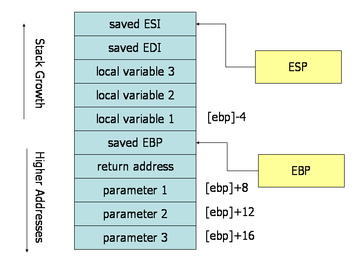

原文 by [x86 Assembly Guide](http://flint.cs.yale.edu/cs421/papers/x86-asm/asm.html)  
This is a version adapted by Quentin Carbonneaux from David Evans' [original document](http://www.cs.virginia.edu/~evans/cs216/guides/x86.html). The syntax was changed from Intel to AT&T, the standard syntax on UNIX systems, and the HTML code was purified.  

This guide describes the basics of 32-bit x86 assembly language programming, covering a small but useful subset of the available instructions and assembler directives. There are several different assembly languages for generating x86 machine code. The one we will use in CS421 is the GNU Assembler (gas) assembler. We will uses the standard AT&T syntax for writing x86 assembly code.   

The full x86 instruction set is large and complex (Intel's x86 instruction set manuals comprise over 2900 pages), and we do not cover it all in this guide. For example, there is a 16-bit subset of the x86 instruction set. Using the 16-bit programming model can be quite complex. It has a segmented memory model, more restrictions on register usage, and so on. In this guide, we will limit our attention to more modern aspects of x86 programming, and delve into the instruction set only in enough detail to get a basic feel for x86 programming.  

## Registers

Modern (i.e 386 and beyond) x86 processors have eight 32-bit general purpose registers, as depicted in Figure 1. The register names are mostly historical. For example, EAX used to be called the accumulator since it was used by a number of arithmetic operations, and ECX was known as the counter since it was used to hold a loop index. Whereas most of the registers have lost their special purposes in the modern instruction set, by convention, two are reserved for special purposes — the stack pointer (ESP) and the base pointer (EBP).  

For the EAX, EBX, ECX, and EDX registers, subsections may be used. For example, the least significant 2 bytes of EAX can be treated as a 16-bit register called AX. The least significant byte of AX can be used as a single 8-bit register called AL, while the most significant byte of AX can be used as a single 8-bit register called AH. These names refer to the same physical register. When a two-byte quantity is placed into DX, the update affects the value of DH, DL, and EDX. These sub-registers are mainly hold-overs from older, 16-bit versions of the instruction set. However, they are sometimes convenient when dealing with data that are smaller than 32-bits (e.g. 1-byte ASCII characters).  

  
Figure 1. x86 Registers  
## Memory and Addressing Modes  

### Declaring Static Data Regions

You can declare static data regions (analogous to global variables) in x86 assembly using special assembler directives for this purpose. Data declarations should be preceded by the .data directive. Following this directive, the directives .byte, .short, and .long can be used to declare one, two, and four byte data locations, respectively. To refer to the address of the data created, we can label them. Labels are very useful and versatile in assembly, they give names to memory locations that will be figured out later by the assembler or the linker. This is similar to declaring variables by name, but abides by some lower level rules. For example, locations declared in sequence will be located in memory next to one another.  

Example declarations:  
``` asm
.data		
var:		
.byte 64	/* Declare a byte, referred to as location var, containing the value 64. */
.byte 10	/* Declare a byte with no label, containing the value 10. Its location is var + 1. */
x:		
.short 42	/* Declare a 2-byte value initialized to 42, referred to as location x. */
y:		
.long 30000    	/* Declare a 4-byte value, referred to as location y, initialized to 30000. */
```
Unlike in high level languages where arrays can have many dimensions and are accessed by indices, arrays in x86 assembly language are simply a number of cells located contiguously in memory. An array can be declared by just listing the values, as in the first example below. For the special case of an array of bytes, string literals can be used. In case a large area of memory is filled with zeroes the .zero directive can be used.  

Some examples:  
``` asm
s:		
.long 1, 2, 3	/* Declare three 4-byte values, initialized to 1, 2, and 3. 
The value at location s + 8 will be 3. */
barr:		
.zero 10	/* Declare 10 bytes starting at location barr, initialized to 0. */
str:		
.string "hello"   	/* Declare 6 bytes starting at the address str initialized to 
the ASCII character values for hello followed by a nul (0) byte. */
```
### Addressing Memory

Modern x86-compatible processors are capable of addressing up to 232 bytes of memory: memory addresses are 32-bits wide. In the examples above, where we used labels to refer to memory regions, these labels are actually replaced by the assembler with 32-bit quantities that specify addresses in memory. In addition to supporting referring to memory regions by labels (i.e. constant values), the x86 provides a flexible scheme for computing and referring to memory addresses: up to two of the 32-bit registers and a 32-bit signed constant can be added together to compute a memory address. One of the registers can be optionally pre-multiplied by 2, 4, or 8.  

The addressing modes can be used with many x86 instructions (we'll describe them in the next section). Here we illustrate some examples using the mov instruction that moves data between registers and memory. This instruction has two operands: the first is the source and the second specifies the destination. 

Some examples of mov instructions using address computations are:  
``` asm
mov (%ebx), %eax	/* Load 4 bytes from the memory address in EBX into EAX. */
mov %ebx, var(,1)	/* Move the contents of EBX into the 4 bytes at memory address var.
(Note, var is a 32-bit constant). */
mov -4(%esi), %eax	/* Move 4 bytes at memory address ESI + (-4) into EAX. */
mov %cl, (%esi,%eax,1)   	/* Move the contents of CL into the byte at address ESI+EAX. */
mov (%esi,%ebx,4), %edx     	/* Move the 4 bytes of data at address ESI+4*EBX into EDX. */
```
Some examples of invalid address calculations include:  
``` asm
mov (%ebx,%ecx,-1), %eax	/* Can only add register values. */
mov %ebx, (%eax,%esi,%edi,1)     	/* At most 2 registers in address computation. */
```
### Operation Suffixes

In general, the intended size of the of the data item at a given memory address can be inferred from the assembly code instruction in which it is referenced. For example, in all of the above instructions, the size of the memory regions could be inferred from the size of the register operand. When we were loading a 32-bit register, the assembler could infer that the region of memory we were referring to was 4 bytes wide. When we were storing the value of a one byte register to memory, the assembler could infer that we wanted the address to refer to a single byte in memory.  

However, in some cases the size of a referred-to memory region is ambiguous. Consider the instruction mov $2, (%ebx). Should this instruction move the value 2 into the single byte at address EBX? Perhaps it should move the 32-bit integer representation of 2 into the 4-bytes starting at address EBX. Since either is a valid possible interpretation, the assembler must be explicitly directed as to which is correct. The size prefixes b, w, and l serve this purpose, indicating sizes of 1, 2, and 4 bytes respectively.  

For example:  
``` asm
movb $2, (%ebx)	/* Move 2 into the single byte at the address stored in EBX. */
movw $2, (%ebx)	/* Move the 16-bit integer representation of 2 into the 2 bytes starting at the address in EBX. */
movl $2, (%ebx)     	/* Move the 32-bit integer representation of 2 into the 4 bytes starting at the address in EBX. */
```
## Instructions

Machine instructions generally fall into three categories: data movement, arithmetic/logic, and control-flow. In this section, we will look at important examples of x86 instructions from each category. This section should not be considered an exhaustive list of x86 instructions, but rather a useful subset. For a complete list, see Intel's instruction set reference.  

We use the following notation:  
```
<reg32>    	Any 32-bit register (%eax, %ebx, %ecx, %edx, %esi, %edi, %esp, or %ebp)
<reg16>	Any 16-bit register (%ax, %bx, %cx, or %dx)
<reg8>	Any 8-bit register (%ah, %bh, %ch, %dh, %al, %bl, %cl, or %dl)
<reg>	Any register
<mem>	A memory address (e.g., (%eax), 4+var(,1), or (%eax,%ebx,1))
<con32>	Any 32-bit immediate
<con16>	Any 16-bit immediate
<con8>	Any 8-bit immediate
<con>	Any 8-, 16-, or 32-bit immediate
```
In assembly language, all the labels and numeric constants used as immediate operands (i.e. not in an address calculation like 3(%eax,%ebx,8)) are always prefixed by a dollar sign. When needed, hexadecimal notation can be used with the 0x prefix (e.g. $0xABC). Without the prefix, numbers are interpreted in the decimal basis.  

### Data Movement Instructions

**mov** — Move  

The mov instruction copies the data item referred to by its first operand (i.e. register contents, memory contents, or a constant value) into the location referred to by its second operand (i.e. a register or memory). While register-to-register moves are possible, direct memory-to-memory moves are not. In cases where memory transfers are desired, the source memory contents must first be loaded into a register, then can be stored to the destination memory address.  
*Syntax*  
```
mov <reg>, <reg>
mov <reg>, <mem>
mov <mem>, <reg>
mov <con>, <reg>
mov <con>, <mem>
```
*Examples*  
```
mov %ebx, %eax — copy the value in EBX into EAX
movb $5, var(,1) — store the value 5 into the byte at location var
```
**push** — Push on stack  

The push instruction places its operand onto the top of the hardware supported stack in memory. Specifically, push first decrements ESP by 4, then places its operand into the contents of the 32-bit location at address (%esp). ESP (the stack pointer) is decremented by push since the x86 stack grows down — i.e. the stack grows from high addresses to lower addresses.   
*Syntax*  
```
push <reg32>
push <mem>
push <con32>
```
*Examples*  
```  
push %eax — push eax on the stack
push var(,1) — push the 4 bytes at address var onto the stack
```
**pop** — Pop from stack  

The pop instruction removes the 4-byte data element from the top of the hardware-supported stack into the specified operand (i.e. register or memory location). It first moves the 4 bytes located at memory location (%esp) into the specified register or memory location, and then increments ESP by 4.  
*Syntax*  
```
pop <reg32>
pop <mem>
```
*Examples*  
```  
pop %edi — pop the top element of the stack into EDI.
pop (%ebx) — pop the top element of the stack into memory at the four bytes starting at location EBX.
```
**lea** — Load effective address  

The lea instruction places the address specified by its first operand into the register specified by its second operand. Note, the contents of the memory location are not loaded, only the effective address is computed and placed into the register. This is useful for obtaining a pointer into a memory region or to perform simple arithmetic operations.  
*Syntax*  
```
lea <mem>, <reg32>
```
*Examples*  
```
lea (%ebx,%esi,8), %edi — the quantity EBX+8*ESI is placed in EDI.
lea val(,1), %eax — the value val is placed in EAX.
```

### Arithmetic and Logic Instructions

**add** — Integer addition  
The add instruction adds together its two operands, storing the result in its second operand. Note, whereas both operands may be registers, at most one operand may be a memory location.  
*Syntax*  
```
add <reg>, <reg>
add <mem>, <reg>
add <reg>, <mem>
add <con>, <reg>
add <con>, <mem>
```
*Examples*  
```
add $10, %eax — EAX is set to EAX + 10
addb $10, (%eax) — add 10 to the single byte stored at memory address stored in EAX
```
**sub** — Integer subtraction  

The sub instruction stores in the value of its second operand the result of subtracting the value of its first operand from the value of its second operand. As with add, whereas both operands may be registers, at most one operand may be a memory location.  
*Syntax*  
```
sub <reg>, <reg>
sub <mem>, <reg>
sub <reg>, <mem>
sub <con>, <reg>
sub <con>, <mem>
```
*Examples*  
```
sub %ah, %al — AL is set to AL - AH
sub $216, %eax — subtract 216 from the value stored in EAX
```
**inc, dec** — Increment, Decrement  

The inc instruction increments the contents of its operand by one. The dec instruction decrements the contents of its operand by one.  
*Syntax*  
```
inc <reg>
inc <mem>
dec <reg>
dec <mem>
```
*Examples*  
```
dec %eax — subtract one from the contents of EAX
incl var(,1) — add one to the 32-bit integer stored at location var
```
**imul** — Integer multiplication  

The imul instruction has two basic formats: two-operand (first two syntax listings above) and three-operand (last two syntax listings above).  
The two-operand form multiplies its two operands together and stores the result in the second operand. The result (i.e. second) operand must be a register.  

The three operand form multiplies its second and third operands together and stores the result in its last operand. Again, the result operand must be a register. Furthermore, the first operand is restricted to being a constant value.  

*Syntax*  
```
imul <reg32>, <reg32>
imul <mem>, <reg32>
imul <con>, <reg32>, <reg32>
imul <con>, <mem>, <reg32>
```
*Examples*  
```
imul (%ebx), %eax — multiply the contents of EAX by the 32-bit contents of the memory at location EBX. Store the result in EAX.
imul $25, %edi, %esi — ESI is set to EDI * 25
```
**idiv** — Integer division  

The idiv instruction divides the contents of the 64 bit integer EDX:EAX (constructed by viewing EDX as the most significant four bytes and EAX as the least significant four bytes) by the specified operand value. The quotient result of the division is stored into EAX, while the remainder is placed in EDX.  
*Syntax*  
```
idiv <reg32>
idiv <mem>
```
*Examples*  
```
idiv %ebx — divide the contents of EDX:EAX by the contents of EBX. Place the quotient in EAX and the remainder in EDX.
idivw (%ebx) — divide the contents of EDX:EAS by the 32-bit value stored at the memory location in EBX. Place the quotient in EAX and the remainder in EDX.
```
**and, or, xor** — Bitwise logical and, or, and exclusive or  

These instructions perform the specified logical operation (logical bitwise and, or, and exclusive or, respectively) on their operands, placing the result in the first operand location.  
*Syntax*  
```
and <reg>, <reg>
and <mem>, <reg>
and <reg>, <mem>
and <con>, <reg>
and <con>, <mem>
or <reg>, <reg>
or <mem>, <reg>
or <reg>, <mem>
or <con>, <reg>
or <con>, <mem>
xor <reg>, <reg>
xor <mem>, <reg>
xor <reg>, <mem>
xor <con>, <reg>
xor <con>, <mem>
```
*Examples*  
```
and $0x0f, %eax — clear all but the last 4 bits of EAX.
xor %edx, %edx — set the contents of EDX to zero.
```
**not** — Bitwise logical not  

Logically negates the operand contents (that is, flips all bit values in the operand).  

*Syntax*  
```
not <reg>
not <mem>
```
*Example*  
```
not %eax — flip all the bits of EAX
```

**neg** — Negate  

Performs the two's complement negation of the operand contents.  
*Syntax*  
```
neg <reg>
neg <mem>
```
*Example*  
```
neg %eax — EAX is set to (- EAX)
```
**shl, shr** — Shift left and right  

These instructions shift the bits in their first operand's contents left and right, padding the resulting empty bit positions with zeros. The shifted operand can be shifted up to 31 places. The number of bits to shift is specified by the second operand, which can be either an 8-bit constant or the register CL. In either case, shifts counts of greater then 31 are performed modulo 32.  
*Syntax*  
```
shl <con8>, <reg>
shl <con8>, <mem>
shl %cl, <reg>
shl %cl, <mem>

shr <con8>, <reg>
shr <con8>, <mem>
shr %cl, <reg>
shr %cl, <mem>
```
*Examples*  
```
shl $1, eax — Multiply the value of EAX by 2 (if the most significant bit is 0)
shr %cl, %ebx — Store in EBX the floor of result of dividing the value of EBX by 2n where n is the value in CL. Caution: for negative integers, it is different from the C semantics of division!
```
### Control Flow Instructions

The x86 processor maintains an instruction pointer (EIP) register that is a 32-bit value indicating the location in memory where the current instruction starts. Normally, it increments to point to the next instruction in memory begins after execution an instruction. The EIP register cannot be manipulated directly, but is updated implicitly by provided control flow instructions.  

We use the notation <label> to refer to labeled locations in the program text. Labels can be inserted anywhere in x86 assembly code text by entering a label name followed by a colon. For example,  
```
       mov 8(%ebp), %esi
begin:
       xor %ecx, %ecx
       mov (%esi), %eax
```
The second instruction in this code fragment is labeled begin. Elsewhere in the code, we can refer to the memory location that this instruction is located at in memory using the more convenient symbolic name begin. This label is just a convenient way of expressing the location instead of its 32-bit value.  
**jmp** — Jump  

Transfers program control flow to the instruction at the memory location indicated by the operand.  
*Syntax*  
`jmp <label>`  

*Example*  
`jmp begin — Jump to the instruction labeled begin.`  

**jcondition** — Conditional jump  

These instructions are conditional jumps that are based on the status of a set of condition codes that are stored in a special register called the machine status word. The contents of the machine status word include information about the last arithmetic operation performed. For example, one bit of this word indicates if the last result was zero. Another indicates if the last result was negative. Based on these condition codes, a number of conditional jumps can be performed. For example, the jz instruction performs a jump to the specified operand label if the result of the last arithmetic operation was zero. Otherwise, control proceeds to the next instruction in sequence.
A number of the conditional branches are given names that are intuitively based on the last operation performed being a special compare instruction, cmp (see below). For example, conditional branches such as jle and jne are based on first performing a cmp operation on the desired operands.  

*Syntax*  
```
je <label> (jump when equal)
jne <label> (jump when not equal)
jz <label> (jump when last result was zero)
jg <label> (jump when greater than)
jge <label> (jump when greater than or equal to)
jl <label> (jump when less than)
jle <label> (jump when less than or equal to)
```
*Example*  
```
cmp %ebx, %eax
jle done
```
If the contents of EAX are less than or equal to the contents of EBX, jump to the label done. Otherwise, continue to the next instruction.  
**cmp** — Compare  

Compare the values of the two specified operands, setting the condition codes in the machine status word appropriately. This instruction is equivalent to the sub instruction, except the result of the subtraction is discarded instead of replacing the first operand.  
*Syntax*  
```
cmp <reg>, <reg>
cmp <mem>, <reg>
cmp <reg>, <mem>
cmp <con>, <reg>
```
*Example*  
```
cmpb $10, (%ebx)
jeq loop
```
If the byte stored at the memory location in EBX is equal to the integer constant 10, jump to the location labeled loop.  
**call, ret** — Subroutine call and return  

These instructions implement a subroutine call and return. The call instruction first pushes the current code location onto the hardware supported stack in memory (see the push instruction for details), and then performs an unconditional jump to the code location indicated by the label operand. Unlike the simple jump instructions, the call instruction saves the location to return to when the subroutine completes.  
The ret instruction implements a subroutine return mechanism. This instruction first pops a code location off the hardware supported in-memory stack (see the pop instruction for details). It then performs an unconditional jump to the retrieved code location.  

*Syntax*  
```
call <label>
ret
```
## Calling Convention

To allow separate programmers to share code and develop libraries for use by many programs, and to simplify the use of subroutines in general, programmers typically adopt a common calling convention. The calling convention is a protocol about how to call and return from routines. For example, given a set of calling convention rules, a programmer need not examine the definition of a subroutine to determine how parameters should be passed to that subroutine. Furthermore, given a set of calling convention rules, high-level language compilers can be made to follow the rules, thus allowing hand-coded assembly language routines and high-level language routines to call one another.  

In practice, many calling conventions are possible. We will describe the widely used C language calling convention. Following this convention will allow you to write assembly language subroutines that are safely callable from C (and C++) code, and will also enable you to call C library functions from your assembly language code.  

The C calling convention is based heavily on the use of the hardware-supported stack. It is based on the push, pop, call, and ret instructions. Subroutine parameters are passed on the stack. Registers are saved on the stack, and local variables used by subroutines are placed in memory on the stack. The vast majority of high-level procedural languages implemented on most processors have used similar calling conventions.  

The calling convention is broken into two sets of rules. The first set of rules is employed by the caller of the subroutine, and the second set of rules is observed by the writer of the subroutine (the callee). It should be emphasized that mistakes in the observance of these rules quickly result in fatal program errors since the stack will be left in an inconsistent state; thus meticulous care should be used when implementing the call convention in your own subroutines.  

  
Stack during Subroutine Call   
[Thanks to James Peterson for finding and fixing the bug in the original version of this figure!]  
A good way to visualize the operation of the calling convention is to draw the contents of the nearby region of the stack during subroutine execution. The image above depicts the contents of the stack during the execution of a subroutine with three parameters and three local variables. The cells depicted in the stack are 32-bit wide memory locations, thus the memory addresses of the cells are 4 bytes apart. The first parameter resides at an offset of 8 bytes from the base pointer. Above the parameters on the stack (and below the base pointer), the call instruction placed the return address, thus leading to an extra 4 bytes of offset from the base pointer to the first parameter. When the ret instruction is used to return from the subroutine, it will jump to the return address stored on the stack.  

### Caller Rules

To make a subrouting call, the caller should:  

1. Before calling a subroutine, the caller should save the contents of certain registers that are designated caller-saved. The caller-saved registers are EAX, ECX, EDX. Since the called subroutine is allowed to modify these registers, if the caller relies on their values after the subroutine returns, the caller must push the values in these registers onto the stack (so they can be restore after the subroutine returns.  
2. To pass parameters to the subroutine, push them onto the stack before the call. The parameters should be pushed in inverted order (i.e. last parameter first). Since the stack grows down, the first parameter will be stored at the lowest address (this inversion of parameters was historically used to allow functions to be passed a variable number of parameters).  
3. To call the subroutine, use the call instruction. This instruction places the return address on top of the parameters on the stack, and branches to the subroutine code. This invokes the subroutine, which should follow the callee rules below.  

After the subroutine returns (immediately following the call instruction), the caller can expect to find the return value of the subroutine in the register EAX. To restore the machine state, the caller should:    

1. Remove the parameters from stack. This restores the stack to its state before the call was performed.
2. Restore the contents of caller-saved registers (EAX, ECX, EDX) by popping them off of the stack. The caller can assume that no other registers were modified by the subroutine.

#### Example

The code below shows a function call that follows the caller rules. The caller is calling a function myFunc that takes three integer parameters. First parameter is in EAX, the second parameter is the constant 216; the third parameter is in the memory location stored in EBX.  
``` asm
push (%ebx)    /* Push last parameter first */
push $216      /* Push the second parameter */
push %eax      /* Push first parameter last */

call myFunc    /* Call the function (assume C naming) */

add $12, %esp
```
Note that after the call returns, the caller cleans up the stack using the add instruction. We have 12 bytes (3 parameters * 4 bytes each) on the stack, and the stack grows down. Thus, to get rid of the parameters, we can simply add 12 to the stack pointer.  

The result produced by myFunc is now available for use in the register EAX. The values of the caller-saved registers (ECX and EDX), may have been changed. If the caller uses them after the call, it would have needed to save them on the stack before the call and restore them after it.  

### Callee Rules

The definition of the subroutine should adhere to the following rules at the beginning of the subroutine:  

1. Push the value of EBP onto the stack, and then copy the value of ESP into EBP using the following instructions:  
```
    push %ebp
    mov  %esp, %ebp
```
This initial action maintains the base pointer, EBP. The base pointer is used by convention as a point of reference for finding parameters and local variables on the stack. When a subroutine is executing, the base pointer holds a copy of the stack pointer value from when the subroutine started executing. Parameters and local variables will always be located at known, constant offsets away from the base pointer value. We push the old base pointer value at the beginning of the subroutine so that we can later restore the appropriate base pointer value for the caller when the subroutine returns. Remember, the caller is not expecting the subroutine to change the value of the base pointer. We then move the stack pointer into EBP to obtain our point of reference for accessing parameters and local variables.  
2. Next, allocate local variables by making space on the stack. Recall, the stack grows down, so to make space on the top of the stack, the stack pointer should be decremented. The amount by which the stack pointer is decremented depends on the number and size of local variables needed. For example, if 3 local integers (4 bytes each) were required, the stack pointer would need to be decremented by 12 to make space for these local variables (i.e., sub $12, %esp). As with parameters, local variables will be located at known offsets from the base pointer.
3. Next, save the values of the callee-saved registers that will be used by the function. To save registers, push them onto the stack. The callee-saved registers are EBX, EDI, and ESI (ESP and EBP will also be preserved by the calling convention, but need not be pushed on the stack during this step).  

After these three actions are performed, the body of the subroutine may proceed. When the subroutine is returns, it must follow these steps:  

1. Leave the return value in EAX.
2. Restore the old values of any callee-saved registers (EDI and ESI) that were modified. The register contents are restored by popping them from the stack. The registers should be popped in the inverse order that they were pushed.
3. Deallocate local variables. The obvious way to do this might be to add the appropriate value to the stack pointer (since the space was allocated by subtracting the needed amount from the stack pointer). In practice, a less error-prone way to deallocate the variables is to move the value in the base pointer into the stack pointer: mov %ebp, %esp. This works because the base pointer always contains the value that the stack pointer contained immediately prior to the allocation of the local variables.
4. Immediately before returning, restore the caller's base pointer value by popping EBP off the stack. Recall that the first thing we did on entry to the subroutine was to push the base pointer to save its old value.
5. Finally, return to the caller by executing a ret instruction. This instruction will find and remove the appropriate return address from the stack.

Note that the callee's rules fall cleanly into two halves that are basically mirror images of one another. The first half of the rules apply to the beginning of the function, and are commonly said to define the prologue to the function. The latter half of the rules apply to the end of the function, and are thus commonly said to define the epilogue of the function.  

#### Example

Here is an example function definition that follows the callee rules:  
```asm

  /* Start the code section */
  .text

  /* Define myFunc as a global (exported) function. */
  .globl myFunc
  .type myFunc, @function
myFunc:

  /* Subroutine Prologue */
  push %ebp      /* Save the old base pointer value. */
  mov %esp, %ebp /* Set the new base pointer value. */
  sub $4, %esp   /* Make room for one 4-byte local variable. */
  push %edi      /* Save the values of registers that the function */
  push %esi      /* will modify. This function uses EDI and ESI. */
  /* (no need to save EBX, EBP, or ESP) */

  /* Subroutine Body */
  mov 8(%ebp), %eax   /* Move value of parameter 1 into EAX. */
  mov 12(%ebp), %esi  /* Move value of parameter 2 into ESI. */
  mov 16(%ebp), %edi  /* Move value of parameter 3 into EDI. */

  mov %edi, -4(%ebp)  /* Move EDI into the local variable. */
  add %esi, -4(%ebp)  /* Add ESI into the local variable. */
  add -4(%ebp), %eax  /* Add the contents of the local variable */
                      /* into EAX (final result). */

  /* Subroutine Epilogue */
  pop %esi       /* Recover register values. */
  pop %edi
  mov %ebp, %esp /* Deallocate the local variable. */
  pop %ebp       /* Restore the caller's base pointer value. */
  ret
```
The subroutine prologue performs the standard actions of saving a snapshot of the stack pointer in EBP (the base pointer), allocating local variables by decrementing the stack pointer, and saving register values on the stack.  

In the body of the subroutine we can see the use of the base pointer. Both parameters and local variables are located at constant offsets from the base pointer for the duration of the subroutines execution. In particular, we notice that since parameters were placed onto the stack before the subroutine was called, they are always located below the base pointer (i.e. at higher addresses) on the stack. The first parameter to the subroutine can always be found at memory location (EBP+8), the second at (EBP+12), the third at (EBP+16). Similarly, since local variables are allocated after the base pointer is set, they always reside above the base pointer (i.e. at lower addresses) on the stack. In particular, the first local variable is always located at (EBP-4), the second at (EBP-8), and so on. This conventional use of the base pointer allows us to quickly identify the use of local variables and parameters within a function body.  

The function epilogue is basically a mirror image of the function prologue. The caller's register values are recovered from the stack, the local variables are deallocated by resetting the stack pointer, the caller's base pointer value is recovered, and the ret instruction is used to return to the appropriate code location in the caller.  

**Credits**: This guide was originally created by Adam Ferrari many years ago, and since updated by Alan Batson, Mike Lack, and Anita Jones.  
It was revised for 216 Spring 2006 by [David Evans](http://www.cs.virginia.edu/evans/).  
It was finally modified by [Quentin Carbonneaux](http://cs.yale.edu/~qcar) to use the AT&T syntax for Yale's CS421.  